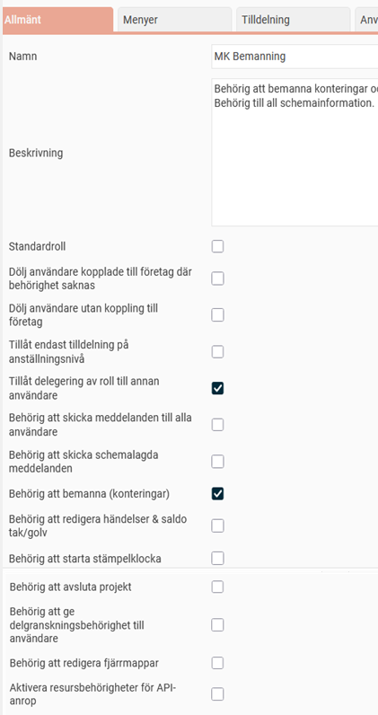
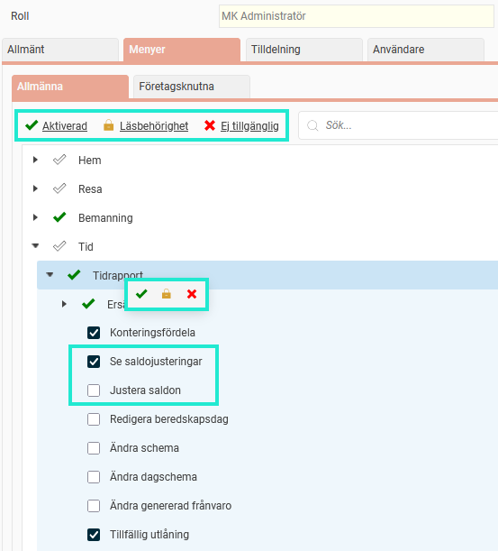
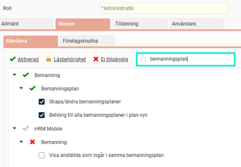

# ⚙️Vad är en roll?

**Datum:** den 19 januari 2026  
**Kategori:** Systemgemensamt  
**Underkategori:** Användare & Behörighet  
**Typ:** concept  
**Svårighetsgrad:** advanced  
**Tags:** användare, behörighet, mobil, roll, säkerhet  
**Bilder:** 3  
**URL:** https://knowledge.flexhrm.com/sv/vad-%C3%A4r-en-roll

---

Användares roller styr vad de kan se och göra i HRM. Nedan följer en beskrivning av inställningsmöjligheterna för roller.
Allmänna inställningar för en roll
Inställningar för menyer
Tilldelning av roller
Se vilka användare som har en viss roll
En roll i Flex HRM styr vad en användare kan se och göra i systemet. För att en användare ska kunna logga in och arbeta i Flex HRM måste hen tilldelas minst en roll. En användare kan ha flera roller samtidigt för att få rätt behörigheter. Det kan till exempel handla om att en användare behöver en behörighet på individnivå för att hantera sin egen tidrapport, samtidigt som hen behöver en annan behörighet på företagsnivå för att kunna se företagets alla anställda i Närvarotablån (men inte vara behörig till deras tidrapport).
Allmänna inställningar för en roll
Du hittar inställningarna för roller under
Användare/Behörigheter > Roller
På fliken
Allmänt
kan du namnge och beskriva rollen. Beskrivningen visas som en tooltip när du håller muspekaren över rollens namn i användarregistret.

Du kan också hantera flera andra inställningar här:
Standardroll
- Om du markerar en roll som standardroll, kommer den automatiskt att tilldelas nya användare som läggs upp i systemet.
Dölj användare kopplade till företag där behörighet saknas; Dölj användare utan koppling till företag
- Du kan begränsa vilka användare som syns för rollen. Av säkerhetsskäl är inställningarna som standard aktiverade vid skapandet av en ny roll.
Tillåt endast tilldelning på anställningsnivå
- Använd den här inställningen för att hindra att rollen används på andra nivåer än anställning. Den används ofta för att skydda känsliga uppgifter som lönespecifikationer.
Tillåt delegering av roll till annan användare
- Markera detta om rollen ska kunna delegeras till en annan användare. Det är användbart för till exempel attestanter som vill delegera sin attesträtt vid ledighet.
Behörig att skicka meddelanden
- Markera om rollen ska kunna skicka meddelanden till anställda. Du kan välja att ge behörighet att skicka till alla användare i Flex HRM, eller bara till de som tillhör samma företag. Meddelanden hanteras i en panel på Startsidan, samt i vyn Meddelanden i HRM Mobile.
Behörig att bemanna (konteringar)
- Ger behörighet att bemanna anställda på konteringar.
Behörig att redigera händelser & saldo tak/golv
- Ger möjlighet att ändra i eller skapa egna händelsefunktioner och saldo tak/golv.
Behörig att starta stämpelklocka
- Ger användaren tillåtelse att starta stämpelklockan, vilket kräver inloggning.
Behörig att avsluta projekt
- Ger möjlighet att avsluta projekt direkt från reseräkningen eller tidrapporten.
Behörig att ge delgranskningsbehörighet till användare
- Ger möjlighet att tilldela delgranskningsbehörighet till användare.
Behörig att redigera fjärrmappar
- Ger behörighet att redigera fjärrmappar som används bland annat för schemalagda importer och exporter.
Aktivera resursbehörigheter för API-anrop
- Används för att detaljstyra behörigheter för API-anrop, per API-resurs.
Inställningar för menyer
Under
Användare/Behörigheter > Roller > fliken Menyer
kan du styra vilka menyer användaren ska ha tillgång till. Fliken är uppdelad i flikarna
Allmänna
och
Företagsknutna
.
Fliken Allmänna
- Här listas alla menyer i Flex HRM.
Du sätter
en grön bock för de menyer användarna ska kunna se och använda, ett hänglås för att ge läsbehörighet och et
t rött kryss för de menyer som inte ska vara tillgängliga. Många menyer går att expandera, och göra mer specifika behörighetsinställningar.
Du kan markera flera menyer samtidigt genom att hålla in CTRL-knappen på ditt tangentbord.
Du kan antingen markera och klicka på grön bock, hänglås eller rött kryss i överkant eller högerklicka på en rad för att välja behörighet. Båda alternativen är markerade på bilden nedan.
Observera
a
tt när en huvudmeny markeras med en viss behörighet så sätts automatiskt samma behörighet på tillhörande undermenyer.
På bilden nedan är menyn
Tid
och dess undermeny
Tidrapport
utfällda. Rollen har behörighet till tidrapport, men inte till alla funktioner, den kan till exempel se saldojusteringar, men tillåts inte att göra egna justeringar av saldon.

Söka i rollträdet
Du kan använda sökfältet för att söka upp en meny istället för att manuellt klicka fram den. Sökträffarna visar alla matchande menyer, med eventuella övernoder.

Klickar du efter sökning på en övernod nollställs sökningen. Det är för att tydliggöra att en förändring av en övernod påverkar alla undernoder (inte bara den framsökta).
Fliken Företagsknutna
Används för register som kan se olika ut i olika företag, och därför inte kan styras helt i det generella behörighetsträdet. Precis som på fliken
Allmänna
sätter du behörigheter med grön bock, hänglås eller rött kryss. Läs mer i artikeln
Hur fungerar företagsknuten behörighet?
Tilldelning av roller
Under
Användare/Behörigheter > Roller > Tilldelning
kan du styra om användare med den valda rollen ska få tilldela roller till andra användare. Du kan välja att ge behörighet att tilldela
Inga roller
,
Alla roller
eller ett
Enligt urval
. Om du väljer
Enligt urval
får du specificera vilka roller som får tilldelas.
Du kan också välja om behörigheten ska utökas till alla befintliga företag genom att markera rutan
Behörig att tilldela roller i alla företag
.
Se vilka användare som har en viss roll
På fliken
Användare
kan du se vilka användare som har den aktuella rollen, samt vilket företag och anställd de är kopplade till.
Relaterat
Roller och behörigheter i Flex HRM
Hur fungerar företagsknuten behörighet?
