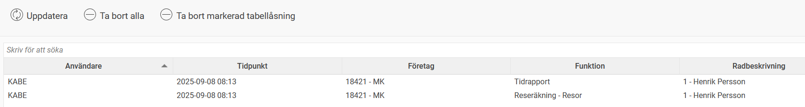
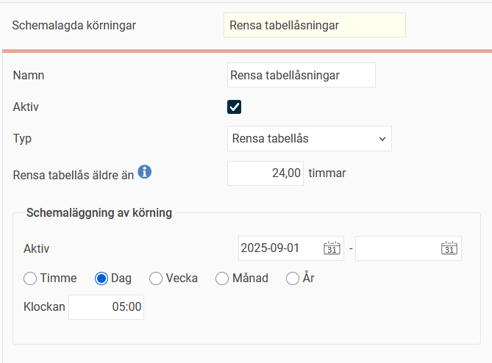

# ⚙️Vad är en tabellåsning?

**Datum:** den 29 september 2025  
**Kategori:** Systemgemensamt  
**Underkategori:** Användare & Behörighet  
**Typ:** concept  
**Svårighetsgrad:** beginner  
**Tags:** användare  
**Bilder:** 2  
**URL:** https://knowledge.flexhrm.com/sv/vad-%C3%A4r-en-tabell%C3%A5sning

---

Information om att se och hantera tabellåsningar, samt om att schemalägga en regelbunden rensning.
En tabellåsning är en funktion som hindrar att flera användare arbetar med samma sak samtidigt i Flex HRM. Det kan handla om att arbeta med samma medarbetare i en tidrapport eller att använda en specifik funktion, till exempel
Överföring till lön
. Systemet ser till att bara den första användaren får tillgång, medan de andra får ett felmeddelande.
Var hittar jag tabellåsningar?
Du kan se vilka funktioner och rader som är låsta av olika användare under
Allmänt > Tabellåsningar
.

I vyn visas följande information:
Användare
– Användarens inloggnings-id.
Tidpunkt
– När funktionen låstes.
Företag
– Företaget som användaren arbetar i.
Funktion
– Vilken funktion som användaren arbetar med.
Radbeskrivning
– Vilken rad i en tabell som avses.
Kan jag ta bort en tabellåsning?
Om du är hindrad i ditt arbete på grund av en tabellåsning finns det möjlighet att ta bort den. Du kan se vem som har låst funktionen under
Allmänt > Tabellåsningar
. Prata med den användaren för att se om låsningen är nödvändig.
Observera
Om du tar bort en låsning kan det leda till att den andra användaren förlorar osparade ändringar.
I vyn för tabellåsningar finns tre funktionsknappar:
Uppdatera
– Uppdaterar listan med de senaste förändringarna.
Ta bort alla
– Tar bort alla låsningar.
Ta bort markerad tabellåsning
– Tar bort en specifik låsning som du har markerat.
Kan gamla tabellåsningar tas bort automatiskt?
Ja, för att undvika onödiga låsningar kan du ställa in en regelbunden rensning. Under
Allmänt > Schemalagda körningar
kan du konfigurera en automatisk körning som till exempel tar bort låsningar som är äldre än 24 timmar. I exemplet nedan ska rensningen göras dagligen kl 05:00.

