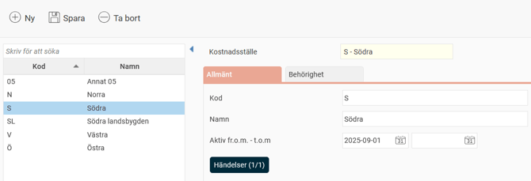

# ⚙️Vad är ett konteringsregister?

**Datum:** den 15 oktober 2025  
**Kategori:** Systemgemensamt  
**Underkategori:** Register  
**Typ:** concept  
**Svårighetsgrad:** beginner  
**Tags:** användare, behörighet, roll  
**Bilder:** 1  
**URL:** https://knowledge.flexhrm.com/sv/vad-%C3%A4r-ett-konteringsregister

---

Artikeln beskriver enkla, ej utökade, konteringsregister.
Flex HRM använder konteringsregister för att styra behörighet och för att märka upp poster, som till exempel poster för bokföring och statistik.
Du kan skapa nya register och anpassa dem efter dina behov. Två register kan utökas, ett projektregister och ett kundregister. Den här artikeln beskriver enkla register som inte är utökade.
Ett konteringsregister är i grunden en förteckning med kod, namn och ett datumintervall.

Aktiv från och med – till och med:
Här anger eller ser du datumintervallet för när konteringen är aktiv. Konteringen kan bara användas för registreringar som görs inom det angivna intervallet. Om du inte anger något datum alls är konteringen alltid aktiv. Inaktiva konteringar visas i rapporter och kan fortfarande användas när du gör urval.
Beroende på hur du använder registret kan det ha fler inställningar och flikar, såsom
Bemanning
,
Fakturering
och
Kompetenser
. Dessa beskrivs i artikeln
Vad är ett projektregister?
Händelser
Om du använder HRM Time finns knappen
Händelser
i konteringsregistren. Där kan du skapa händelser som gäller per kontering. Det kan till exempel vara att en viss extra ersättning ska utbetalas för all tid som arbetas på ett specifikt kostnadsställe.
Behörighet till konteringsregister
Det är möjligt att ställa in behörighet för specifika register. Du kanske till exempel ska kunna redigera kostnadsställen men bara kunna se projektregistret. Behörigheten till konteringsregister kan styras med företagsknuten behörighet. Läs mer här:
Hur fungerar företagsknuten behörighet?
Fliken Behörighet
De konteringsregister som används för behörighet och urval (inställningen finns under
Inställningar > Allmänt > Konteringsdimensioner
) har en flik som heter
Behörighet
.
Under den här fliken kan du se vilka användare som har behörighet via en kontering, samt via vilken roll. Fliken är behörighetsstyrd och måste aktiveras på de roller som ska kunna visa
Behörighet
.
Relaterade artiklar
Hur hanterar man konteringsdimensioner i Flex HRM?
Vad är ett projektregister?
Vad är ett kundregister?
Hur använder man Händelser i HRM Time?
Hur fungerar företagsknuten behörighet?
