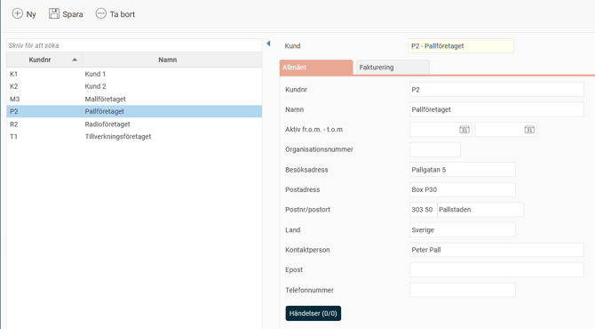

# ⚙️Vad är ett kundregister?

**Datum:** den 22 september 2025  
**Kategori:** Systemgemensamt  
**Underkategori:** Register  
**Typ:** concept  
**Svårighetsgrad:** beginner  
**Tags:** användare, behörighet, roll  
**Bilder:** 1  
**URL:** https://knowledge.flexhrm.com/sv/vad-%C3%A4r-ett-kundregister

---

Artikeln beskriver utökat kundregister.
Ett kundregister är ett av företagets konteringsregister som har utökats med kunduppgifter.
För att ställa in
ett konteringsregister som kundregister går du till
Inställningar > Allmänt > Konteringsdimensioner
.
Kundregistret är en förteckning som innehåller information om en kund:
Kundnummer
Namn
Aktiv
Organisationsnummer
Besöksadress
Postadress
Postnummer och postort
Land
Kontaktperson
E-post
Telefonnummer

Användning av kundregistret
Kundregistret används ofta i samband med fakturering. Om det används för detta syfte har registret även en extra flik som heter
Fakturering
. Mer information om detta hittar du i artikeln
Vad är ett projektregister?
Händelser
Om du använder HRM Time finns knappen
Händelser
i konteringsregistren. Där kan du skapa händelser som gäller per kontering. Det kan till exempel vara att en viss extra ersättning ska utbetalas för all tid som arbetas på ett specifikt kundnummer.
Behörighet till konteringsregister
Det är möjligt att ställa in behörighet för specifika register. Du kanske till exempel ska kunna redigera kostnadsställen men bara kunna se projektregistret. Behörigheten till konteringsregister kan styras med
företagsknuten behörighet.
Läs mer här:
Hur fungerar företagsknuten behörighet?
Fliken Behörighet
De konteringsregister som används för behörighet och urval (inställningen under
Inställningar > Allmänt > Konteringsdimensioner)
har en flik som heter
Behörighet.
Under den här fliken kan du se vilka användare som har behörighet via en kontering, samt via vilken roll. Fliken är behörighetsstyrd och måste aktiveras på de roller som ska kunna visa
Behörighet.
Relaterade artiklar
Hur hanterar man konteringsdimensioner i Flex HRM?
Vad är ett projektregister?
Vad är ett konteringsregister?
Hur använder man Händelser i HRM Time?
Hur fungerar företagsknuten behörighet?
