# ⚙️Vad är ett projektregister?

**Datum:** den 30 september 2025  
**Kategori:** Systemgemensamt  
**Underkategori:** Register  
**Typ:** concept  
**Svårighetsgrad:** advanced  
**Tags:** användare, behörighet, integration, mobil, roll  
**Bilder:** 16  
**URL:** https://knowledge.flexhrm.com/sv/vad-%C3%A4r-ett-projektregister

---

En omfattande beskrivning av den information och de inställningar som finns på respektive flik i ett utökat projektregister. Gå direkt till den flik du söker med hjälp av innehållsförteckningen.
Utökat projektregister och trädstruktur
Allmänt
Kommentarer
Bilagor
Bemanning
Kompetenser
Deltagare
Status
Fakturering
Granskning
Platser
Behörighet
E
t
t projektregister i Flex HRM är ett register som används bland annat för att
styra behörighet
,
filtrera urval
och
märka upp poster
i systemet, till exempel för bokföring och statistik. Det är ett av systemets konteringsregister.
Det utökade projektregistret har fler funktioner än ett enkelt konteringsregister, som i sin grund består av en kod, ett namn och ett datumintervall.
Observera
Vi använder här begreppet
Projekt
. Ni kan ha valt att benämna det utökade projektregistret på annat sätt i ert system.
Artikeln går igenom de flikar som är möjliga att ha i ett utökat projektregister. Beroende på licens och inställningar kanske ni inte använder alla dessa flikar.
Utökat projektregister och trädstruktur
Det utökade projektregistret kan ha en
trädstruktur
med
huvudprojekt
,
delprojekt
och
registrerbara projekt
.
Koden för varje nivå avskiljs med en punkt (.). Exempel:
BS
(huvudprojekt) >
BS.HR
(delprojekt) >
BS.HR.Bem
(registrerbart projekt).
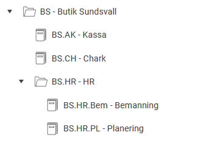
Registrerbara projekt
är de som kan väljas när du registrerar tid i tidrapporter, reseräkningar och liknande.
Huvudprojekt/delprojekt kan
inte
användas för registrering, och registrerbara projekt har inga underprojekt.
Du behöver inte använda projektregistret med trädstruktur. Det går bra att endast använda registrerbara projekt.
Allmänt
På fliken Allmänt kan du lägga upp projekt på olika nivåer:
huvud-/delnivå
och
registrerbar nivå
. Endast projekt på registrerbar nivå kan användas vid registrering av tidrapporter och reseräkningar. Huvud-/delnivåer kan inte användas för registrering.
Du skapar ett nytt projekt genom att antingen lägga upp ett helt nytt eller genom att kopiera ett befintligt projekt.
Vid upplägg av en undernivå till en befintlig huvudnivå kan du markera aktuell huvudnivå i listan till vänster. Därefter klickar du på knappen
Ny
och svarar ja på frågan om att skapa ett underprojekt.
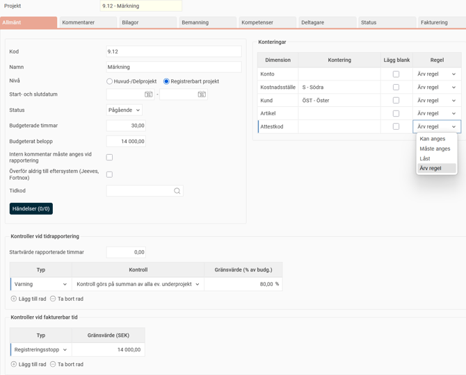
Projektinformation och inställningar
Kod
Projektets förkortning. Du kan använda både bokstäver och siffror.
Namn
Projektets benämning.
Start- och slutdatum
Det datum projektet ska starta respektive avslutas.
Status
Anger projektets tillstånd. Alternativen är
Pågående
,
Fryst
och
Avslutat
. Projekt med statusen
Fryst
eller
Avslutat
kan inte längre användas för registrering.
Budgeterade timmar
Uppskattad tidsåtgång i timmar för projektet. – Om du anger budgeterade timmar på underprojekt, visar huvudprojektet en summering av tiden från underprojekten. – Om du anger budgeterade timmar på huvudprojektet kan du inte ange det på underprojekt.
Budgeterat belopp
Uppskattat belopp för projektet. – Om du anger budgeterat belopp på underprojekt, visar huvudprojektet en summering av beloppet från underprojekten. – Om du anger budgeterat belopp på huvudprojektet kan du inte ange det på underprojekt.
Intern kommentar måste anges vid rapportering
Markera rutan om användare måste lämna en intern kommentar när de rapporterar tid på projektet.
Överför aldrig till eftersystem (Jeeves, Fortnox)
Markera rutan om poster konterade med projektet
inte
ska överföras till ditt eftersystem (om ni har en integration). Fältet visas endast på underprojekt. - Fortnox: Får genomslag vid överföring av fakturaunderlag, inte bokföring.
Tidkod
Här kan du ange en avvikande tidkod för projektet. Detta kan vara användbart om du till exempel vill att all tid som registreras på projektet ska gå över med en annan löneart till lön. Funktionen måste först aktiveras.
Inställningar > Allmänt > Konteringsdimensioner
och markera
Använd avvikande tidkoder
för konteringsdimensionen. Om en tidkod anges här, fylls den automatiskt i i tidrapporten när du registrerar tid på projektet.
Observera:
Detta gäller inte i ersättningsvyn. Det finns också en inställning per tidkod,
Kan ersättas av tidkod från kontering
, som styr om en tidkod kan skrivas över av en annan tidkod från en kontering. Denna inställning finns under
Inställningar > Tid och Bemanning > Tidkoder
.
Händelser
Om ni använder HRM Time kan du via knappen
Händelser
skapa regler för konteringen. Det kan till exempel vara en extra ersättning som ska betalas ut för all tid som arbetas på projektet. Mer information finns i artikeln
Hur använder man Händelser i HRM Time?
.
Konteringar på projekt
Du kan ange konteringar som programmet automatiskt ska koppla till när projektet används. Klicka på förstoringsglaset för att se en lista över upplagda konteringar på respektive nivå och välj den du vill hämta in.
Om inställningen
Lägg ut kontering från Projekt
är markerad under
Inställningar > Allmänt > Konteringsdimensioner
(på flikarna
Tid
,
Resa
och
Lön
), kommer en kontering som lagts in på projektet att fyllas i automatiskt i registreringen.
Exempel: Om kostnadsställe X läggs in på projekt Y, kommer kostnadsställe X att falla ut i tidrapporten när du registrerar tid på projekt Y (om inställningen är aktiv på fliken
Tid
för kostnadsställe).
Du kan också markera
Lägg blank
för en konteringsdimension på projektet om du vill att det fältet ska lämnas tomt i tidrapporten. För att
Lägg blank
ska få genomslag behöver konteringsdimensionen vara inställd på
Lägg ut kontering från Projekt
under
Inställningar > Allmänt > Konteringsdimensioner.
Du kan ställa in regler för dimensionen på projektet:
M
åste anges
,
Kan anges
eller
L
åst
.
Standard är
Ärv regel
, vilket innebär att regeln hämtas från konteringsdimensionens inställning (eller från utläggskoden om det handlar om en sådan).
Regeln från projektet får genomslag även om konteringen inte är inställd på att läggas ut från projekt.
Observera:
Regler från projektregistret har högst prioritet. Därefter gäller regeln från koden (till exempel utläggskoden), och sist den generella regeln på konteringsdimensionen.
Kontroller vid tidrapportering
Du kan ställa in varningar eller spärrar för att kontrollera att budgeterad tid inte överskrids. Varningar visas längst ner till höger när tidrapporten sparas. Du kan varna användare när projektet närmar sig budgeterad tid eller stoppa registreringen helt om gränsen överskrids.
Typ
Välj om det ska vara en
Varning
(tidrapporten sparas ändå) eller ett
Registreringsstopp
(tidrapporten kan inte sparas).
Kontroll
Kontrollen ärvs ned till alla underprojekt om den läggs på ett huvudprojekt. – Om kontrollen läggs på ett
huvudprojekt
räknas registrerad tid ihop från alla underprojekt och jämförs med summan av budgeterade timmar för alla underprojekt. – Om kontrollen läggs på
lägsta nivån
(underprojekt) är det bara den tid som rapporterats på just det projektet som räknas.
Gränsvärde (% av budg.)
Ange hur många procent av budgeterad tid som ska ha uppnåtts för att varningen/stoppet ska inträda.
Kontroller vid fakturerbar tid
Du kan kontrollera hur mycket fakturerbar tid som har rapporterats, där systemet tar hänsyn till olika timpriser. Endast granskad tid kontrolleras. Kontrollen sker vid sparning, inte vid granskning.
Typ
Välj
Varning
eller
Registreringsstopp
.
Gränsvärde (SEK)
Ange gränsvärdet i svenska kronor för när varningen/registreringsstoppet ska inträda.
Kommentarer
På fliken
Kommentarer
kan du lägga till interna och externa kommentarer. Dessa kommentarer hjälper till att ge viktig information till olika parter, som projektdeltagare eller faktureringsansvariga.
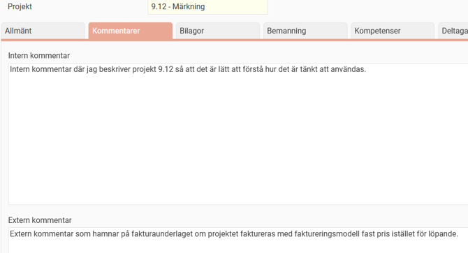
En
intern kommentar
är text du matar in som endast är synlig internt. Den visas när du söker efter konteringar i olika funktioner i programmet där en kontering ska anges. Exemplet på bilden nedan visar tidrapporten, fältet Projekt.
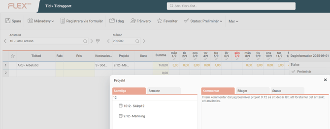
En
extern kommentar
är text som är avsedd att visas externt. Den följer med till fakturaunderlaget när projektet
frisläpps till fakturering,
men
endast om ett
fast pris
finns angivet på projektet fliken F
akturering
).
Förväxla inte detta med intern och extern kommentar i tidrapporter, det är inte samma sak.
Bilagor
Här kan du hantera de bilagor du vill bifoga till det aktuella projektet i Flex HRM.
Du kan lägga till en bilaga på två sätt:
Klicka på knappen
Ny fil
.
Dra och släpp filer direkt till projektet.
När du lagt till bilagan får du upp en dialogruta där du kan:
Skriva in en
beskrivning
för filen.
Ange om bilagan ska
visas vid registrering
av tidrapporter och reseräkningar.
Tips
Klicka på
Info-i
vid
Filtyp
för att se vilka filformat som stöds.
Visa bilagor vid registrering
Om du bockar i
Visa vid registrering
kommer bilagorna att visas i den söklista som visas när du väljer projekt i till exempel en tidrapport eller en reseräkning. Därifrån kan du också ladda ner bilagorna.
Om du
inte
bockar i
Visa vid registrering
syns bilagorna endast under
Register > Projekt
.
Bilden nedan visar projekt LO.101 som har två bilagor. Båda visas i projektregistret, men i reseräkningen visas endast en bilaga, den som har
Visa vid registrering
inställt.

Hantera befintliga bilagor
Längst ner på fliken
Bilagor
hittar du knappar för att hantera de bilagor som redan finns:
Ladda ner
– Används för att ladda ner en bilaga.
Ta bort
– Används för att ta bort en bilaga.
Redigera
– Används för att ändra
beskrivningen
eller inställningen för
visning vid registrering
.
Bemanning
Fliken
Bemanning
visas för den konteringsdimension som ni har ställt in ska användas för bemanning i systemet. Här kan du skapa arbetspass och bestämma vilken färg de ska ha i bemanningsöversikten.
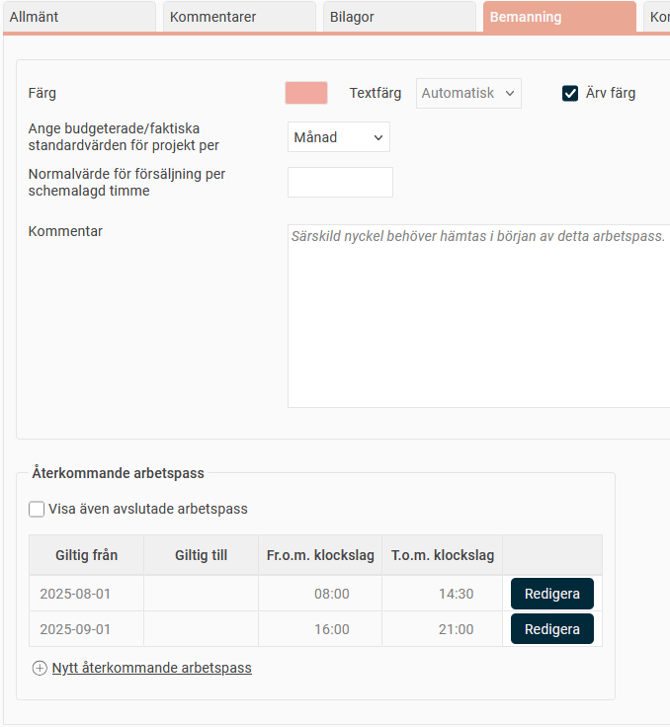
Ställ in färg och textfärg
Du kan ställa in en specifik färg och textfärg för din kontering, så att den syns tydligt i bemanningsöversikten.
Klicka på fältet för
Färg
eller
Textfärg
för att se en palett med valbara färger. Gör ditt val genom att klicka på önskad färg.
För
Textfärg
kan du använda
automatisk textfärg
. Då får du svart eller vit text, beroende på färginställningen.
Om du markerar
Ärv färg
hämtas färgen från konteringens huvudnod (huvudprojekt) om du använder en trädstruktur. På så sätt behöver du inte välja färg för varje enskilt underprojekt.
Exempel:
Om du vill att alla projekt under
Region 2
ska vara gröna väljer du grön färg på huvudprojektet
Region 2
. Alla nya projekt som skapas under detta får då automatiskt
Ärv färg
markerad och blir också gröna.
Standardvärden och försäljning
Inställningarna för
normalvärde
och
standardvärden
får genomslag i de nyckeltal som visas längst till höger i schemavyerna.
Ange budgeterade/faktiska standardvärden för projekt per:
Här väljer du vilken tidsenhet som ska användas i uppföljningen av projekten i schemavyerna.
Normalvärde för försäljning per schemalagd timme:
Här kan du ställa in ett normalvärde för försäljning per timme för ett specifikt projekt, om det skiljer sig från det värde som är satt på företagsnivå. Normalvärdet på företagsnivå hittar du under
Inställningar > Tid och Bemanning > Bemanning
, fliken
Uppföljning/budget
.
Kommentar
Du kan lägga till kommentarer i bemanningsöversikten som sedan visas för de anställda i deras scheman. Du kan ange kommentarer på tre ställen:
I konteringsregistret
(detta gäller för alla arbetspass på konteringen/projektet).
Per arbetspass
(visas för alla anställda på det arbetspasset).
Per anställd och arbetspass
(visas för en specifik anställd på det arbetspasset).
Om du anger en
Kommentar
på fliken
Bemanning
på ett projekt, kommer alla arbetspass på det projektet att få den kommentaren. Det kan vara användbart för generell information alla anställda som arbetar på projektet behöver veta.
Lägger du kommentaren på ett huvudprojekt gäller den för alla underprojekt, så länge du inte har angett en avvikande kommentar på något av dem.
Kommentaren visas i:
Schemavyerna.
Min kalender
på startsidan i HRM.
Mitt schema
i HRM Mobile.
Rapporten
Personligt schema
.
De tre nedersta kräver att inställningen
Visa kommentarer för anställda (Mobile, rapporter, kalender)
är markerad under
Inställningar > Tid och Bemanning > Bemanning
.
Återkommande arbetspass
Här visas de återkommande arbetspass som du har skapat för konteringen.
Återkommande arbetspass specificerar bemanningsbehovet för konteringen på en repeterande basis under ett valfritt antal veckor. De anger mellan vilka tider bemanning behövs och hur många personer som behövs under dessa tider.
Kompetenser
Projektet kan kopplas till en eller flera
kompetenser
. Detta kan användas vid bemanning för att styra vilka
projekt
som personer med olika kompetenser får arbeta på.
Kompetenserna måste finnas upplagda i systemet under
Register
>
Kompetenser
för att du ska kunna välja dem.
Koppla kompetenser och sätt nivå
Varje kompetens tillhör en
kompetensgrupp
. För att lättare hitta rätt kompetens kan du filtrera på en kompetensgrupp.
Under
Nivå
kan du gradera respektive kompetens. För att sätta kompetensnivån fyller du i önskat antal rutor genom att klicka på dem.
Ärva kompetenser
Om du markerar inställningen
Ärv kompetenser
kommer kompetenserna att hämtas från projektets huvudnod. Detta gör att du inte behöver ange kompetenser på varje enskilt underprojekt.
Om du till exempel vill att alla projekt under projekt
LO
ska ha samma kompetenser, väljer du dessa under huvudprojektet
LO
. Alla nya underprojekt som skapas under
LO
kommer då automatiskt att ha
Ärv kompetenser
markerad som standard.
I exemplet nedan har projekt
LO
kompetensen
B-körkort
.
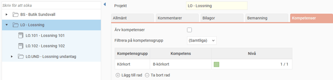
Det registrerbara underprojektet
LO.101
har ärvt samma kompetens.
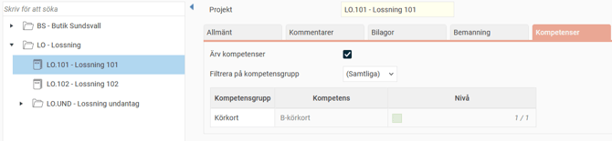
Projekt
LO.102
har inte en bock för att ärva kompetenser, utan har kompletterats med ytterligare en kompetens.

Det innebär att för att arbeta på projekt
LO.102
ska du ha kompetenserna
Brandutbildning
och
B-körkort
, medan det för
LO.101
räcker med
B-körkort
.
En anställds kompetenser anges i
anställdaregistret
, under fliken
Kompetenser
.
Deltagare
Fliken
Deltagare
kan du använda för att specificera vilka anställda som arbetar med ett visst projekt.
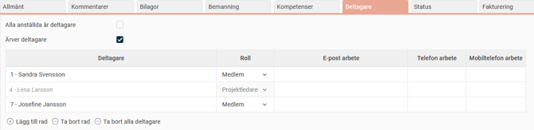
Du kan ställa in regler för hur deltagare ska användas i systemet under
Inställningar > Allmänt > Konteringsdimensioner
. Här kan du ange att endast deltagare ska ha tillgång till projektet, eller att du som standard bara ser de projekt du är deltagare i.
Markera rutan
Alla anställda är deltagare
om du vill att
samtliga
anställda ska kunna registrera tid på det aktuella projektet.
Markera rutan
Ärver deltagare
om du vill att deltagare från tillhörande
huvudprojekt
ska överföras till det valda underprojektet. Det här valet finns bara om projektet är ett
underprojekt
.
Deltagare som ärvs från ett överliggande projekt visas med
kursiv och grå text
och är låsta för redigering.
Deltagarlistan visar du deltagarnas namn, anställningsnummer,
roll
i projektet samt kontaktuppgifter. En deltagare kan ha rollen
Medlem
eller
Projektledare
.
Status
Fliken
Status
visar hur mycket tid som har
arbetats
jämfört med den
budgeterade
tiden i projektet. Informationen visas med hjälp av staplar.
Om projektet du tittar på är ett
huvudprojekt
räknas den arbetade och budgeterade tiden fram
inklusive
alla tillhörande
underprojekt
.
Du kan välja att filtrera informationen genom att göra ett urval på
anställd
och
datumintervall
. Om du inte gör något urval visas sammanställningen för
alla anställda
och för en
obegränsad tidsperiod
.
Under fliken
Utfall
visas resultatet med tre staplar:
Arbetade timmar
(den faktiska tidsåtgången).
Frisläppta timmar till fakturering
.
Budgeterade timmar
(den uppskattade tidsåtgången, som du ställer in i projektregistret under fliken
Allmänt
).
Om de
arbetade timmarna
överstiger de
budgeterade timmarna
får stapeln
röd
färg.
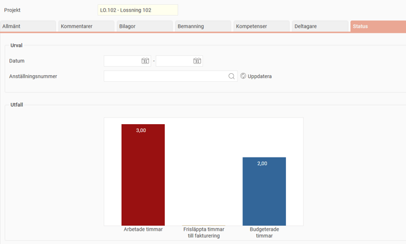
Om de
arbetade timmarna
är
mindre
än eller
lika med
de
budgeterade timmarna
får stapeln
grön
färg.
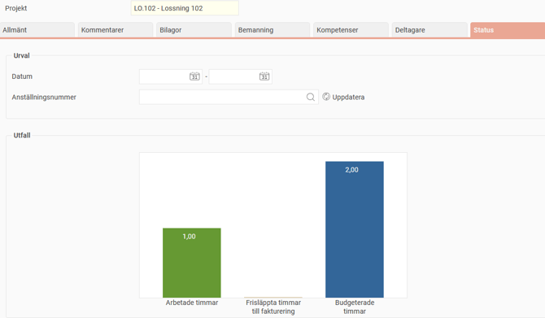
Du kan klicka på staplarna för att få mer detaljerad information:
Klicka på stapeln
Arbetade timmar
för att se vilka anställda som har arbetat på projektet och hur många timmar de har registrerat.
Om du använder fakturering i HRM Time kan du klicka på stapeln
Frisläppta timmar till fakturering
för att se hur många fakturerbara timmar som anställda har rapporterat och som har blivit frisläppta för fakturering.
Fakturering
I Flex HRM kan du göra inställningar för fakturering av tid och resor. Du hittar dessa inställningar under
Inställningar > Allmänt > Fakturering
.
Här väljer du om ni använder fakturering i
HRM Time
och/eller
HRM Travel
. Du ställer också in vilka
konteringsdimensioner
som ska styra faktureringspriset och vad som faktureras.
Faktureringsinställningar per konteringsregister
De konteringsregister du väljer att använda för fakturering får en specifik flik i registret,
Fakturering
. På den fliken ställer du in om en post ska
faktureras
. Alternativen är:
Ja - alltid
: Posten markeras för fakturering och detta kan inte ändras.
Nej - aldrig
: Posten markeras inte för fakturering och detta kan inte ändras.
Kan faktureras, föreslå Ja
: Posten föreslås för fakturering, men du kan ändra det.
Kan faktureras, föreslå Nej
: Posten föreslås
inte
för fakturering, men du kan ändra det.
Ställ in Faktureringspris
På fliken
Fakturering
i konteringsregistret kan du även ställa in faktureringspriset.
Exempel:
För projektet nedan är
timpriset
2500 kr/timme, förutom om kund M3 angivits. I det fallet ska timpriset vara 2200 kr.
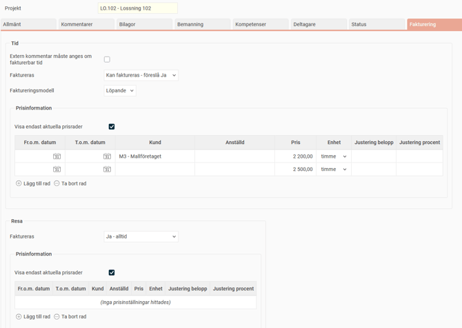
Om du inte anger något pris för
HRM Travel
kommer faktureringen att baseras på det registrerade beloppet. Ett utlägg på 2000 kr får då ett faktureringspris på 2000 kr.
För
HRM Time
kan du välja mellan två olika faktureringsmodeller:
Löpande
: Den tid som rapporteras faktureras löpande baserat på den registrerade tiden i tidrapporterna.
Fast pris
: Ingenting faktureras löpande. Tiden frisläpps för fakturering först när projektet får status
Avslutat
.
Granskning
De användare som ska delattestera behöver ha en roll som ger dem behörighet för delattestering och till vyn för delattestering. Förutom detta måste du också ställa in vilka projekt varje användare är behörig att delattestera. Detta görs i
användarregistret
, fliken
Konteringsgranskning
, eller i
projektregistret
, fliken
Granskning
.
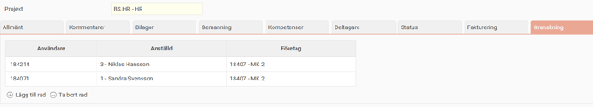
Platser
På fliken
Platser
kan du koppla en eller flera
platser
till dina projekt. Platserna används för att styra var stämpling kan ske, eller för att automatiskt föreslå projekt baserat på var användaren befinner sig när hen stämplar i
HRM Mobile
.
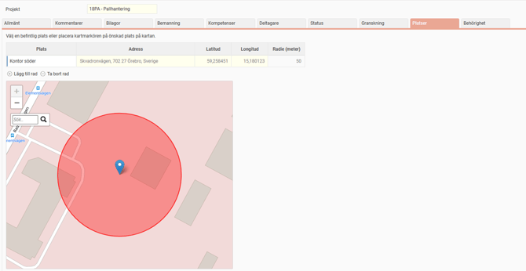
Lägg till en plats
Du kan koppla en plats till ett projekt på tre sätt:
Välj en befintlig plats:
Välj en plats som redan är upplagd i systemet. Du hittar de befintliga platserna under
Inställningar > Tid och Bemanning > Platser
.
Markera på karta:
Du kan peka ut en plats direkt på kartan. Använd kartnålen eller sök på en adress.
Importera platser:
Det finns en möjlighet att importera platser till konteringsregistret via importmallen för
Kontering
,
Du kan ange hur många meters radie som ska accepteras för att avgöra om en anställd är på platsen. Väljer du ingen radie används ett standardvärde. Du kan kan ställa in standardvärdet under
Inställningar > Tid och Bemanning > Tidrapporter.
Så används platserna
Platserna du ställer in har flera funktioner:
Begränsa stämpling i HRM Mobile:
Du kan begränsa så att en användare endast kan stämpla på vissa angivna platser.
Automatiskt projektval:
En plats kan användas för att ett projekt automatiskt ska föreslås i
HRM Mobile
när en användare stämplar från den platsen.
Behörighet
De konteringsregister som används för behörighet och urval (inställningen under
Inställningar > Allmänt > Konteringsdimensioner
) har en flik som heter
Behörighet
.
Under den här fliken kan du se vilka användare som har behörighet via en kontering, samt via vilken roll. Fliken är behörighetsstyrd och måste aktiveras på de roller som ska kunna visa Behörighet.
Relaterade artiklar
Hur hanterar man konteringsdimensioner i Flex HRM?
Går det att kopiera projekt?
Stämpla i HRM Mobile med hjälp av plats
Kan man begränsa stämplingen i HRM Mobile via plats?
Hur aktiverar jag funktionen Fakturering i HRM Time?
Hur aktiverar jag funktionen Fakturering i HRM Travel?
Hur använder man Händelser i HRM Time?
