# ⚙️Vad behöver vi tänka på inför årsskiftet i HRM Travel?

**Datum:** den 18 november 2025  
**Kategori:** Systemgemensamt  
**Underkategori:** Inställningar  
**Typ:** config  
**Svårighetsgrad:** advanced  
**Tags:** roll  
**Bilder:** 14  
**URL:** https://knowledge.flexhrm.com/sv/%C3%A5rsskiftet-hrm-travel

---

Artikeln demonstrerar det som förändras eller är bra att veta inför årsskiftet. Det angår traktamente, loggning, milersättningar, reseräkningar och hämtning av belopp och procent.
Årsskifte i Flex HRM Travel
Varje år beslutar Skatteverket om olika belopp och procentsatser. Nya värden hämtas från Flex Applications webbtjänst Flex Online.
Traktamentsregler
Kontrollera under Intervall om det finns regler för det nya året.
När du använder beloppskonstanter för prissättning kommer dessa att styra beloppen för skattefria traktamenten så att ersättningen blir rätt utifrån när resan har genomförts.
Om du däremot vill göra förändringar på traktamentsregler eller ändra till exempel fasta belopp på skattepliktiga traktamentsregler behöver du skapa ett nytt regel-intervall för att kunna styra beloppen utifrån resans datum.
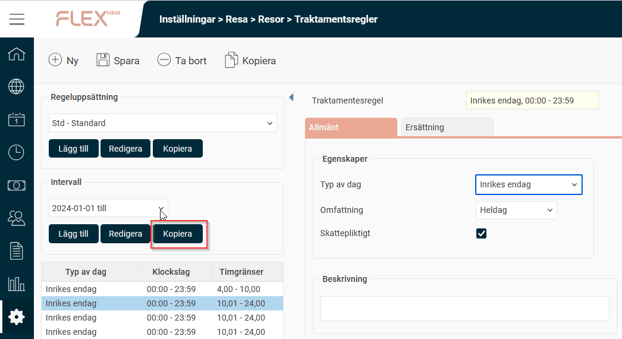
Om det saknas regler för kommande år kan du välja att kopiera intervallet för innevarande år. Flex HRM föreslår då att intervallet kopieras till kommande år. Genom att inte ange något slutdatum kommer regelverket gälla fram till dess att du eventuellt anger ett slutdatum. När du klickar på OK kopieras samtliga regler i vald regeluppsättning, till det nya intervallet.
Det är viktigt att kontrollera intervallen för samtliga regeluppsättningar som används.
Nattraktamente - Logi
Om belopp för nattraktamente har angivits manuellt behöver dessa uppdateras med årets belopp. Ett manuellt angivet belopp kan finnas i rutan för Belopp/Procent eller direkt på lönearten.
Om lönearten är inställd att hämta från belopp och procent kommer priset att uppdateras automatiskt.
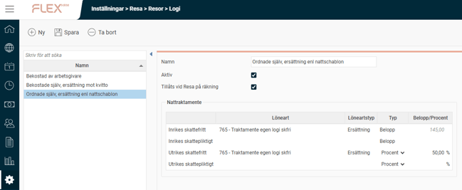
Hämta Belopp och Procent
Belopp och procent hämtas automatiskt till Flex HRM, vilket innebär
att du inte behöver göra en manuell hämtning vid årsskiftet. Möjligheten att hämta värden manuellt finns och kan användas vid behov. Värden hämtas allteftersom de finns tillgängliga. Observera att tillgängligheten beror på när respektive lands myndigheter publicerar värden för det nya året.
För att manuellt hämta värden kan du klicka på ikonen ”Hämta/uppdatera belopp och procent”.
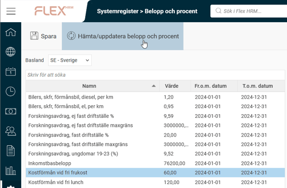
Flex HRM föreslår ett fr.o.m.-datum för hämtning. Klicka på Ok för att hämta in nya värden.
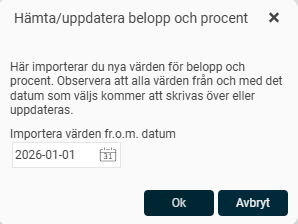
Hämta normalbelopp för utrikestraktamenten
Normalbelopp för utrikestraktamenten hämtas automatiskt till Flex HRM. Du behöver alltså inte göra en manuell hämtning vid årsskiftet. Möjligheten att hämta värden manuellt finns fortfarande kvar och kan användas vid behov. Värden hämtas för samtliga länder allteftersom de finns tillgängliga. Observera att tillgängligheten beror på när respektive lands myndigheter publicerar värden för det nya året.
För att manuellt hämta Normalbelopp kan du klicka på ikonen ”Importera”.
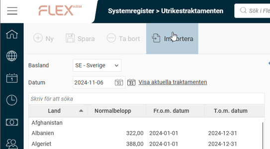
Välj sedan ‘År’ och klicka på Importera.
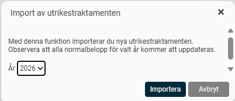
Loggning - Logginställningar/Logg
Under Logginställningar kan du kontrollera vilka loggar som är aktiverade samt aktivera nya loggar. Genom att aktivera loggning för belopp och procent samt utrikestraktamenten kan du se alla ändringar som gjorts i loggvyn.
För att aktivera loggning av belopp och procent skapar du en logginställning av typen Systemregister - Belopp och procent.
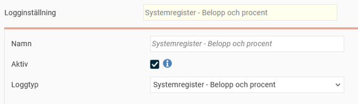
För att aktivera loggning av utrikestraktamenten skapar du en logginställning av typen Resor - Utrikestraktamenten. Denna loggar dels ändringar på normalbelopp för utrikestraktamenten under Systemregister - Utrikestraktamenten, dels ändringar som görs per företag på skattepliktiga utrikestraktamenten under Inställningar - Resa - Resor - Utrikestraktamenten.
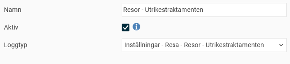
Skattepliktiga utrikestraktamenten  - Traktamentsregler/Utrikestraktamenten
Skattepliktiga belopp för utrikestraktamenten kan anges direkt på en traktamentsregel eller under utrikestraktamenten. Det är också möjligt att hämta in normalbelopp som skattepliktiga belopp.
När ett belopp är angivet på en traktamentsregel gäller beloppet för alla länder. Ändringen behöver göras per regel och regeluppsättning.

När ett belopp är angivet under utrikestraktamenten gäller det per valt land.
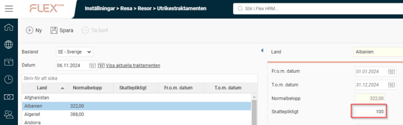
Här kan du se om normalbelopp och/eller skattepliktigt belopp används för era skattepliktiga utrikestraktamenten.
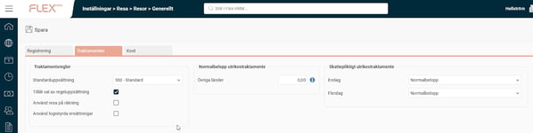
Milersättningar - Lönearter/Fordonstyper
Om skattefria milersättningar är prissatta från belopp och procent på egna lönearter kommer dessa uppdateras automatiskt vid årsskiftet.
Skattepliktiga milersättningar  - Fordonstyper, fliken
Lönearter
Om beloppen för skattepliktig milersättning har angivits manuellt behöver dessa uppdateras med årets belopp. Ett manuellt angivet belopp kan finnas i rutan för Pris/km eller direkt på lönearten. Om lönearten är inställd att hämta från belopp och procent kommer priset att uppdateras automatiskt.
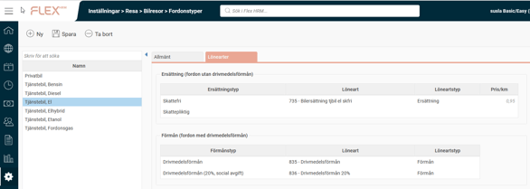
Initiering av reseräkningsnummer  - Reseräkningar
Om du använder en nummerserie för reseräkningar som ska ändras vid årsskiftet gör du det här. Observera att ändringen påverkar alla nya reseräkningar som skapas i HRM och endast får genomslag då initieringsnumret är högre än befintliga reseräkningsnummer.
Du har möjlighet att använda ett datumstyrt prefix i initieringsnummer för reseräkningar. Detta gör att du inte längre behöver ange ett nytt initieringsnummer vid årsskiftet när du har reseräkningsnummer som inleds
med till exempel årtal.
Det finns fyra alternativa prefix: yy, yyyy, yyMM och yyyyMM. Genom att använda prefixet tillsammans med ett löpnummer kommer Flex HRM Travel automatiskt använda aktuellt år (eller år och månad) som en del av reseräkningsnumret då användarna skapar nya reseräkningar.
Om du anger t.ex. yyyy som prefix och 001 som löpnummer kommer nya reseräkningar under 2026 få reseräkningsnummer från 2026001 till 2026999.
Aktuellt initieringsnummer visas under inställningarna.
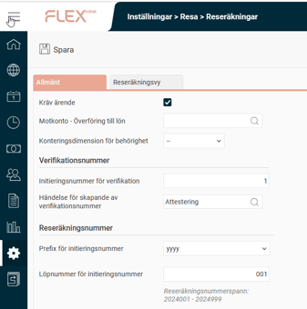
Milgränsmallar
Kontrollera under Intervall om det finns regler för det nya året. Om regler för kommande år saknas kan du välja att kopiera intervallet för innevarande år. Flex HRM föreslår att intervallet ska kopieras till nästkommande år. När du klickar på OK kopieras samtliga regler i vald mall till det nya intervallet.
Kontrollera intervall för samtliga mallar som används.
Om beloppen för ersättning har angivits manuellt behöver dessa uppdateras med årets belopp.
Ett manuellt angivet belopp kan finnas i rutan för ersättning eller direkt på lönearten.
Om lönearten är inställd att hämta från belopp och procent kommer priset att uppdateras automatiskt.
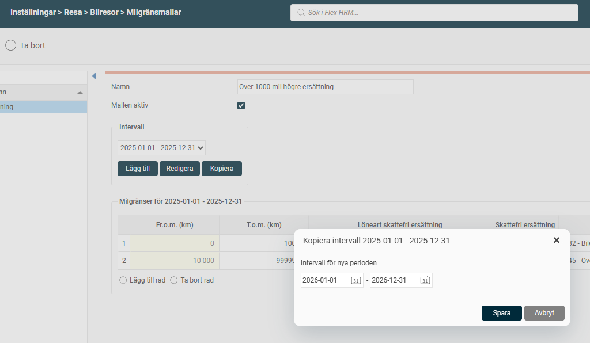
