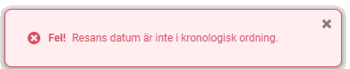
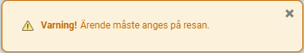

# Vad betyder de meddelanden som visas vid sparning?

**Datum:** den 5 september 2025  
**Kategori:** Systemgemensamt  
**Underkategori:** Inställningar  
**Typ:** concept  
**Svårighetsgrad:** beginner  
**Tags:** Ingen  
**Bilder:** 3  
**URL:** https://knowledge.flexhrm.com/sv/vad-betyder-de-meddelanden-som-visas-vid-sparning

---

Systemmeddelanden visas som rutor längst ned till höger i skärmen. Det finns tre olika typer av meddelanden:
Information
,
Fel
och
Varning
.
Information
Informationsmeddelanden har en blå symbol och blå text. De dyker upp som en bekräftelse när en åtgärd har genomförts i programmet utan fel, till exempel när du har sparat något.

Fel
Felmeddelanden har en röd symbol och röd text. Dessa meddelanden visas när du försöker spara något utan att de nödvändiga villkoren är uppfyllda. Åtgärda felet enligt anvisningen och försök sedan att spara igen.

Varning
Varningsmeddelanden kan visas när du sparar, trots att själva sparandet fungerar. Varningen signalerar att det kan finnas andra förutsättningar som gör att det förväntade resultatet kanske inte uppnås.
Ett exempel är om det finns en inställning som kräver att ett ärende måste anges på resor. Du kan då spara en resa utan ärende, men du måste lägga till ett ärende för att reseräkningen ska kunna granskas.

