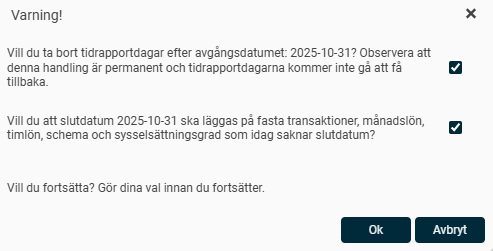
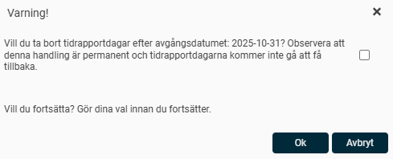
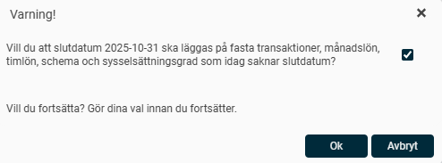

# Vad betyder varningen när jag lägger in ett avgångsdatum på anställd?

**Datum:** den 20 oktober 2025  
**Kategori:** Systemgemensamt  
**Underkategori:** Användare & Behörighet  
**Typ:** concept  
**Svårighetsgrad:** beginner  
**Tags:** roll  
**Bilder:** 3  
**URL:** https://knowledge.flexhrm.com/sv/varning-avg%C3%A5ngsdatum

---

Här får du svar på vad varningen som dyker upp när du avslutar en anställd betyder.
Offboarding - Avsluta anställd
När du ska avsluta en anställning i HRM anger du ett avgångsdatum för anställningsperioden direkt i anställdaregistret. Har du HRM Time eller HRM Payroll får du upp en varning som du behöver ta ställning till.
Vad betyder Varningen som dyker upp?

HRM Time
Om ni som företag har HRM Time får du upp följande fråga när du sparar ett avgångsdatum på en anställd:

Kryssar du i rutan svarar du
JA
på frågan "Vill du ta bort tidrapportdagar efter avgångsdatumet?" och eventuella tidrapporteringar som har gjorts efter avgångsdatumet kommer att tas bort.
Kryssar du INTE i rutan svarar du
NEJ
på frågan "Vill du ta bort tidrapportdagar efter avgångsdatumet?" och eventuella tidrapporteringar som har gjorts efter avgångsdatumet kommer att ligga kvar om den anställde sedan skulle få en ny anställning.
HRM Payroll
Om ni som företag har HRM Payroll får du upp följande fråga när du sparar ett avgångsdatum på en anställd:

Kryssar du i rutan svarar du
JA
på frågan "Vill du att slutdatum ska läggas på fasta transaktioner, månadslön, timlön, schema och sysselsättningsgrad som idag saknar slutdatum?" Det innebär att dessa fält i HRM kommer få samma slutdatum som avgångsdatumet.
Kryssar du INTE i rutan svarar du
NEJ
på frågan "Vill du att slutdatum ska läggas på fasta transaktioner, månadslön, timlön, schema och sysselsättningsgrad som idag saknar slutdatum?" Det innebär att dessa fält i HRM fortsatt kommer att ligga utan slutdatum.
