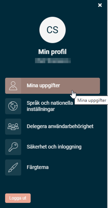
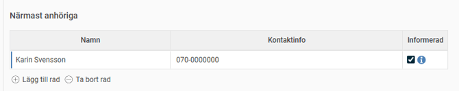

# Var hittar jag information om närmast anhöriga?

**Datum:** den 20 oktober 2025  
**Kategori:** Systemgemensamt  
**Underkategori:** Mobil  
**Typ:** other  
**Svårighetsgrad:** intermediate  
**Tags:** mobil  
**Bilder:** 2  
**URL:** https://knowledge.flexhrm.com/sv/var-hittar-jag-info-om-narmast-anhorig-0

---

I HRM anges Närmast anhöriga under dina personuppgifter. Det finns tillgängligt under Mina uppgifter både via dator och mobil.
Under närmast anhöriga anger du den/de personer som din arbetsgivare ska kontakta om det skulle hända dig något i ditt arbete.
Min profil
hittar du högst upp till höger i HRM.
1. Gå till
Mina uppgifter

2.
Lägg till rad
och fyll i Närmast anhörig.
Informerad kryssar du i för att ange att respektive anhörig har blivit informerad om att dennes uppgifter finns tillgängliga i HRM.
3.
Spara
.

I vissa företag kan du även hitta Närmast anhöriga direkt under
Personal - Anställda - Personuppgifter
.
