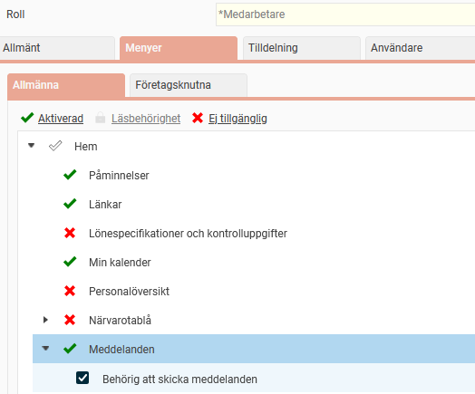
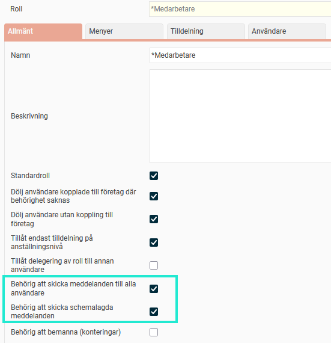
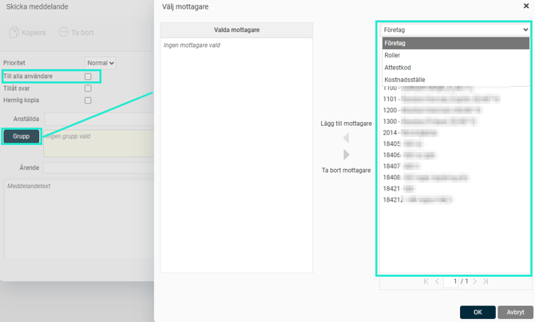

# ⚙️Vilka behörigheter finns för meddelanden i Flex HRM?

**Datum:** den 30 oktober 2025  
**Kategori:** Systemgemensamt  
**Underkategori:** Användare & Behörighet  
**Typ:** config  
**Svårighetsgrad:** intermediate  
**Tags:** användare, behörighet, mobil, roll  
**Bilder:** 3  
**URL:** https://knowledge.flexhrm.com/sv/vilka-beh%C3%B6righeter-finns-f%C3%B6r-meddelanden-i-flex-hrm

---

På startsidan i Flex HRM finns en panel där du kan skicka meddelanden till enskilda anställda eller till hela grupper. Du kan ha behörighet att
både skicka och ta emot
meddelanden, eller
bara att ta emot
dem.
Du hanterar meddelanden på startsidan i Flex HRM och i vyn
Meddelanden
i HRM Mobile.
Hur du hanterar behörigheter för meddelanden
Du ställer in behörigheterna för meddelanden per
roll
under
Användare/Behörigheter
>
Roller
, fliken
Menyer
.
För att användare med rollen ska kunna se meddelandepanelen på startsidan i Flex HRM och vyn
Meddelanden
i HRM Mobile, ställer du in detta under
Menyer
, noderna
Hem
och
HRM Mobile
.
För att ge rollen behörighet att
själv skicka meddelanden
, bockar du i det under noden för
Meddelanden
på startsidan.

Du kan också ställa in om rollen ska vara behörig att skicka meddelanden till
alla användare
och att skicka
schemalagda meddelanden
. Detta gör du på fliken
Allmänt
.

Skicka schemalagda meddelanden
innebär att användaren kan ställa in en giltighetstid för ett meddelande, till exempel att det endast ska visas en viss dag.
Skicka till alla användare
innebär att användaren kan skicka meddelandet till databasens alla användare, istället för att vara begränsad till de anställda hen har rollen för.
Exempel
Om en användare har rollen
Medarbetare
som är behörig att skicka meddelanden för sin egen anställning, kan hen i panelen
Meddelanden
endast välja att skicka meddelande till sig själv.
Om du ger rollen
Medarbetare
behörighet att
skicka meddelanden till alla användare
, kan användaren nu välja att skicka meddelandet till:
Alla
Alla i ett visst företag
Alla med en viss roll
Alla med viss hemkontering

Relaterade artiklar
Hur fungerar meddelanden i Flex HRM?
Hur fungerar meddelanden i HRM Mobile?
