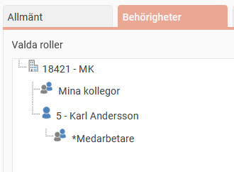
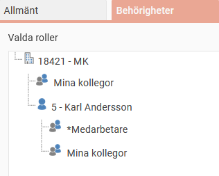

# Vilken roll gäller när en användare har flera roller?

**Datum:** den 19 september 2025  
**Kategori:** Systemgemensamt  
**Underkategori:** Användare & Behörighet  
**Typ:** other  
**Svårighetsgrad:** intermediate  
**Tags:** användare, behörighet, roll  
**Bilder:** 2  
**URL:** https://knowledge.flexhrm.com/sv/vilken-roll-g%C3%A4ller-n%C3%A4r-en-anv%C3%A4ndare-har-flera-roller

---

Roller styr vad du kan se och göra i Flex HRM. Du kan ha flera olika roller, som tilldelas på olika nivåer: företagsnivå, konteringsnivå och anställdnivå.
Specifika roller går före generella
Den mest specifika nivån gäller. Det innebär att en roll som är tilldelad på anställdnivå har företräde framför en roll på företagsnivå.
Exempel:
Om du har rollen
Mina kollegor
på företagsnivå och rollen
Medarbetare
på din anställning, är det rollen
Medarbetare
som gäller för dig. Den specifika rollen för din anställning slår alltså ut den generella rollen för hela företaget.
Ger
Mina kollegor
, men inte
Medarbetare
,
behörighet till Närvarotablån kommer du att se dina kollegor i Närvarotablån, men inte dig själv.

Det mest tillåtande gäller
Du kan tilldela flera roller på samma nivå, till exempel både rollen
Mina kollegor
och
Medarbetare
på anställdnivå.

I dessa fall är det den roll som ger mest behörighet som får genomslag. Om rollen
Mina kollegor
tillåter dig att se Närvarotablån medan rollen
Medarbetare
inte gör det, kommer du att ha behörighet att se dig själv i Närvarotablån.
