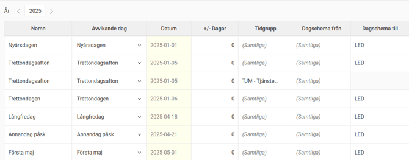

# ⚙️Avvikelsedagar - Hur ställer man in schema för avvikande dagar?

**Datum:** den 11 december 2025  
**Kategori:** Time  
**Underkategori:** Inställningar  
**Typ:** config  
**Svårighetsgrad:** intermediate  
**Tags:** lön, schema, tidrapport  
**Bilder:** 2  
**URL:** https://knowledge.flexhrm.com/sv/avvikelsedagar-hur-st%C3%A4ller-man-in-avvikande-dagar

---

Denna artikel förklarar inställningarna i vyn Avvikelsedagar

Avvikelsedagar används för att
ställa in de avvikande dagar som finns under året, t.ex. om scheman automatiskt ska ändras till ledig dag på röda dagar som infaller på vardagar.
Här följer en förklaring av inställningarna i vyn.
Namn.
Det namn du vill ge avvikelsedagen. Använder du en fast dag i kolumnen
Avvikande dag
får avvikelsedagen automatiskt namn från denna.
Avvikande dag.
Här kan du välja att ställa in ett datum eller välja i en lista över helgdagar och vanligt förekommande avvikelsedagar.
Datum.
Har du valt en fast dag i kolumnen
Avvikande dag
faller datum ut automatiskt för alla år. Har du valt datum i kolumnen
Avvikande dag
anger du datum. Om du anger datum med endast månad och år kommer avvikelsedagen att gälla varje år.
+/-dagar.
Används för att ställa in t ex Annandag jul + 1 dag, vilket skulle ge en avvikelsedag för 27 december varje år.
Tidgrupp.
Ska olika regler gälla för olika tidgrupper skapar du en rad per tidgrupp. Det går också att ha en rad för
Samtliga
, och en avvikande rad för en tidgrupp. Alla i denna tidgrupp kommer då att få enligt den avvikande raden, och alla andra enligt raden för
Samtliga
.
Dagschema från.
Används för att specificera om endast vissa dagscheman ska ändras på avvikelsedagen.
Dagschema till.
Ange det dagschema som ska gälla på avvikelsedagen.
Ersätt även lediga dagar.
Bocka i denna om du vill att alla anställda ska ändra schema på avikelsedagen. Vill du att lediga anställda ska undantas ska den inte vara ibockad.
Förkorta schema med (%).
Istället för att ändra dagschema kan du ange en procentssats. 25% skulle göra att alla med arbetstid 8-17 (en timme lunch) skulle få arbetstid 8-15, alla med arbetstid 8-12 skulle få arbetstid 8-11.
Avv. tid.
Används om du vill att manuellt angivna tider i schemat ska fortsätta gälla, istället för att skrivas över av avvikelsedagen. Du kan läsa mer om denna inställning i en separat artikel:
Vad betyder "Avv. tid" i vyn Avvikelsedagar?
Helgdag.
Bockas i om du vill att dagens namn ska visas med röd färg i tidrapporten och i det publika schemat.
Helgdag restid.
Används av resor i HRM Travel. Om ditt företag använder uppdelning av restid mellan vardag och helg finns här möjlighet att markera att en avvikelsedag ska hanteras som en helgdag för restid.
Röd dag arbg-intyg.
Används av arbetsgivarintyg (HRM Payroll). För den som har en fastställd arbetstid och har månadslön räknas arbetsfria ”röda dagar” och ”klämdagar” som arbete, om löneavdrag inte görs för ledigheten. För att hantera detta behöver man ange vilka avvikelsedagar som ska räknas som ”röda dagar” i arbetsgivarintyget. Om du har olika grupper av personal och inte alla omfattas av reglerna för röda dagar behöver du ange per tidgrupp
vilka som ska räknas som röda dagar genom att lägga upp flera rader med olika inställningar. En dag som är markerad som röd dag kommer räknas som arbetad tid motsvarande hur schemat skulle se ut om det inte hade varit en avvikelsedag.
Händelser.
Det går att koppla händelser till specifika avvikelsedagar. Det kan t ex handla om att en ersättning ska genereras vid arbete på röd dag.
Fr.o.m. år  och T.o.m. år.
Här kan du ange mellan vilka år en specifik rad ska vara giltig. Behöver du till exempel ändra inställningarna för en avvikelsedag från och med 2022 kan du ange 2021 som t.o.m. år på den befintliga raden och skapa en ny rad med 2022 som fr.om. år.
Exempel
På trettondagsafton ska alla anställda få dagschema LED (ett schema för ledig dag), förutom i tidgrupp TJM. Där ska man istället minska arbetstiden med 50%.
I vyn för avvikelsedagar behöver vi två rader för trettondagsafton. En gäller Samtliga, en gäller tidgrupp TJM. "Samtliga" innebär då "Samtliga som inte berörs av en annan rad för samma dag".

