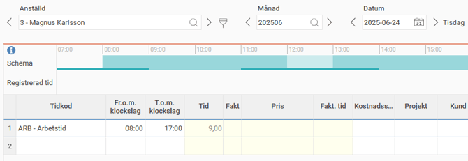
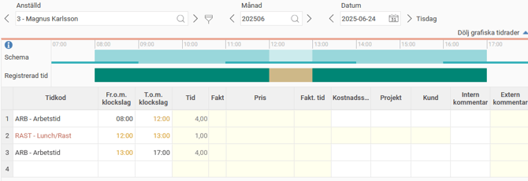
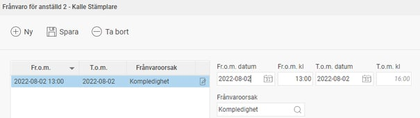
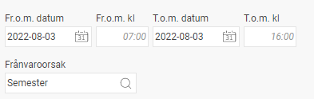
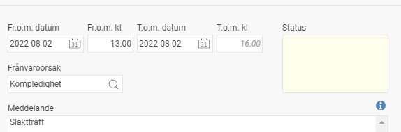
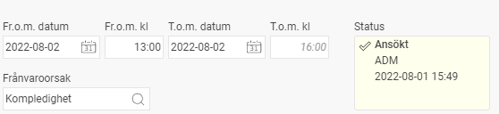
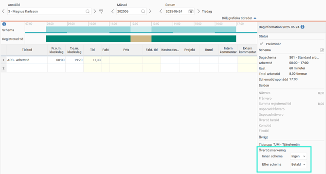
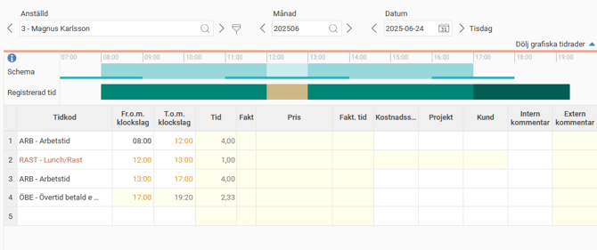

# Dagredovisning - Hur registrerar man närvaro, frånvaro och övertid för en dag?

**Datum:** den 26 september 2025  
**Kategori:** Time  
**Underkategori:** Tidrapportering  
**Typ:** other  
**Svårighetsgrad:** intermediate  
**Tags:** frånvaro, schema, semester, tidkod, tidrapport, övertid  
**Bilder:** 11  
**URL:** https://knowledge.flexhrm.com/sv/dagredovisning-hur-registrerar-man-n%C3%A4rvaro-fr%C3%A5nvaro-och-%C3%B6vertid-f%C3%B6r-en-dag

---

Artikeln innehåller en steg för steg-beskrivning av registrering av tid i tidrapporten för dagredovisning.
Registrera tid i tidrapporten – dagredovisning
Med
dagredovisning
menas att registrering av tid sker med klockslag.
Ett alternativ är
periodredovisning
, där man endast rapporterar antal timmar, inte klockslag.
Läs mer om att registrera tid med periodredovisning.
Registrera närvaro.
Registrera frånvaro.
Registrera övertid.
Registrera närvaro
Ställ markören i fältet Tidkod. Tryck Tab och arbetskoden hämtas automatiskt. Fyll i ankomsttid i Fr.o.m. klockslag och hemgångstid i T.o.m. klockslag.

När du sparar visas registrerad tid och standardrast läggs ut i tidrapporten.

Stämmer inte rastens längd med din rast för dagen går det bra att ändra genom att justera klockslagen för rast. Tänk på att även justera klockslagen för arbetstiden.

Spara.
Registrera frånvaro
Klicka på frånvarohanteraren:

Vid frånvaro del av dag, ange datum och klockslag samt välj frånvaroorsak

Vid heldagar anges endast datum, och systemet föreslår de schematider som gäller:

Möjlighet finns att lämna ett meddelande för att förklara frånvaron:

Spara.
Om frånvaron först måste godkännas kommer den att få status
Ansökt
och gå vidare till din chef. Så snart frånvaron är godkänd kommer den att genereras ut i tidrapporten.

Om frånvaron inte behöver godkännas kommer den att få status
Registrerad
och synas i din tidrapport direkt.

Registrera övertid
Ange arbetad tid. Välj vilken ersättningsform du önskar under Övertidsmarkering i daginformationen.

Övertid faller ut enligt gällande regler när du sparar dagen.

