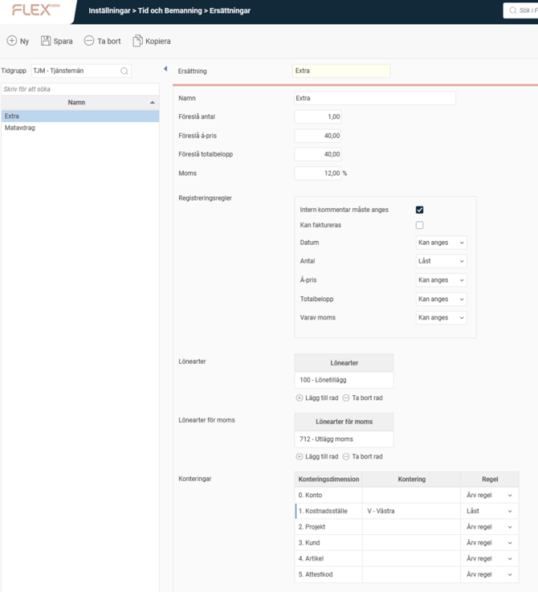
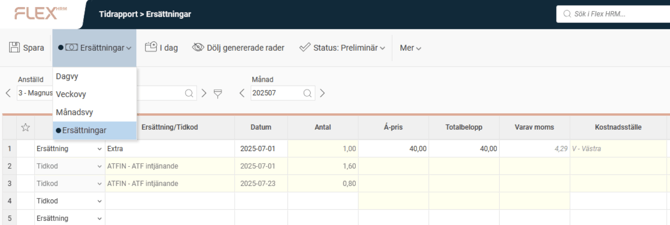

# ⚙️Ersättningar - Hur hanterar man ej timbaserade ersättningar i HRM Time?

**Datum:** den 29 september 2025  
**Kategori:** Time  
**Underkategori:** Mobil & Stämpling  
**Typ:** config  
**Svårighetsgrad:** intermediate  
**Tags:** hrm-time, lön, schema, tidkod, tidrapport  
**Bilder:** 2  
**URL:** https://knowledge.flexhrm.com/sv/ers%C3%A4ttningar-hur-hanterar-man-ej-timbaserade-ers%C3%A4ttningar-i-hrm-time

---

Ersättningar används istället för tidkoder om man vill ha ersättningar med i systemet som inte styrs via timmar. Det kan t.ex. vara utryckningstillägg för snö eller extra tillägg vid sen förändring av schema. Utfallet av händelser hamnar under Ersättningar.

I inställningsvyn för Ersättningar kan du per tidgrupp skapa nya ersättningskoder och göra följande inställningar:
Namn
Föreslå antal/
á-pris/
totalbelopp -
Använd för att värden ska läggas ut vid registrering av ersättningskoden.
Moms -
En procentsats som programmet ska använda för att beräkna moms på aktuell ersättning.
Registreringsregler -
Här kan du bl.a. ange om en intern kommentar måste anges när man använder ersättningskoden, eller t.ex. låsa fältet för antal, om man vill att värdet från
Föreslå antal
ska läggas ut och inte kunna ändras.
Lönearter -
Anges en löneart här överförs ersättningen till lön.
Lönearter för moms -
Den löneart som ska användas för moms på aktuell ersättning.
Konteringar -
Används för att t.ex. ange att ett visst kostnadsställe ska läggas ut när ersättningskoden registreras. Du kan också ange regler, som att fältet ska vara låst så att det föreslagna kostnadsstället inte kan ändras.
Du kan se och registrera ersättningskoder i fliken
Ersättningar
i tidrapporten. Här kan du också registrera tidkoder (om de är inställda på att tillåta registrering i ersättningsvyn) och se ersättningskoder/tidkoder som fallit ut från
Händelser
.

Relaterade artiklar
Hur ställer man in att Ersättningar ska kunna stämplas i HRM Timeclock?
Hur använder man Händelser i HRM Time?
