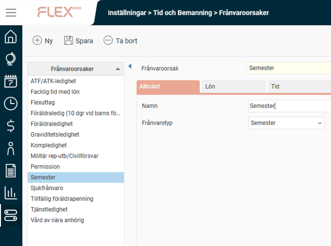
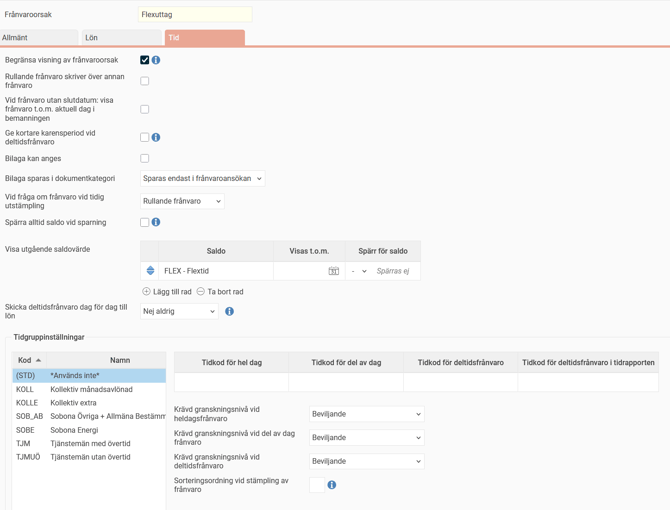

# ⚙️Frånvaroorsaker i tidrapporten - Vad är en frånvaroorsak?

**Datum:** den 6 oktober 2025  
**Kategori:** Time  
**Underkategori:** Frånvaro & Semester  
**Typ:** concept  
**Svårighetsgrad:** beginner  
**Tags:** frånvaro, lön, ob, saldo, schema, semester, stämpling, tidkod  
**Bilder:** 2  
**URL:** https://knowledge.flexhrm.com/sv/fr%C3%A5nvaroorsaker-i-tidrapporten-vad-%C3%A4r-en-fr%C3%A5nvaroorsak

---

Frånvaroorsaker används för att ställa in hur frånvarohantering ska fungera. Inställningarna som kan styras från fliken Tid förklaras nedan.
Frånvaroorsaker används för att ställa in hur frånvarohanteringen ska fungera och vilka tidkoder som ska falla ut i tidrapporten vid frånvaro. Frånvaroorsaker läggs upp per företag, och kan på fliken
Tid
anpassas per tidgrupp.
Viktigt att tänka på:
När du justerar eller lägger upp nya frånvaroorsaker, var noga med att testa flödet från frånvaroregistrering och hela vägen in i lön.
Frånvaroorsaker, fliken Allmänt
Under  fliken
Allmänt
anger du namn och väljer vilken frånvarotyp frånvaroorsaken avser.
För frånvarotyp Föräldraledighet får du också välja om barn ska anges vid frånvaro, och hur barnet ska anges (födelsedatum, personnummer, identifikationsnummer).

Frånvaroorsaker, fliken Tid

I
d
enna flik ställer man in följande inställningar:
Begränsa visning av frånvaroorsak.
Används för att dölja frånvaroorsak i bl. a. Närvarotablå och Kalender. Begränsas visningen visas endast "Frånvaro" istället för t. ex. "Sjukfrånvaro". Det går att ställa in behörighet för att se frånvaroorsaken trots att begränsning används.
Rullande frånvaro skriver över annan frånvaro.
Rullande frånvaro är frånvaro utan slutdatum. I en tidrapport kan det ligga semester 5 juni. Startar en rullande sjukfrånvaro 4 juni gäller den före semestern.
Vid frånvaro utan slutdatum: visa frånvaro t.o.m. aktuell dag i bemanningen.
Rullande frånvaro (frånvaro utan slutdatum) kan vara svårhanterat i bemanningen eftersom du inte vet när den kommer att avslutas. Med denna inställning kan du välja att visa rullande frånvaro endast till dagens datum. Använder du inte inställningen visas rullande frånvaro för alla framtida dagar i bemanningen, tills frånvaron har fått ett slutdatum.
Ge kortare karensperiod vid deltidsfrånvaro.
Används om deltidsfrånvaro ska ge kortare karensperiod på samma sätt som lägre sysselsättningsgrad. Denna inställning har bara effekt om ”Dagar för sjuk-ob” är inställt på ”Endast från karensperiodens slut till dag 14”.
Bilaga kan anges:
Du kan ställa in att bilagor får bifogas i frånvarohanteraren. Det kan t. ex. gälla sjukintyg. Det finns rollinställningar för vem som får se och vem som får ladda upp bilagor. Om företaget har licens för HRM Employee och/eller HRM Payroll kan man också ange att bilagan ska sparas i anställdaregistret.
Vid fråga om frånvaro vid tidig utstämpling.
Om du stämplar ut innan arbetstidens slut/innan flexramens början kan du få en fråga om att ange frånvaroorsak vilket sedan skapar en frånvaro. Denna inställning används för att bestämma om det ska bli frånvaro till dagens slut, en rullande frånvaro som varar till nästa instämpling, eller om användaren själv ska få välja vid utstämplingen.
Visa utgående saldovärde.
Ange de saldon som ska visas i frånvarohanteraren. Vid semesteransökan kan det t. ex. vara bra att se hur många semesterdagar du har kvar.
Visas t. o. m.
Används för saldon som semester där man ofta fyller på dagar 1 april. Gör du en ansökan i mars ser du då inte de dagar som tillkommer i april.
Spärr för saldo.
Används om man inte ska kunna ta ut t. ex. semester när det finns för få dagar i saldot. Har du fem dagar i semestersaldot och spärrar för saldovärde 0 kan du ansöka om sex dagar semester, men ansökan kommer inte att kunna godkännas eftersom saldovärde 0 då skulle understigas.
Frånvaro som inte ska godkännas, utan genereras i tidrapporten direkt, kommer inte att kunna sparas om den orsakar att man går under den satta saldospärren.
Spärra alltid saldo vid sparning.
Används spärr av saldo går det inte att godkänna en frånvaroansökan som skulle orsaka att saldot går under spärren. Bockar du i denna inställning faller spärren in tidigare, då kommer frånvaroansökan inte att kunna sparas.
Skicka deltidsfrånvaro dag för dag till lön.
Deltidsfrånvaro brukar skickas till lön
med datumintervall och omfattning oavs
ett om deltidsfrånvaron är minskad lika mycket varje dag eller intermittent. Med den här inställningen kan man välja om man vill att deltidsfrånvaron ska föras över till lön per dag istället. Om deltidsfrånvaron skickas dag för dag
kommer
frånvarons tid att räknas som differensen mellan antal timmar heltid och deltidsfrånvaroschemats schematid.
"Valbart" innebär att det går att ändra i frånvarohanteraren.
Tidgruppsinställningar
Du ställer in per tidgrupp vilka tidkoder som ska gälla för varje frånvaroorsak. Ange tidkod för heldag, för del av dag och deltidsfrånvaro. Anger du inga tidkoder blir frånvaroorsaken inte valbar i frånvarohanteraren för de anställda som tillhör tidgruppen. Anger du endast tidkod för hel dag kan du inte skapa frånvaro för del av dag.
Tidkod för deltidsfrånvaro i tidrapporten anges om du vill att deltidsfrånvaro ska läggas ut som en tidrad i tidrapporten. Utan denna minskar schematiden, och information om deltidsfrånvaro visas i tidrapportens daginformation och periodinformation.
Du kan även ställa in krävd granskningsnivå per tidgrupp. "Ingen granskning krävs" innebär att frånvaro genereras ut i tidrapporten när den sparas i frånvarohanteraren. Krävs en granskningsnivå skapas en ansökan vid första sparning. Frånvaron läggs ut i tidrapporten först när den är helt granskad.
Genom att ange en siffra för ”Sorteringsordning vid stämpling av frånvaro” kan du per tidgrupp ställa in om en frånvaroorsak ska vara valbar vid stämpling av frånvaro, samt styra i vilken ordning frånvaroorsakerna ska visas vid stämpling.
