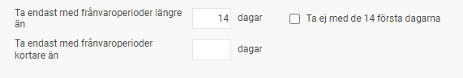
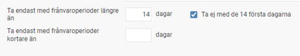
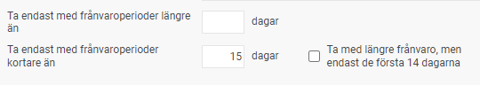
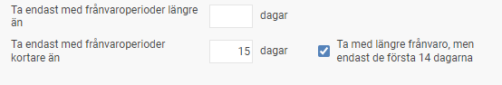
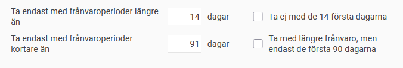

# Frånvarostatistik - Vad betyder Ta endast med frånvaroperioder längre/kortare än?

**Datum:** den 29 augusti 2025  
**Kategori:** Time  
**Underkategori:** Frånvaro & Semester  
**Typ:** concept  
**Svårighetsgrad:** beginner  
**Tags:** frånvaro  
**Bilder:** 5  
**URL:** https://knowledge.flexhrm.com/sv/fr%C3%A5nvarostatistik-vad-betyder-ta-endast-med-fr%C3%A5nvaroperioder-l%C3%A4ngre/kortare-%C3%A4n

---

En förklaring av urvalsmöjligheterna Ta endast med frånvaroperioder längre än och Ta endast med frånvaroperioder kortare än.
Filterera frånvaro baserat på längd
I Flex HRM finns det möjlighet att filtrera bort viss frånvaro från rapporter och statistik baserat på hur länge frånvaron varar. Den här funktionen är särskilt användbar om du till exempel vill exkludera långtidssjukskrivningar från din statistik. På så sätt kan du fokusera på trender för kortare, mer återkommande frånvaro utan att en enstaka lång frånvaro drar upp procenten. Du kan också välja att enbart följa upp långtidssjukskrivningar i ditt företag.
Var kan du använda filtret?
Du kan använda filtret för frånvarolängd på följande ställen i Flex HRM:
Rapporten
Frånvarostatistik
Statistikcentralen
(i frånvarostatistiken)
Exporter via
Exportmall Frånvaro
Dashboards
Så fungerar inställningarna
All frånvaro tas med om du inte anger något i fälten för att ta med frånvaroperioder längre/kortare än.
Endast frånvaro längre än X antal dagar:
Om du ställer in att endast perioder längre än exempelvis fjorton dagar ska tas med, kommer hela frånvaroperioden att räknas in. En frånvaroperiod på trettio dagar kommer alltså att räknas med i sin helhet.

Långa frånvaroperioder men exkludera X antal första dagar:
Om du vill ta med långa frånvaroperioder, men inte räkna de första dagarna, gör du den här inställningen. Om en frånvaroperiod är trettio dagar och du ställer in så att de fjorton första dagarna inte ska räknas med, kommer endast de sista sexton dagarna att räknas in.

Endast frånvaro kortare än X antal dagar:
Denna inställning gör att endast frånvaroperioder kortare än exempelvis femton dagar tas med i ditt urval.

Långa frånvaroperioder men inkludera endast X antal första dagar:
Denna variant tar med längre frånvaroperioder, men bara de första fjorton dagarna av perioden.

Du kan också kombinera inställningarna, till exempel för att enbart inkludera frånvaro som är längre än fjorton dagar men kortare än nittioen dagar.

Återinsjuknande
I företag med basland Sverige räknas en sjukperiod som sammanhängande om en anställd återinsjuknar inom fem dagar. Dagarna när den anställda arbetar räknas inte som sjukdagar.
Bra att veta om exporter
När d
u exporterar frånvaro via en exportmall exporteras varje enskild frånvaropost. Det innebär att varje post kontrolleras mot dina filterinställningar. Om en frånvaropost uppfyller kraven exporteras hela posten, annars inte. Exporter saknar därför valen för att exkludera en del av en frånvaroperiod.
