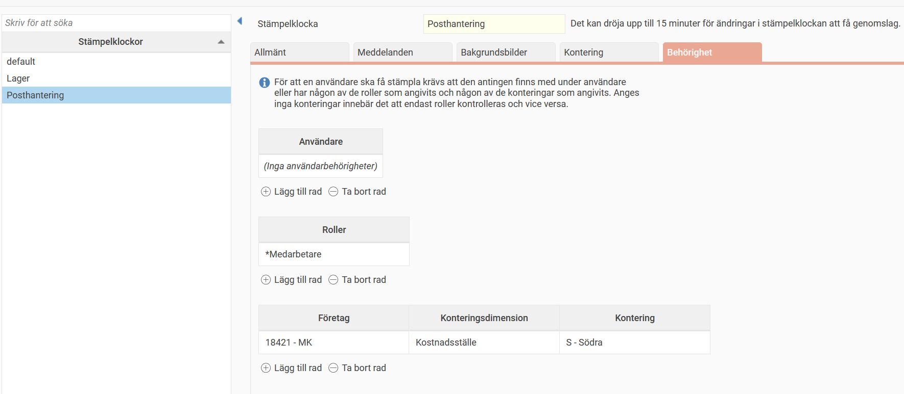

# ⚙️Går det att behörighetsstyra en stämpelklocka?

**Datum:** den 26 september 2025  
**Kategori:** Time  
**Underkategori:** Mobil & Stämpling  
**Typ:** config  
**Svårighetsgrad:** intermediate  
**Tags:** Ingen  
**Bilder:** 1  
**URL:** https://knowledge.flexhrm.com/sv/g%C3%A5r-det-att-beh%C3%B6righetsstyra-en-st%C3%A4mpelklocka

---

Under
Systemregister > Stämpelklockor > Fliken Behörighet
kan du ange vilka som får stämpla på vald stämpelklocka.
Du kan lägga till och ta bort behörigheter genom att klicka på
Lägg till rad
respektive
Ta bort rad
.
Behörigheterna kan anges per
användare, roll
och
kontering
. Standard för alla stämpelklockor är att det är tomt i alla tre tabeller, vilket innebär att alla får stämpla.

Exempel
I bilden ovan har vi ställt in behörigheten för klockan
Posthantering.
Endast användare som har roll
*Medarbetare
samt är kopplade till en anställd med hemkostnadsställe
S
i företag 18421 kan stämpla på denna klocka.
Om en användare som inte uppfyller dessa kriterier stämplar, visas ett meddelande om att behörighet saknas.
