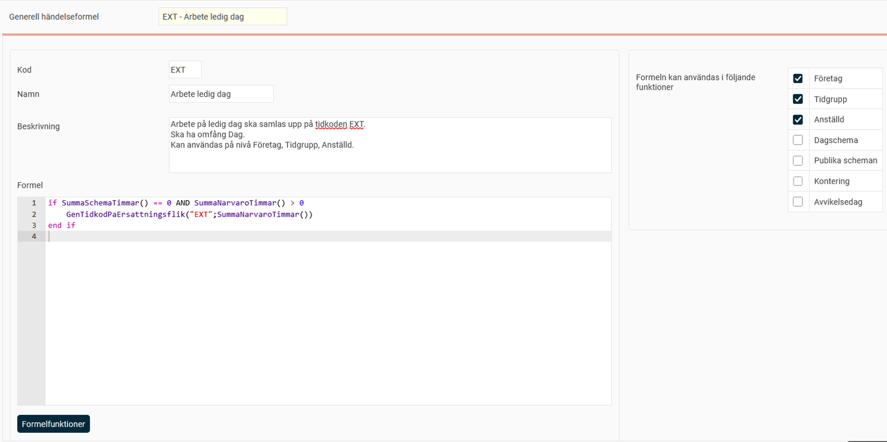

# ⚙️HRM Time: Vad är Generella händelseformler?

**Datum:** den 26 september 2025  
**Kategori:** Time  
**Underkategori:** Tidrapportering  
**Typ:** concept  
**Svårighetsgrad:** advanced  
**Tags:** hrm-time, ob, schema, tidkod, tidrapport  
**Bilder:** 1  
**URL:** https://knowledge.flexhrm.com/sv/hrm-time-vad-%C3%A4r-generella-h%C3%A4ndelseformler

---

Generella händelseformler kan användas för händelser på olika nivåer.
Händelser byggs av formler och används för att utifrån vissa förutsättningar generera tidkoder eller ersättningskoder i tidrapporten på fliken
Ersättningar
. Formler kan skrivas för en enskild händelse, eller så kan du använda dig av
Generella händelseformler
som kan hämtas in till flera händelser.
Observera
Händelser är komplexa. Vi rekommenderar att du tar hjälp av en konsult från Flex Applications för att skriva de formler som behövs om du vill skapa en händelse.
I vyn
Generella händelseformler
kan du skapa händelseformler samt definiera vilka funktioner i HRM Time som ska kunna använda formeln. Vissa formler kan t.ex. vara tänkta att endast använda på specifika avvikelsedagar, eller kunna läggas endast för specifika anställda. Generella händelseformler kan användas på följande nivåer:
Företag.
Tidgrupp.
Anställd.
Dagschema.
Publikt schema.
Kontering.
Avvikelsedag.
Använd fältet
Beskrivning
för att förklara formeln, det underlättar framtida användande.
Knappen
Formelfunktioner
ger en popup som listar de formelfunktioner som finns.

I exemplet ovan finns en generell händelseformel som ska summera tid arbetad på ledig dag på tidkoden “EXT”. Denna formel ska gå att använda på företags-, tidgrupps- och anställdnivå.
Denna formel får inget genomslag så länge den endast finns som generell händelseformel. Det är först när man skapar en händelse som den kan generera tidkoden i tidrapporter.
Relaterat
Formelspråk i Flex HRM.
Hur använder man Händelser i HRM Time?
