# ⚙️Hur aktiverar jag funktionen "Fakturering" i HRM Time?

**Datum:** den 26 september 2025  
**Kategori:** Time  
**Underkategori:** Inställningar  
**Typ:** config  
**Svårighetsgrad:** intermediate  
**Tags:** attestering, hrm-time, mobil, ob, tidrapport  
**Bilder:** 15  
**URL:** https://knowledge.flexhrm.com/sv/hur-anv%C3%A4nds-funktionen-frisl%C3%A4pp-till-fakturering

---

Funktionen “Fakturering” eller “Frisläpp till fakturering” används antingen för att få ut faktureringsunderlag för att fakturera kunder direkt alternativt få ut arbetade timmar per konteringar för uppföljning.
Aktivering  av Fakturering
För att aktivera funktionen kan man här välja om man vill aktivera både Time och/eller Travel. Man väljer de konteringsdimensioner som man vill kunna exportera och fakturera.
Inställningar - Allmänt - Fakturering - Fliken Allmänt
Kolumnen fältnamn / Prioritetsordning
Lägg till de konteringar (kolumnen fältnamn) som man i Time och Travel vill ha med i frisläppet samt kunna prioritera i vilken ordning man letar efter pris. Den styr även vilka konteringar som syns i funktionen “Redigering av fakturaunderlag”
Prioritetsordningen
styr i vilken ordning systemet skall leta efter prissättningen. Systemet letar efter pris i den kontering som ligger på rad 1 därefter kontering på rad 2 osv
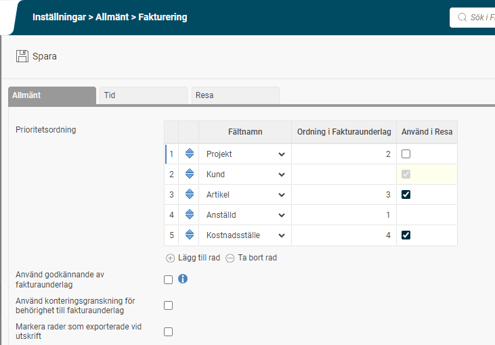
Kolumnen “Ordning i Fakturaunderlag”
Styr enbart hur man vill gruppera Rapportutskriften under funktionen “Frisläpp till fakturering”
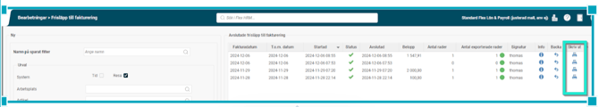
Kolumnen “Använd i Resa”
Aktivera de konteringar som ska användas i Travel.
Artikel är mest vanlig att använda för prissättning. För export till Fortnox är den obligatorisk.
Använd godkännande av fakturaunderlag
Om man önskar ett godkännande av frisläppta rader innan  man exporterar.
Se mer under avsnitt “Redigering och godkännande av fakturaunderlag”
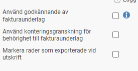
Använd konteringsgransning för behörighet till fakturaunderlag
Om man vill styra behörigheten till att endast granskningsansvariga på projekten ska kunna redigera och godkänna.
Se mer under avsnitt “Redigering och godkännande av fakturaunderlag”

Markera rader som exporterade vid utskrift
Om man inte tar ut exportfiler utan endast vill ha ut rapportutskrifter på fakturaunderlagen så kan man aktivera detta alternativ för att exporter skall markeras med en “grön” ikon
Om man exporterar fakturaunderlagen som en fil så blir det grön ikon med automatik efter att filexporten är utförd
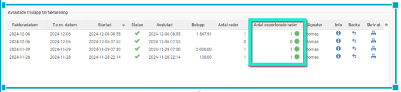
Fält i redigering av Fakturaunderlag
Vilka konteringar som är valbara styrs av vilka konteringar man aktiverat
Se avsnitt nedan “Redigering och godkännande av fakturaunderlag”
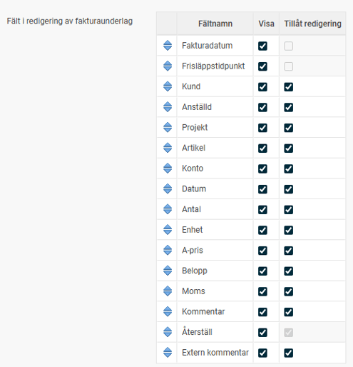
Inställningar - Allmänt - Fakturering - Fliken Tid
Använd fakturering
i tid måste aktiveras för att funktionen skall aktiveras i Time.
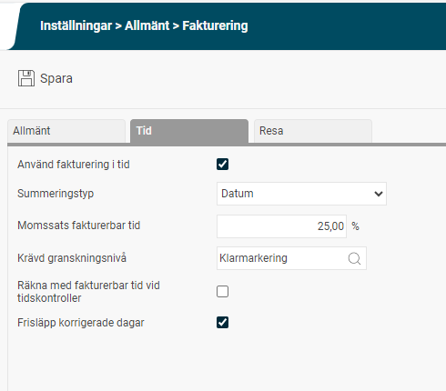
Summeringstyp
Det finns 4 val av hur man vill summera sina frisläppta timmar.
Per “Rad” betyder att summering sker per tidrad (kan alltså vara flera rader under samma dag)
Per datum innebär att rader under samma datum slås ihop så länge pris och kontering är densamma
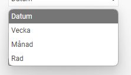
Momssats fakturerbar tid
Används endast om man önskar vidarefakturerar frisläppta timmar direkt till kund. Om man inte direktfakturerar kund anger man 0 %
Krävd granskningsnivå
Ange vilken granskningsnivå (Klar, projektattest, attest) som krävs för att en tidrad skall “frisläppas”. En frisläppt rad kan aldrig frisläppas på nytt (om man inte använder funktionen korrigering av fakturaunderlag)
Räkna med fakturerbar tid vid tidskontroller
Om man aktiverar denna funktion så kommer kontrollen ske mot antal “fakturerade timmar” av budget istället för mot “faktiskt arbetade” timmar.
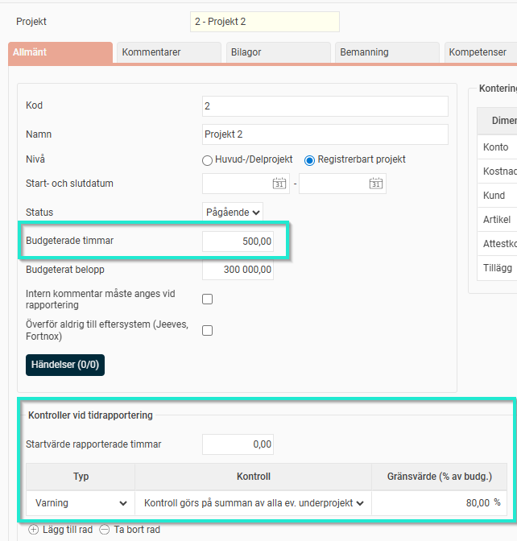
På konteringen som har “Utökat projekt” kan man använda en funktion med varning/registreringsstopp i samband med beloppstak/gränser.
Varning = man får en varning men man kan ändå spara
Registreringsstopp = Man kan inte spara registreringen om man överskrider antal registrede timmar
Frisläpp korrigerade dagar
Med denna inställning kan du styra huruvida tider på dagar som korrigerats i tidrapporten ska frisläppas eller inte. Väljer ni att inte ha inställningen markerad innebär detta att tidrader på en dag som har blivit korrigerad inte kommer att frisläppas på nytt. Detsamma gäller ersättningsrader, det vill säga om dagen som ersättningen ligger på blivit korrigerad så kommer ersättningsrader från den dagen inte att tas med i frisläppet om denna inställning är avmarkerad.
Faktureringslogik per tidrad.
Under de konteringar man valt skall ingå i Faktureringen så aktiveras olika val man kan ställa in per kontering enligt exempel från Produktregistret nedan:
Kan faktureras - föreslå nej
Kan faktureras - föreslå ja
Ja - alltid
Nej - aldrig
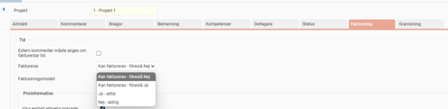
Logiken om man har olika inställningar på olika konteringsdimensioner är enligt följande:
Steg 1 är det som gäller först och gäller inte den så är det steg 2 osv.
Om inga konteringar finns så fakturerar vi aldrig.
Om det finns någon kontering som har ”Nej Aldrig” så ska vi aldrig fakturera.
Finns någon som har ”Ja Alltid” så fakturerar vi alltid.
Finns det någon med ”Ja” så tar vi den.
Stämmer inget av ovanstående in så blir det ”Nej”.
För att kunna frisläppa måste både kund och fakturabocken finnas med. Så i exemplet nedan så har man på rad 2 kund 1 men man har inget pris eller fakturabock vilket innebär att denna rad ej kommer att frisläppas. Om man valt exempelvis “Kan faktureras - föreslå nej” så är det valbart att bocka i manuellt om man trots allt vill fakturera. samma princip om man valt “Kan faktureras - föreslå ja” så kan man ta bort fakturabocken
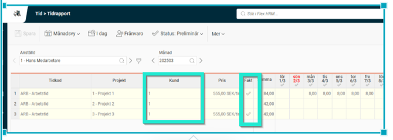
Redigering av fakturaunderlag
Fakturaunderlag kan redigeras och godkännas i HRM innan det förs över till ditt ekonomisystem.
Aktivera “Redigering av fakturaunderlag”
Under Administration – Allmänt – Roller ställer du in vilka roller som ska ha behörighet till vyn “Redigering av fakturaunderlag” som ligger under Bearbetningar.
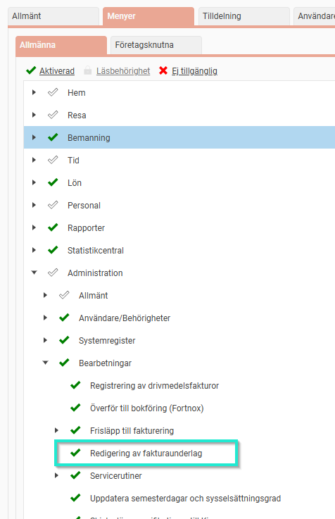
Godkännande av fakturaunderlag
Aktivera “Godkännande av fakturaunderlag”
Under Administration – Inställningar – Allmänt – Fakturering kan du välja om du vill använda godkännande av fakturaunderlag. Det innebär att t.ex. en projektledare eller kundansvarig kan godkänna fakturaunderlagsraderna innan de exporteras till ekonomisystemet. Behörighet krävs till menyn “Redigering av fakturaunderlag”
Inställningar - Allmänt - Fakturering

“Redigering och godkännande av fakturaunderlag”
Vyn Redigering och godkännande av fakturaunderlag ser ut såhär:
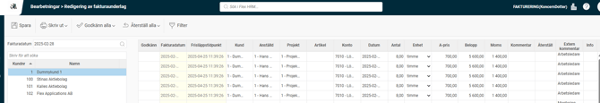
Här visas alla de rader i fakturaunderlaget som blivit frisläppta per fakturadatum och kund. Du kan göra eventuella korrigeringar och godkänna raderna (om den funktionen används).
Kolumner som visas i vyn
Vilka kolumner som ska visas i redigeringsvyn och ordningen på dem ställer du in under Administration – Inställningar – Allmänt – Fakturering.
Återställ en redigering
Du kan även återställa alla rader till sitt ursprung om du vill.
Kommentar till redigeringen
Det finns också möjlighet att skriva en kommentar till din redigering.
Godkänna fakturarader
Det finns funktioner för att skriva ut fakturaunderlaget och godkänna alla. Om du ångrar dig med en redigering kan du återställa den raden till sitt ursprung.
Behörigheter för att godkänna
Där kan du också ställa in om du vill att behörigheterna ska gå enligt konteringsgranskning (ofta kallat delattest). Det innebär att en användare som t.ex. är behörig att delattestera Projekt A enbart kommer att få upp fakturarader på Projekt A. Annars används vanliga behörigheter till anställda. Om en användare har en roll som ger tillgång till redigeringsvyn på Avdelning 1 kommer alla fakturarader från anställda i Avdelning 1 att visas.
Info om vem som godkänt/redigerat en rad
Under kolumnen info visas information om vem som godkänt raden och när. Är raden redigerad kan du även där se de ursprungliga värdena.
Påminnelser om att “godkänna fakturaunderlag”
Det finns en möjlighet att få en påminnelse om att godkänna fakturaunderlag. Likt andra påminnelser ställer du in det under Administration – Inställningar – Allmänt – Påminnelser.
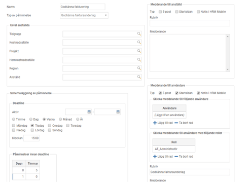
I bilden ovan är det inställt att deadline för att godkänna fakturaunderlag är på tisdagar kl. 15:00. Det kommer att skickas ut en påminnelse 1 dygn innan samt 5 timmar innan deadline till de användare som har fakturaunderlagsrader kvar att godkänna.
Påminnelsen kan likt andra påminnelser (som t.ex. attestering av reseräkningar eller tidrapporter) skickas via epost, som notis i HRM Mobile samt visas på startsidan i HRM.
Tips! Om du vill läsa mer om Fakturering
Klicka här
