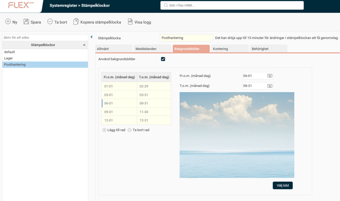
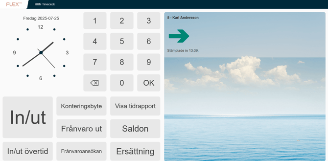

# ⚙️Hur ändrar jag bakgrundsbild i stämpelklockan?

**Datum:** den 26 september 2025  
**Kategori:** Time  
**Underkategori:** Mobil & Stämpling  
**Typ:** config  
**Svårighetsgrad:** intermediate  
**Tags:** Ingen  
**Bilder:** 2  
**URL:** https://knowledge.flexhrm.com/sv/hur-%C3%A4ndrar-jag-bakgrundsbild-i-st%C3%A4mpelklockan

---

Under
Systemregister > Stämpelklockor > Bakgrundsbilder
kan du markera en klocka och bocka i
Använd bakgrundsbilder
.
När du har gjort det kommer det automatiskt att läggas upp en bild per årstid; en vinterbild för perioden december – februari, en vårbild för perioden mars – maj, en sommarbild för perioden juni – augusti och en höstbild för perioden september – november. Dessa datum kan du själv justera om du vill. Du kan också välja att lägga till någon av de andra bilderna som finns tillgängliga.

I HRM Timeclock kommer aktuell bakgrundsbild att visas som bakgrund i högerdelen av stämpelklockan.

