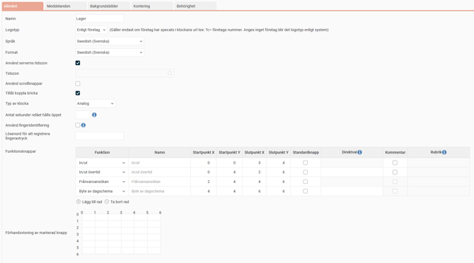
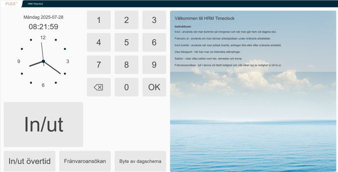
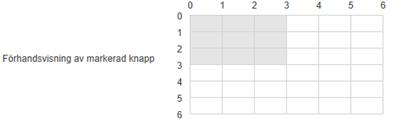
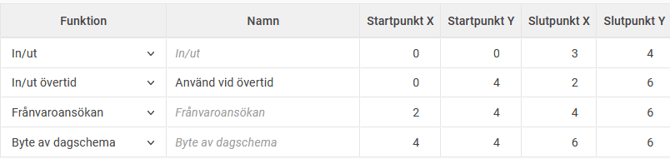
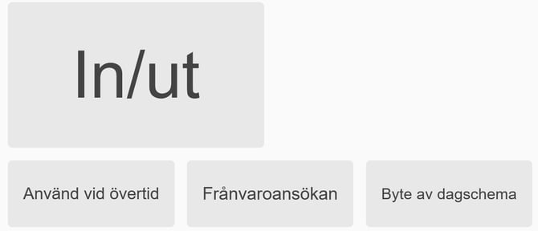

# ⚙️Hur ändrar jag knapparna i stämpelklockan?

**Datum:** den 26 september 2025  
**Kategori:** Time  
**Underkategori:** Mobil & Stämpling  
**Typ:** config  
**Svårighetsgrad:** intermediate  
**Tags:** mobil, ob, stämpling  
**Bilder:** 5  
**URL:** https://knowledge.flexhrm.com/sv/hur-%C3%A4ndrar-jag-knapparna-i-st%C3%A4mpelklockan

---

Under
Systemregister > Stämpelklockor
kan man skapa och redigera stämpelklockornas utseende och funktion.

Namn
Här ger du stämpelklockan ett namn.
Logotyp
Här finns möjlighet att få med ditt företags logotyp längst uppe till vänster i klockan. Det gör du genom att välja något av alternativen
Enligt system
eller
Enligt företag
.
Språk, Format
Här väljer du vilket språk den aktuella stämpelklockan ska ha. Tillgängliga språk förutom svenska är engelska, norska, danska och finska. Du kan också välja format, vilket då anpassar formatet som datum och klockslag visas i till det valda landets standardformat.
Tidszon
Som standard hämtar HRM Timeclock tiden från servern där systemet är installerat, men du kan välja en annan tidszon genom att markera önskat alternativ i urvalsmenyn. Alla stämplingar på aktuell klocka kommer då att bli enligt tiden i den valda tidszonen.
Mer info angående tidszoner
När du stämplar i Flex HRM Mobile kommer klockan att utgå från serverns tid men justera dem med skillnaden mellan serverns tidszon och telefonens tidszoninställning. Närvarotablån (både i HRM och i Timeclock) samt Mina kollegor i Mobile som visar anställdas aktuella status kommer att ta hänsyn till vilken tidszon de stämplat i.
Använd scrollknappar
Om du kör Flex HRM Timeclock i en enhet som saknar möjlighet att scrolla genom att dra fingret på skärmen (t.ex. Timespot 37) finns möjligheten att välja om scrollknappar ska visas. För att aktivera dem markerar du denna inställning.
Tillåt koppla bricka
Markera denna inställning för att aktivera möjligheten att på användarnivå kunna koppla en bricka för in-/utstämpling till aktuell stämpelklocka.
Typ av klocka
Här finns möjlighet att välja om klockan ska visas digital, analog eller både och. Om du inte gör något val här kommer klockan att vara digital.
HRM Timeclock med digital och analog klocka:

Använd fingeridentifiering, Lösenord för att registrera fingeravtryck
Om företaget använder fingeravtrycksläsare finns här möjlighet att låta användarna använda fingeravtryck vid stämpling på terminal. Du kan även välja om ett lösenord ska krävas för att registrera ett nytt fingeravtryck på terminalen om du t.ex. vill att en administratör eller liknande ska medverka när ett nytt fingeravtryck registreras. Därefter behöver du även lägga till en knapp för att registrera fingeravtryck, vilket görs under
Funktionsknappar
(se nedan).
Observera att det endast går att koppla fingeravtryck till numeriska användar-ID:n.
Funktionsknappar
Under
Funktionsknappar
anger du vilka knappar som ska visas i klockan, vilken text som ska stå på knapparna samt knapparnas storlek och position. Du kan även välja vilken knapp som ska vara standardknapp, det vill säga vilken knapp som ska visas när du bara visar brickan utan att välja någon funktionsknapp. Knapparnas storlek och position ställs in genom att ange X- och Y-koordinater för start- och slutpunkten. Accepterade värden är sifforna 0-6. Man kan tänka sig ett rutnät där positionen längst upp till vänster är 0,0 och positionen längst ned till höger är 6,6.
För att underlätta att skapa nya eller ändra knapplayouten i befintliga stämpelklockor finns en förhandsvisning som visar var den markerade knappen kommer att visas enligt de inställningar du gjort. Ytan på stämpelklockan där funktionsknapparna ligger innehåller ett rutnät 6x6 rutor där du kan välja vilka rutor varje funktionsknapp ska täcka.

Nedan ser du ett exempel på inställning av knapplayouten och resultatet i stämpelklockan:

