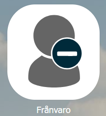
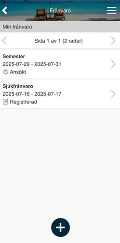
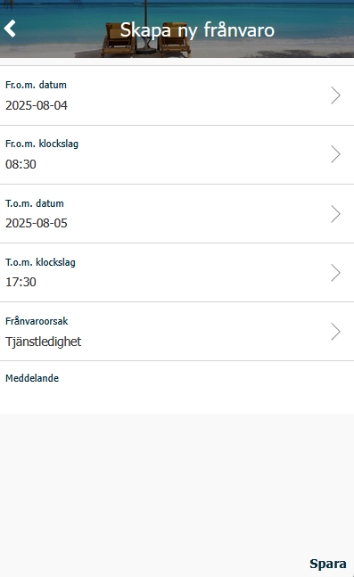
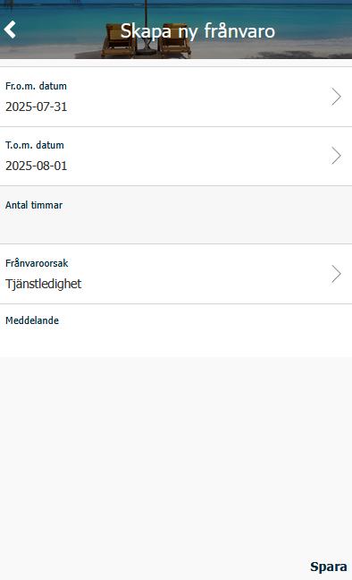

# Hur ansöker och rapporterar jag frånvaro i HRM Mobile?

**Datum:** den 8 januari 2026  
**Kategori:** Time  
**Underkategori:** Mobil & Stämpling  
**Typ:** howto  
**Svårighetsgrad:** intermediate  
**Tags:** frånvaro, mobil, ob, tidrapport  
**Bilder:** 4  
**URL:** https://knowledge.flexhrm.com/sv/fr%C3%A5nvaro-hur-ans%C3%B6ker-och-rapporterar-jag-fr%C3%A5nvaro

---

Frånvaro i HRM Mobile
I funktionen
Frånvaro
ser du all din registrerade och ansökta frånvaro och du kan ansöka om frånvaro samt rapportera tidigare frånvaro.

Registrera en ny frånvaro (dagredovisare):
Klicka på plustecknet.
Ange startdatum och klockslag (om föreslaget klockslag inte stämmer).
Ange slutdatum och klockslag.
Välj frånvaroorsak.
Lämna eventuellt meddelande.
Spara.

Registrera en ny frånvaro (periodredovisare):
Klicka på plustecknet.
Ange startdatum.
Ange slutdatum.
Ange antal timmar (endast om start- och slutdatum är samma dag).
Välj frånvaroorsak.
Lämna eventuellt meddelande.
Spara.

Om frånvaron först måste godkännas kommer den att få status
Ansökt
och gå vidare till din chef. Så snart frånvaron är godkänd kommer den att genereras ut i tidrapporten.
Om frånvaron inte behöver
godkä
nnas kommer den att få status
Registrerad
och synas i din tidrapport direkt.
