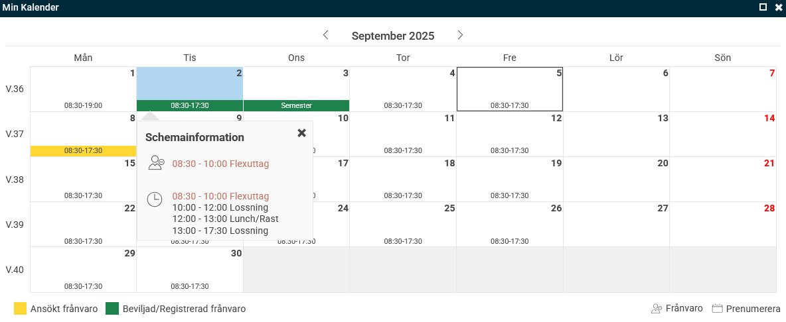

# Hur använder jag Min kalender på startsidan?

**Datum:** den 5 september 2025  
**Kategori:** Time  
**Underkategori:** Frånvaro & Semester  
**Typ:** howto  
**Svårighetsgrad:** intermediate  
**Tags:** frånvaro, schema  
**Bilder:** 1  
**URL:** https://knowledge.flexhrm.com/sv/hur-anv%C3%A4nder-jag-min-kalender-p%C3%A5-startsidan

---

På startsidan ser du en panel som heter Min kalender. Här får du en snabb överblick över din arbetstid och eventuell frånvaro.

Se detaljer i kalendern
Du kan klicka på en dag för att se mer information i en tooltip. Detaljerna som visas beror på hur du rapporterar tid i systemet:
Om du dagredovisar
ser du klockslag för din arbetstid, frånvaro och dina raster.
Om du periodredovisar
ser du antalet timmar för dagen, inte klockslagen.
Om ditt företag använder HRM Plan
och schemalägger på en kontering kan du se detaljer om dina arbetspass.
Ansök om frånvaro
Du kan ansöka om frånvaro direkt från kalendern.
Klicka på
Frånvaro
längst ner till höger i panelen.
Du kan också dra och släppa för att markera de datum du vill ansöka om frånvaro för. Frånvarohanteraren öppnas då med datumen ifyllda.
Prenumerera på ditt schema
Om ditt företag använder funktionen
Prenumerera på schema
kan du lägga till ditt schema i din vanliga kalenderapplikation (Google, iPhone, MacOS eller Outlook).
Klicka på
Prenumerera
längst ner till höger. Då får du en länk som du kan använda för att prenumerera på schemat.
