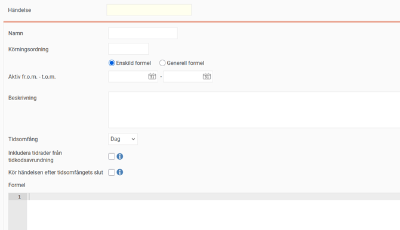
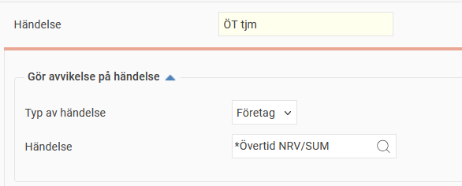
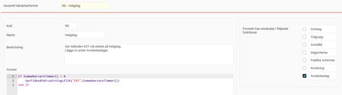
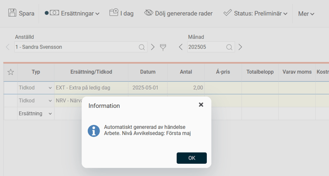

# ⚙️Hur använder man Händelser i HRM Time?

**Datum:** den 26 september 2025  
**Kategori:** Time  
**Underkategori:** Saldon & Beräkning  
**Typ:** config  
**Svårighetsgrad:** advanced  
**Tags:** hrm-time, ob, saldo, schema, tidkod, tidrapport, övertid  
**Bilder:** 4  
**URL:** https://knowledge.flexhrm.com/sv/hur-anv%C3%A4nder-man-h%C3%A4ndelser-i-hrm-time

---

Generell information om att skapa händelser i HRM Time.
Inställningar, behörighet, avvikelse på händelse, exempel.
Popup Händelser
Behörighet
Gör avvikelse på händelse
Exempel
Händelser byggs av formler och används för att generera tidkoder eller ersättningskoder. Resultatet visas i tidrapporten på fliken
Ersättningar
.
Händelser kan användas till många saker, det kan handla om att man ska få extra ersättning vid arbete på en röd dag, summera tid som arbetas mer än ordinarie sysselsättningsgrad och mycket annat.
Händelser kan användas på olika nivåer:
Företag.
Tidgrupp.
Anställd.
Dagschema.
Publikt schema.
Kontering.
Avvikelsedag.
Formler kan skrivas för en enskild händelse, eller så kan man använda sig av
Generella händelseformler
som kan hämtas in till flera händelser.
Observera
Händelser är komplexa. Vi rekommenderar att du tar hjälp av en konsult från Flex Applications för att skriva de formler som behövs om du vill skapa en händelse.
Popup Händelser
För att skapa en händelse som ska gälla för ett helt företag går du in under
Inställningar > Tid och Bemanning > Tidrapporter,
knappen
Händelser
. För att skapa en händelse som ska gälla en tidgrupp använder du knappen
Händelser
i tidgruppens inställningar osv.

En förklaring av inställningarna i popupen
Händelser
följer nedan:
Körningsordning
Här kan du styra i vilken ordning respektive händelse ska köras. Det kan vara användbart i de fall man har händelser som genererar en tidkod som i sin tur påverkar ett saldo. Händelser med körningsordning 1 kommer att köras först, sen de med 2 osv. Sist körs de händelser som inte har någon specificerad körningsordning.
Enskild formel/Generell formel.
Valet
Enskild
ger dig möjlighet att skriva en egen formel. Valet
Generell
gör att du kan välja bland de formler som lagts in under
Generella händelseformler
, inställda på att få användas på den nivå händelsen skapas.
Du kan välja
Generell formel
för att hämta upp en formel som skapats på generell nivå och sedan ändra tillbaka till
Enskild formel
. Då ligger själva formeln kvar men du kan redigera den om du skulle behöva göra det.
Aktiv fr.o.m. – t.o.m.
Ange när händelsen ska gälla. Lämna fälten tomma om det inte ska vara någon tidsbegränsad händelse.
Beskrivning
Beskr
iv vad händelsen gör. Det underlättar ofta att ha en detaljerad beskrivning för händelser.
Tidsomfång
V
älj hur ofta beräkningen och genereringen till
Ersättningar
ska göras. Väljer du till exempel vecka kommer ersättningen att genereras varje vecka.
Inkludera tidrader från tidkodsavrundning
B
ocka i denna om du vill att beräkningen ska ta med tid från tidkosavrundning.
Exempel:
I tidrapporten finns 50 minuter övertid. En tidkodsavrundning gör att denna övertid avrundas till en timme. En händelse har en beräkning som tar med denna tid, den kan räkna med 50 eller 60 minuter beroende på denna inställning.
Kör händelsen efter tidsomfångets slut
Används om händelsen ska beräknas först när sista dagen i perioden som valts som tidsomfång har passerats, eller när hela den perioden blivit granskad.
Användbart för händelser som beräknas per månad, t.ex. ATF-intjänande, om det blir missvisande att den visar resultat innan hela månaden passerat.
Formel
Om
Generell formel
är markerad visas här den formel som valts. Om
Enskild formel
används ska formeln skrivas här. Under knappen
Formelfunktioner
finns de funktioner du kan använda.
Behörighet
För att skapa och redigera händelser räcker det inte att ha behörighet till vyn där händelsen finns. Man måste också vara
Behörig att redigera händelser & saldo tak/golv
(
Användare/Behörigheter > Roller
, fliken
Allmänt
).
Gör avvikelse på händelse
Du kanske har skapat en händelse för hela företaget, men vill att någon tidgrupp ska använda händelsen annorlunda. Då kan du använda
Gör avvikelse på händelse
.
Öppna knappen
Händelser
i tidgruppens inställningar. Fäll ut inställningen för att göra avvikelse och välj den händelse du vill avvika från. Den händelse som är upplagd för företaget kommer då inte längre att gälla just denna tidgrupp. Där gäller istället den händelse du nu skapat.

Bilden ovar visar att händelsen "ÖT tjm" ska gälla istället för företagets händelse "*Övertid NRV/SUM". Detta går att göra även på andra nivåer, t.ex. om en specifik anställd ska avvika från tidgruppens händelse.
Exempel
Ett företag vill ställa in att om man arbetar på vissa helgdagar ska en extra ersättning utbetalas.
För att lösa detta skapar vi en ny tidkod för ersättningen (EXT).
Vi skapar en generell händelseformel som säger att om närvarotid finns ska tidkoden EXT falla ut med samma värde som närvarotiden. Vi anger att formeln får användas på avvikelsedagar.

I inställningarna för avvikelsedagar har varje rad knappen
Händelser.
Vi använder formeln på de dagar som ska generera EXT vid arbete, bland annat avvikelsedagen för första maj.
Anställd 1 arbetar två timmar den första maj, vilket gör att tidkoden EXT läggs ut på fliken
Ersättningar
i hennes tidrapport.

Relaterat
Formelspråk i Flex HRM.
HRM Time: Vad är generella händelseformler?
