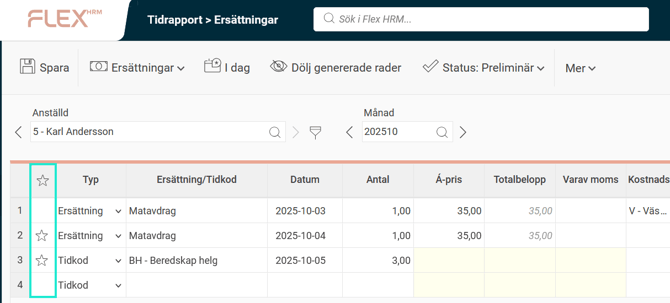

# Hur används Favoriter i Ersättningar?

**Datum:** den 18 augusti 2025  
**Kategori:** Time  
**Underkategori:** Tidrapportering  
**Typ:** howto  
**Svårighetsgrad:** intermediate  
**Tags:** mobil, ob, tidkod, tidrapport  
**Bilder:** 1  
**URL:** https://knowledge.flexhrm.com/sv/hur-anv%C3%A4nds-favoriter-i-ers%C3%A4ttningar

---

Du kan använda
Favoriter
i ersättningsvyn för att underlätta inmatning av ersättningsrader som du ofta registrerar.
Att favoritmarkera en rad i ersättningar i tidrapporten innebär att den visas i varje ny period med ersättningskod/tidkod, konteringar, faktureringsstatus och extern kommentar förifyllda, så att du enbart behöver fylla i datum och antal (beroende på hur ersättningen är inställd).

För att göra en rad till favorit klickar du i kolumnen med stjärnan. Om du inte längre vill ha en rad som favorit klickar du bara bort stjärnan.
Alla favoritrader som hamnar i en ny period markeras med en * på radnumret. När du lagt in något på raden, t.ex. antal eller datum så kommer den att sparas och * försvinner.
Motsvarande funktionalitet med favoriter finns även när du registrerar ersättningar i HRM Mobile.
