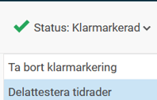

# Hur arbetar man med delattestering i HRM Time?

**Datum:** den 25 augusti 2025  
**Kategori:** Time  
**Underkategori:** Attestering & Granskning  
**Typ:** howto  
**Svårighetsgrad:** intermediate  
**Tags:** attestering, hrm-time, ob, tidrapport  
**Bilder:** 3  
**URL:** https://knowledge.flexhrm.com/sv/hur-arbetar-man-med-delattestering-i-hrm-time

---

Granskning per tidrad i tidrapport och i granskningsvy.
Delattestering är att granska per tidrad. Ofta klarmarkerar anställda sin tidrapport per dag, en chef granskar tidrader konterade med de projekt denne är ansvarig för och en annan chef attesterar tidrapporten för hela månaden.
Observera
Granskning per tidrad kallas ofta delattestering, och baseras ofta på tidradernas projekt men det är inställningsbart.
Vi använder benämningen delattestering i artikeln, och vi utgår från tidrader med projekt. I ert system kan ni använda delattest på en annan konteringsnivå än projekt (kostnadsställe, kund etc.).
Delattestering i tidrapport
Det går att delattestera direkt i tidrapporten under status. Du delattesterar då tidrader för en dag eller för en period (om du är i månadsvyn eller veckovyn).

Det går att delattestera per rad i tidrapporten i avsedd kolumn.

Delattestering i granskningsvy
I delattesteringsvyn får du en översikt över alla rader som du är behörig till och som är redo att delattesteras. Du kan klicka på plustecknet för att få se detaljer om varje rad.

Du kan använda filtret för att göra urval på projekt, bestämma om du ska gruppera på projekt eller på anställda, visa endast delattesterade/ej delattesterade. Är du behörig att granska rader som saknar projekt kan du ställa in att dessa ska visas.
För att rader ska visas i delattesteringsvyn måste de vara granskade på den nivå som krävs för delattestering (ofta klarmarkering).
