# Hur attesterar man en tidrapport?

**Datum:** den 14 november 2025  
**Kategori:** Time  
**Underkategori:** Tidrapportering  
**Typ:** howto  
**Svårighetsgrad:** intermediate  
**Tags:** attestering, frånvaro, lön, ob, saldo, schema, tidkod, tidrapport  
**Bilder:** 12  
**URL:** https://knowledge.flexhrm.com/sv/attestera-tidrapporter-hur-attesterar-man-en-tidrapport

---

Artikeln beskriver hur du attesterar tidrapporter och hur du grupperar tidrapporter i granskningsvyn.
Attestera tidrapporter
Gruppering i granskningsvy per dag
Attestera tidrapporter
Attestering av tidrapport kan ske direkt i registreringsvyn med valet
Attestera dagar
under
Status
.
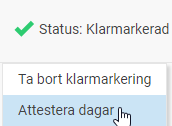
eller via översiktsvyn som nås via menyn
Attestering
:
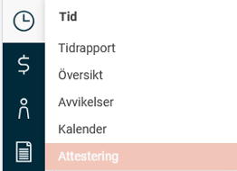
Observera
Vi använder här begreppet
Klarmarkering
för att en anställd granskar sin tidrapport och
Attestering
för att en chef granskar tidrapporter. Det kan heta något annat hos er.
Till vänster i översiktsvyn
Attestering av tidrapporter
listas alla tidrapporter som stämmer överens med urvalet i filtret, valt datumintervall och den inloggade användarens behörighet.
Klicka på en rad för att se detaljposterna till höger i vyn.
Den högra delen består av två flikar, en för att snabbt få överblick över hela tidrapporten och en för eventuella poster under
Ersättningar
.
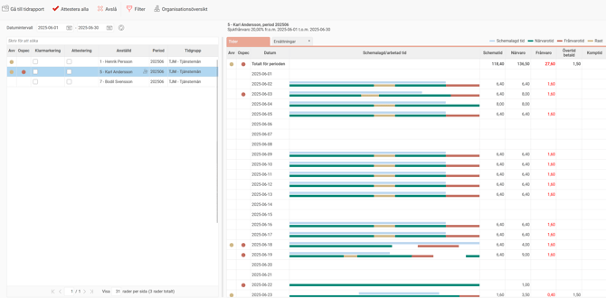
Högst upp visas information om avvikelser, ospecificerad tid och saldon för hela perioden.
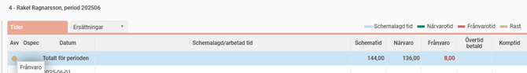
För varje dag visas information på samma vis som för hela perioden plus detaljer kring hur den rapporterade tiden ser ut.
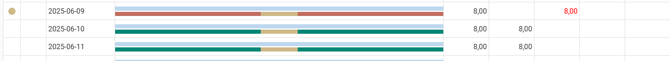
Håll muspekaren över en post för att få mer information om:
Närvaro och hur den är konterad. Samtliga kolumner, förutom kommentarer, som visas i tidrapporten visas även här för att ge mesta möjliga information.
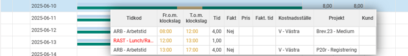
Frånvaro:
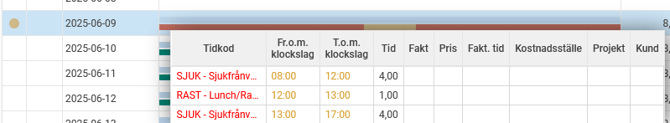
Schematid:
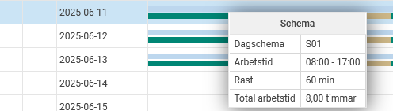
Finns det poster under
Ersättningar
indikeras detta med tecknet
*
. Det finns en kryssruta som styr om automatiskt genererade rader ska synas eller inte.
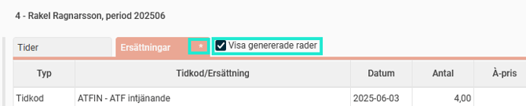
Attestera tidrapporten genom att klicka i
Attestering
i listan till vänster. Din signatur syns då, och tidrapporten är redo att överföras till lön. Den blå informationsikonen ger en popup med information om vilka användare som kan attestera vald anställd.
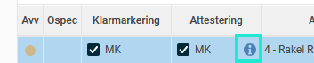
Du kan också välja att attestera alla tidrapporter i listan via knappen
Attestera alla
.
Alla tidrapporter på inladdad sida attesteras då. Om någon tidrapport inte kan attesteras kan du se anledningen till det i en logg.
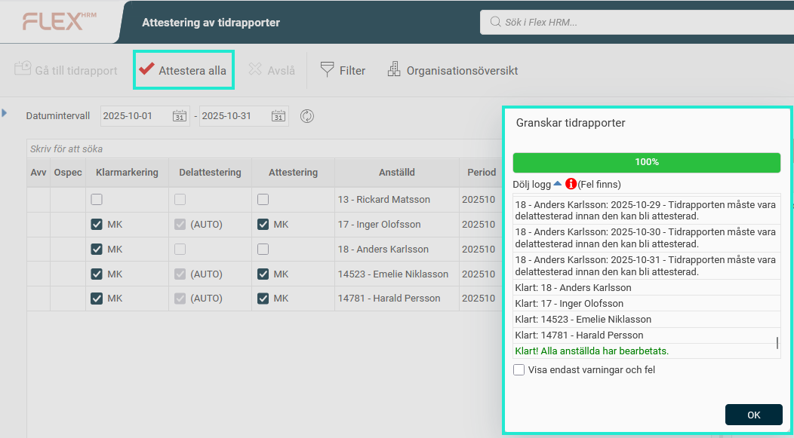
Gruppering i granskningsvy per dag
Ibland vill man attestera tidrapporter per vecka, t.ex. för att kunna fakturera veckovis. Samtidigt görs överföring till lön per månad. Det Flex HRM möjliggör är att du kan ställa in att attestering sker per dag, men att du i attestvyn kan gruppera per vecka och ändå få den veckovisa attesteringen smidig. Samtidigt finns möjligheten att när en månad slutar med en måndag bara attestera måndagen för att få månaden helt attesterad utan att behöva vänta tills veckan är slut.
Attesterar man per dag finns ett val för gruppering i vyn Attestering av tidrapporter. Där kan man välja att gruppera per vecka, och fälla ut rader för att få information om enskilda dagar.
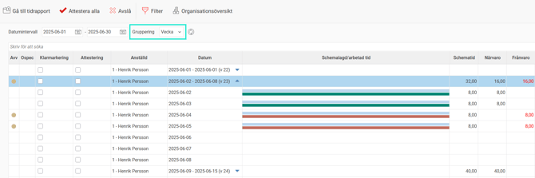
