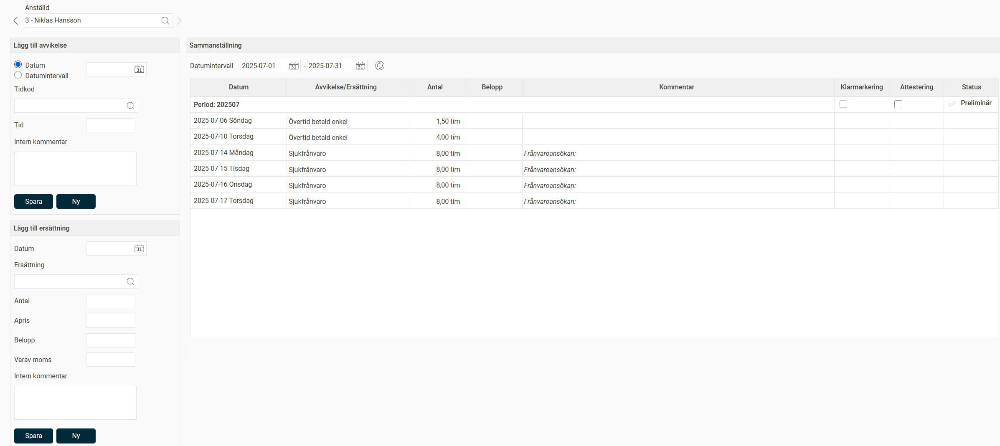

# Hur fungerar avvikelserapportering?

**Datum:** den 18 augusti 2025  
**Kategori:** Time  
**Underkategori:** Övertid & Ersättning  
**Typ:** howto  
**Svårighetsgrad:** intermediate  
**Tags:** frånvaro, ob, schema, tidrapport, övertid  
**Bilder:** 1  
**URL:** https://knowledge.flexhrm.com/sv/hur-fungerar-avvikelserapportering

---

Avvikelserapportering är en enklare typ av tidrapportering, där den anställde endast matar in avvikelser från sitt normala schema. Vid avvikelserapportering visas inte normal arbetstid i tidrapporten.
Tips
Vill du se all tid kan du istället för avvikelserapportering använda
periodredovisning
med inställningen
Lägg ut tider enligt schema
. Schemalagd tid läggs då ut automatiskt som arbetstid i tidrapporten, och så rapporterar man det som avviker, såsom frånvaro och övertid. Läs mer om att
arbeta med periodredovisning
här.
Avvikelserapportering hanteras i vyn
Avvikelser.
Du lägger in avvikelser för enskilda datum eller för ett datumintervall.
Till höger visas en sammanställning av avvikelser för en vald period. Klicka på en rad för att redigera den i inmatningsbilden till vänster.

Under
Lägg till ersättning
kan du registrera
ersättningskoder
. Även dessa visas i sammanställningen.
Möjlighet finns även att granska aktuell period.
Observera
Endast de granskningsnivåer som du är behörig till för den anställde visas här. Namnen på granskningsnivåerna är valbara och kan därför avvika från de som visas i vårt exempel.
Relaterade artiklar
Arbeta med periodredovisning
Begrepp i HRM Time
