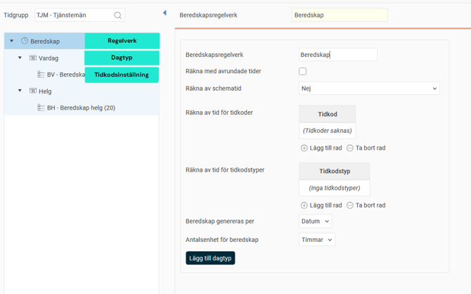
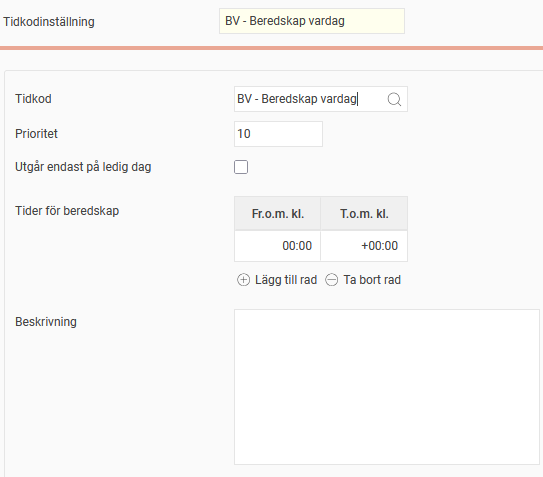
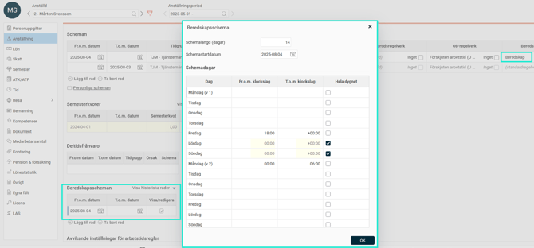
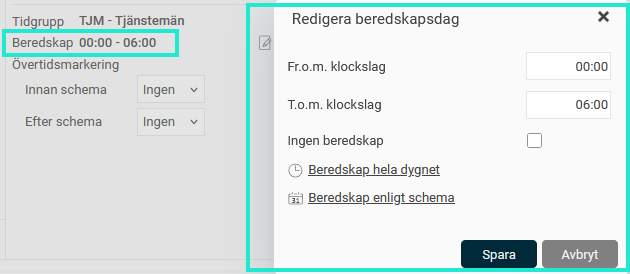

# ⚙️Hur fungerar beredskapsregelverk?

**Datum:** den 21 oktober 2025  
**Kategori:** Time  
**Underkategori:** Övertid & Ersättning  
**Typ:** config  
**Svårighetsgrad:** advanced  
**Tags:** beredskap, ob, schema, tidkod, tidrapport, övertid  
**Bilder:** 6  
**URL:** https://knowledge.flexhrm.com/sv/hur-fungerar-beredskapsregelverk

---

Artikeln informerar om att skapa regelverk för beredskap, hur man schemalägger anställda på beredskapsscheman och visar med exempel hur beredskap faller ut i tidrapporten.
Regelverk
Tilldela regelverk
Exempel
Regelverk
Med hjälp av ett regelverk för beredskap kan HRM Time automatiskt beräkna och generera beredskapsersättning under tidrapportens vy
Ersättningar
.
Under
Beredskapsregelverk
skapas beredskapsregelverk per tidgrupp. Regelverket skapas i tre nivåer: Regelverk, dagtyp, tidkodsinställning. På bilden nedan har vi regelverket
Beredskap
, dagtyperna
Vardag
och
Helg
samt tidkodsinställningarna
BV
och
BH
.

På nivån
Regelverk
kan du göra grundläggande inställningar som gäller för hela regelverket:
Räkna med avrundade tider
Om denna ruta markeras kommer tid som ska räknas av från beredskapen att räkna med dessa tider avrundade (via tidkodsavrundning). Ett exempel kan vara om den anställde har haft inställelse och åkt in och jobbat i en timme men ska få ersättning för tre timmar. Har du inställningen markerad kommer då tre timmar av beredskapsersättningen att räknas bort. Har du inte inställningen markerad räknas en timme bort.
Räkna av schematid
Här kan du ange om, och i vilken utsträckning, schemalagd tid ska räknas bort och därmed inte generera någon beredskapsersättning genom att markera ett av de tre alternativen i menyn:
Nej
Schematid räknas inte av från beredskapsersättningen.
Ja, all tid mellan schemastart och schemaslut
Är schemat 8-17 med rast 12-13 kommer 9 timmar att räknas av från beredskapsersättningen.
Ja, schemats normala arbetstid
Är schemat 8-17 med rast 12-13 kommer 8 timmar att räknas av från beredskapsersättningen (rasten räknas alltså som beredskap).
Räkna av för tidkoder/tidkodstyper
Här väljer du (via tidkod eller tidkodstyp) vilka tidkoder, som när de är rapporterade i tidrapporten,
inte
ska ge beredskap. Det kan handla om att man inte ska få beredskpasersättning för tid där övertid har utfallit.
Beredskap genereras per
När beredskapen genereras under
Ersättningar
kan du välja om den ska genereras per datum eller summeras ihop för hela perioden.
Antalsenhet för beredskap
Här väljer du om antal timmar eller antal dagar man har beredskap ska ge ersättning.
Nivån
Dagtyp
används för att specificera när reglerna ska infalla. Du kan ange veckodagar och avvikande dagar (som att helg-ersättning ska falla ut på julafton, även om den infaller på en vardag).
På nivån
Tidkodsinställning
anger du vilka tidkoder som ska gälla baserat på klockslag. På bilden nedan är BV inställd på att falla ut hela dygnet, men man skulle t.ex. kunna ha en regel för en tidkod som ska falla ut 00:00-06:00 samt 18:00-24:00 och en regel för en annan tidkod som ska falla ut 06:00-18:00.
Det går också att bocka i
Utgår endast på ledig dag
för att
ange att en
tidkodsinställning
endast ska
gä
lla
på dagar då den anställde inte är schemalagd för arbete.
Prioritet
används för att bestämma vilken regel som ska gälla, om det skulle vara så att två regler överlappar.

Tilldela regelverk
I
anställdaregistret
, fliken
Anställning
tilldelar du anställda ett
beredskapsregelverk
.
Detta säger endast att när den anställde har beredskap ska ersättning falla ut enligt detta regelverk.
För att den anställde ska ha beredskap i sitt schema måste du också schemalägga det. Det gör du på samma flik, under
Beredskapsscheman
. Här talar du om hur beredskapen ska schemaläggas, t.ex. varannan vecka, och fr.o.m. vilket datum den anställde ska följa beredskapsschemat.

Exempel
Anställd 2 tillhör beredskapsregelverket
Beredskap
. Regelverket ger BV (beredskap vardag) måndag-fredag kl 00:00-24:00 och BH (beredskap helg) lördag-söndag kl 00:00-24:00.
Han är schemalagd på att beredskap ska gälla varannan helg, från fredag kl 18:00 till måndag kl 06:00.

I tidrapporten ser man tiderna för beredskap i kolumnen
Daginformation
. Användare med behörighet att redigera beredskapsdag kan där öppna en popup för att ändra tider för enskilda dagar

På fliken
Ersättningar
i tidrapporten läggs tidkoder ut enligt beredskapsregelverket, och enligt den anställdes schemalagda beredskap. I detta fall sex timmar varannan fredag och måndag samt tjugofyra timmar varannan lördag och söndag.

