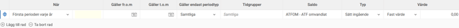
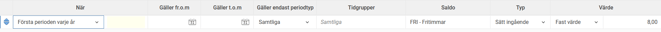
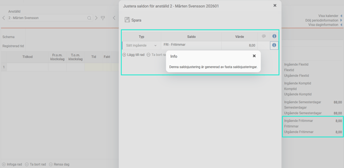
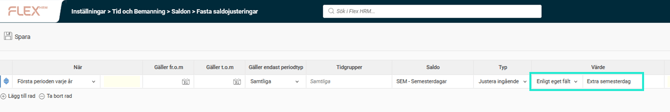
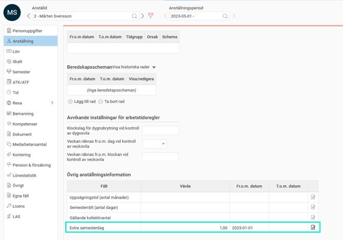
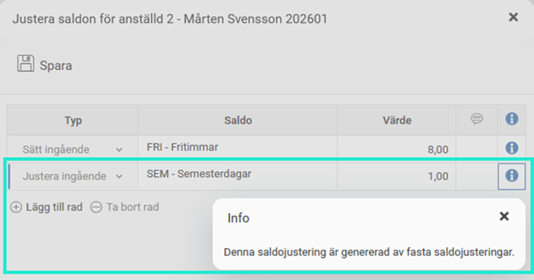

# ⚙️Hur fungerar fasta saldojusteringar?

**Datum:** den 26 september 2025  
**Kategori:** Time  
**Underkategori:** Inställningar  
**Typ:** config  
**Svårighetsgrad:** intermediate  
**Tags:** saldo, semester, tidrapport  
**Bilder:** 7  
**URL:** https://knowledge.flexhrm.com/sv/hur-fungerar-fasta-saldojusteringar

---

Fasta saldojusteringar
kan användas för saldohändelser som ska påverka alla/en grupp av anställda. Det kan t.ex. handla om ett saldo som ska nollställas vid varje årsskifte.

Du kan ställa in att ett saldo ska justeras eller sättas.
Justera
innebär att
lägga till eller dra ifrån
befintligt saldo.
Sätt
innebär att
skriva över
befintligt värde.
Alla sparade rader för fasta saldojusteringar beräknas. Det går alltså att påverka samma saldo flera gånger om man har överlappande inställningar. Med hjälp av de blå pilarna i vänsterkanten kan man bestämma ordningsföljden.
Exempel
I exemplet på bilden nedan har vi ett saldo för
Fritimmar
. De anställda kommer att ha ett saldo med 8 timmar som de kan ta ut under året. Första januari varje år sätts värdet till 8.

Anställd 2 har vid utgången av 2025 3,5 timmar i saldot för Fritimmar.

I tidrapporten för januari 2026 sätts saldot till 8. Justeringen syns i popupen
Saldojusteringar
(Mer > Saldojusteringar).

Fast saldojustering enligt eget fält i anställdaregistret
V
ale
t
Enligt eget fält
kan använd
as i företag som har licens för HRM Employee. Endast egna fält med fälttyp numeriskt.
Med denna
funktion justeras/sätts saldon utifrån ett angivet värde i anställdaregistret, som kan variera från person till person.
Exempel
Den fasta saldojusteringen är inställd på att första perioden varje år kontrollera värdet “Extra semesterdag” i anställdaregistret och justera semestersaldot utifrån det.

Anställda utan värde i fältet “Extra semesterdag” kommer inte att påverkas. Anställd 2 har värde 1, vilket gör att hans semestersaldo får en extra dag i januari.

I företag med basland Norge eller Danmark kan man också använda ålder för att ange vilka som ska påverkas av en fast saldojustering. Åldern räknas utifrån födelseår, inte exakt datum. Är ålder inställt på 60 får man alla som fyllt 60 eller kommer att fylla 60 under innevarande år.
Tips
Läs också om
saldotak/-golv
som kan användas för att för att sätta ett tak och/eller golv för saldon, och ange vad som ska hända om man går över taket/under golvet. Används t.ex. om flexsaldot ska begränsas vid -10, och sedan dras från kompsaldot.
