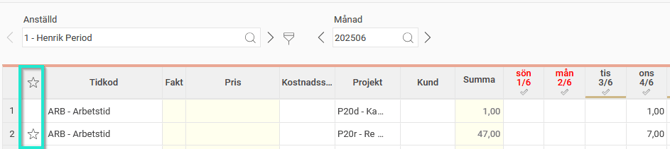
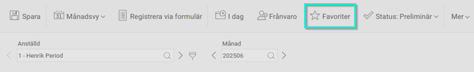
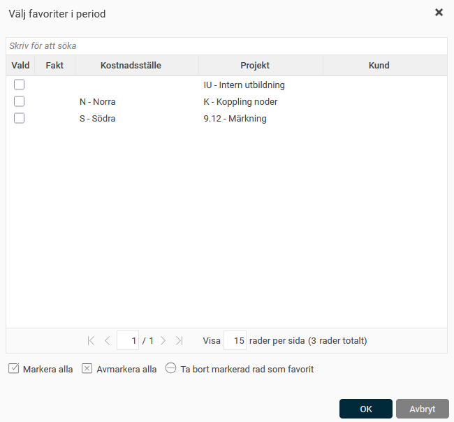

# Hur fungerar Favoriter i periodredovisningen?

**Datum:** den 15 augusti 2025  
**Kategori:** Time  
**Underkategori:** Tidrapportering  
**Typ:** howto  
**Svårighetsgrad:** intermediate  
**Tags:** tidrapport  
**Bilder:** 3  
**URL:** https://knowledge.flexhrm.com/sv/hur-fungerar-favoriter-i-periodredovisningen

---

Det kan finnas möjlighet för dig som periodredovisar att markera rader i tidrapporten som favoritrader för att enklare registrera samma sak senare.
Standard är att favoriter inte används. Aktiveras favoriter finns det en inställning för om de ska hämtas in automatiskt vid varje ny period eller om användaren manuellt hämtar dem. Dessa inställningar behöver göras av den som administrerar HRM.
I tidrapporten klickar du i fältet under stjärnan för att markera en rad som favorit. Klickar du i fältet en gång till tar du bort raden som favorit.

Har du inställt att favoriter ska hämtas in vid ny period så kommer de raderna automatiskt att visas i tidrapporten vid varje ny period.
Har du inställt att favoriter ska hämtas in manuellt klickar du på
Favoriter
i menyn och får upp en vy där du kan välja vilka favoritrader du vill infoga.

I första kolumnen markerar du de rader du vill infoga. Du kan även klicka på
Markera alla
om du vill ha alla rader. På samma sätt som du kan klicka bort en favorit genom att ta bort stjärnan i tidrapporten kan du här markera en rad och sedan klicka på
Ta bort som favorit
.

Tips
Även i ersättningsvyn finns en favorit-funktion för att underlätta registrering av återkommande ersättningar. Läs mer i denna artikel:
Hur används Favoriter i Ersättningar
?
