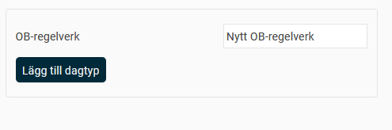
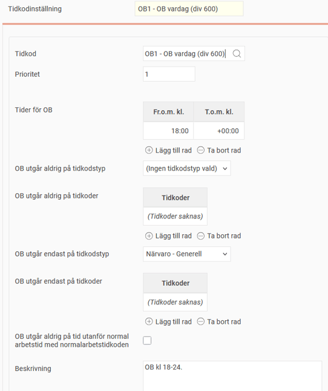
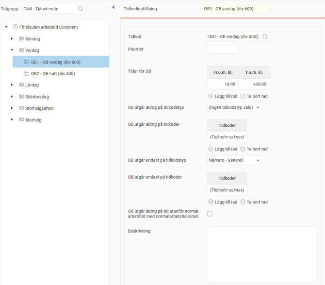
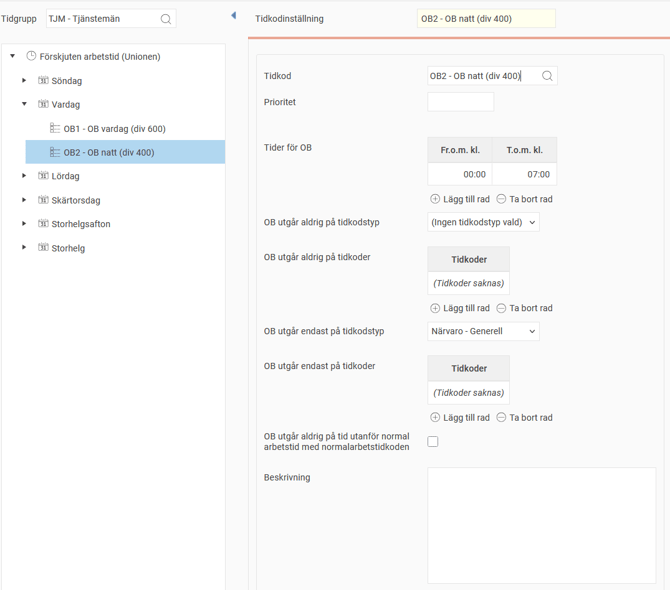
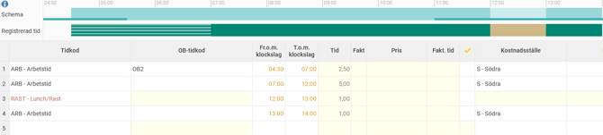
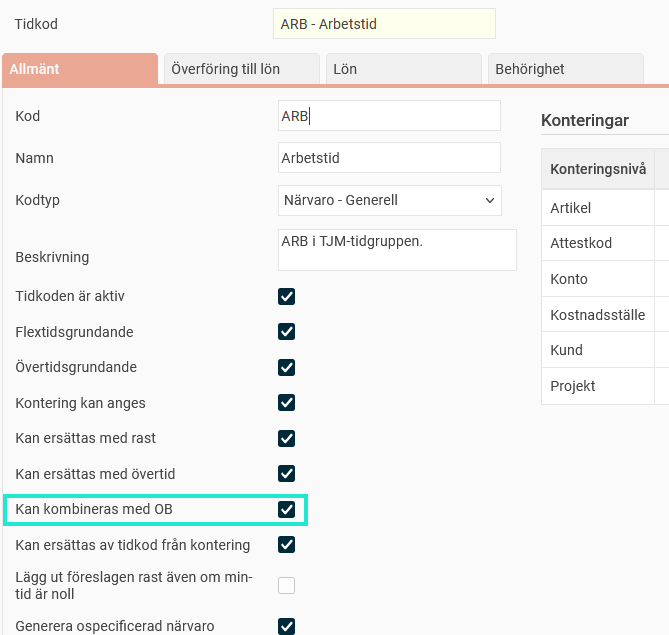

# ⚙️Hur fungerar OB-regelverk?

**Datum:** den 26 september 2025  
**Kategori:** Time  
**Underkategori:** Inställningar  
**Typ:** config  
**Svårighetsgrad:** advanced  
**Tags:** frånvaro, ob, schema, tidkod, tidrapport, övertid  
**Bilder:** 6  
**URL:** https://knowledge.flexhrm.com/sv/hur-fungerar-ob-regelverk

---

En förklaring av inställningarna för OB-regelverk och information om att tilldela anställda OB-regelverk.
Skapa OB-regelverk
Dagtyper
Tidkodinställningar
Tilldela OB-regelverk till anställda
OB-regelverk anvä
n
ds för att styra
när obekväm arbetstid (OB) ska betalas ut. När du ställer in ett regelverk behöver de anställda inte hålla koll på vilka regler som gäller, utan systemet lägger automatiskt in rätt OB-tidkoder i tidrapporten baserat på den rapporterade arbetstiden.
OB-regelverk skapar du under
Inställningar > Tid och Bemanning > Tidregelverk > OB-regelverk
. Du kan också kopiera befintliga regelverk.
Skapa OB-regelverk
Börja med att ge ditt OB-regelverk ett namn. Därefter skapar du olika
Dagtyper
.

Dagtyper
Du kan skapa dagtyper för exempelvis
Vardag
och
Helg.
Du anger vilka veckodagar de ska gälla för. Du kan också skapa dagtyper för särskilda dagar som kräver egna regler, till exempel
Storhelg
eller
Dag före helgdag
.
Om du lägger in en avvikande dag, till exempel att
Storhelg
ska gälla på julafton, slår det ut veckodagsregeln och storhelgsregeln gäller istället. Läs mer om att ange avvikande dagar:
Hur justerar man avvikande dagar i regelverk i HRM Time?
Tidkodinställningar
För varje dagtyp behöver du göra tidkodinställningar. Här ställer du in villkoren för när de olika OB-tidkoderna ska tillämpas.

Tidkod:
Välj den tidkod som ska tillämpas. Du kan välja mellan tidkoder som i tidkodsregistret har kodtypen
Närvaro - OB
eller
Frånvaro - OB
.
Prioritet:
Om flera tidkoder överlappar varandra kan du ange en prioritet. Systemet väljer då den tidkod som har lägst prioritet, vilket innebär att det är den tidkod som ska användas i första hand.
Tider för OB:
Ange de klockslag då OB-tidkoden ska tillämpas.
OB utgår aldrig på tidkodstyp:
Här väljer du en tidkodstyp för vilken denna OB-tidkod inte ska falla ut.
OB utgår aldrig på tidkoder:
Här väljer du en eller flera specifika tidkoder som inte ska ge OB-ersättning.
OB utgår endast på tidkodstyp:
Om OB endast ska gälla för en viss tidkodstyp, väljer du den här.
OB utgår endast på tidkoder:
Om OB endast ska gälla för en eller flera specifika tidkoder, väljer du dem här.
OB utgår aldrig på tid utanför normal arbetstid med normalarbetstidkoden:
Använd den här inställningen för att förhindra att OB betalas ut för tid som ligger utanför ordinarie arbetstid, även om den anställda har flextid.
Exempel
Vi vill att OB-tidkoden
OB1
(OB vardag) ska gälla vid arbete mellan 18:00-24:00, och att
OB2
(OB natt) ska gälla mellan 00:00-07:00, måndag till fredag.
Vi skapar två regler under dagtypen
Vardag
. Vi ställer in att reglerna endast ska gälla för tidkoder med kodtypen
Närvaro - Generell
. På så sätt undviker vi att OB betalas ut för till exempel övertidsarbete.

Tilldela OB-regelverk till anställda
Du kan tilldela ett standardregelverk för OB per tidgrupp. Detta gör du under
Inställningar > Tid och Bemanning > Tidgrupper >
fliken
Tid
.
Om en anställd inte ska följa tidgruppens standardregelverk kan du ange ett avvikande regelverk. Du hittar inställningen i anställdaregistret på fliken
Anställning
vid raden för
Schema
.
Tips: Om OB inte kommer med i tidrapporten
Om OB-regelverket verkar vara korrekt inställt men ingen OB hamnar i tidrapporten, behöver du kontrollera att tidradens huvudtidkod är inställd på att
få kombineras med OB
. Om denna inställning inte är aktiverad kommer OB-tidkoden inte att genereras, oavsett vad regelverket säger.

