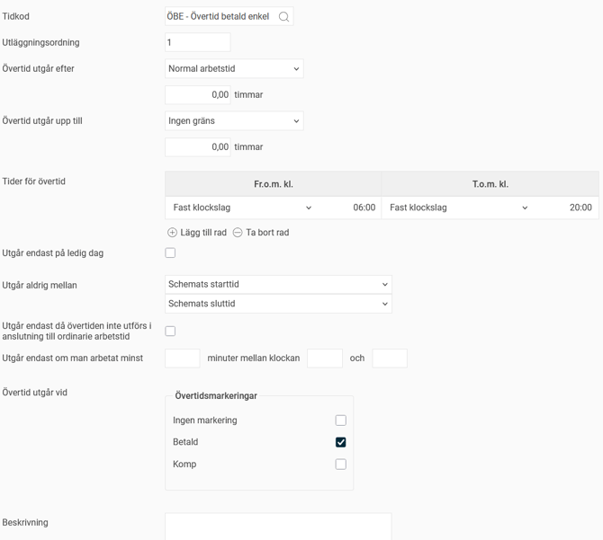
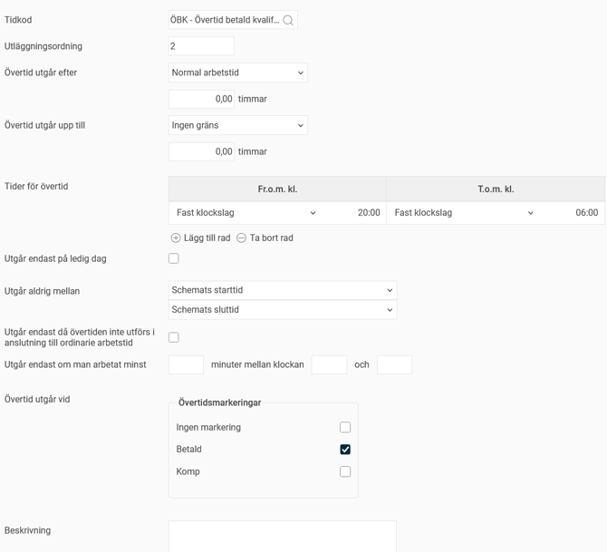
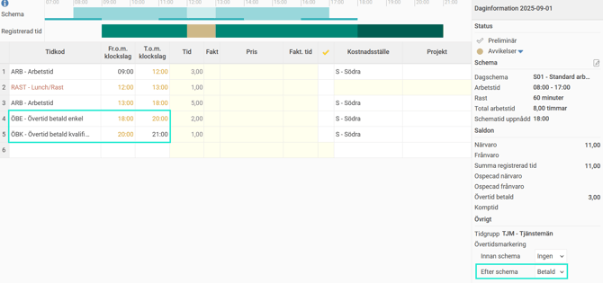
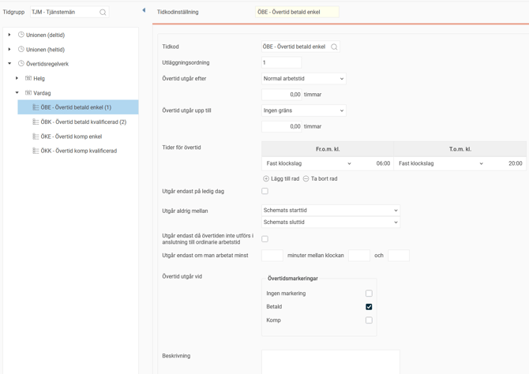
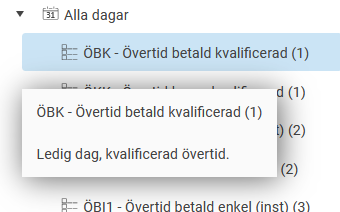
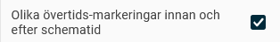

# ⚙️Hur fungerar övertidsregelverk?

**Datum:** den 26 september 2025  
**Kategori:** Time  
**Underkategori:** Inställningar  
**Typ:** config  
**Svårighetsgrad:** advanced  
**Tags:** mobil, ob, schema, stämpling, tidkod, tidrapport, övertid  
**Bilder:** 6  
**URL:** https://knowledge.flexhrm.com/sv/hur-fungerar-%C3%B6vertidsregelverk

---

En förklaring av inställningarna för övertidsregelverk och information om att tilldela anställda övertidsregelverk.
Ställ in ett övertidsregelverk
Förklaring av tidkodinställningar
Tilldela övertidsregelverk
Övertidsmarkera i tidrapporten
V
a
d
är
ett övertidsregelverk?
Ett övertidsregelverk används för att sätta upp regler som styr när övertid ska betalas ut. När en anställd tillhör ett regelverk behöver hen inte själv hålla reda på vilka regler som gäller, utan det räcker med att markera i tidrapporten att hen har arbetat övertid. Då kommer systemet automatiskt att lägga ut rätt övertidstidkoder i tidrapporten.
Observera
Övertidsregelverk är komplexa. Vi rekommenderar att ni tar hjälp av en konsult från Flex Applications vid uppsättning av övertidsregler.
Ställ in ett övertidsregelverk
Du ställer in övertidsregelverk per tidgrupp under
Inställningar > Tid och Bemanning > Tidregelverk > Övertidsregelverk
. Det går också att kopiera befintliga regelverk.
Börja med att ställa in vilka
övertidsmarkeringar
som ska användas i regelverket, till exempel
Betald
och
Komp
. Dessa markeringar blir sedan valbara i tidrapporten.
Skapa sedan
dagtyper
, exempelvis för vardagar och helger. Du anger vilka veckodagar de ska gälla för. Du kan också skapa dagtyper för särskilda dagar som kräver egna regler, till exempel
Storhelg
eller
Dag före helgdag
.
Om du lägger in en avvikande dag, till exempel att
Storhelg
ska gälla på julafton, slår det ut veckodagsregeln och storhelgsregeln gäller istället. Läs mer om att ange avvikande dagar:
Hur justerar man avvikande dagar i regelverk i HRM Time?
För varje dagtyp behöver du göra
tidkodinställningar
. Här anger du vilka villkor som ska gälla för att olika tidkoder ska falla ut.
Exempel
Dagtyp Vardag ska ha två regler för betald övertid. ÖBE ska gälla för övertid mellan kl. 06:00 och 20:00. För övertid före 06:00 eller efter 20:00 ska ÖBK falla ut.
Dagschemats normala arbetstid måste ha uppnåtts för att övertid ska kunna falla ut, och den får inte inträffa under schemats ordinarie tid.

Är du schemalagd åtta timmar, kl. 08:00-17:00, och registrerar arbetstid + övertidsmarkering 09:00-21:00 faller ÖBE ut 18:00-20:00 och ÖBK 20:00-21:00.
Att ÖBE faller ut först kl 18:00, när schematidens slut är 17:00 beror på att du måste arbeta dagens åtta timmar för att övertiden ska kunna falla ut.

Förklaring av tidkodinställningar
I vyn för tidkodinställningar finns flera alternativ att välja på för att anpassa reglerna.

Tidkod
: Den tidkod som ska läggas ut. Här kan du välja tidkoder som i tidkodsregistret är inställda med kodtyp
Närvaro - Övertid
eller
Närvaro - Mertid/Övrig
.
Utläggningsordning
: Styr hur reglerna hanteras om överlappar varandra. Regeln med lägst siffra läggs ut först och kan inte skrivas över av en annan regel.
Övertid utgår efter
: Här bestämmer du när övertid ska börja gälla.
Fast värde
: Övertiden utgår efter ett fast antal timmar.
Normal arbetstid
: Övertiden utgår efter dagschemats normala arbetstid.
Normal arbetstid och flextid
: Övertiden utgår efter normal arbetstid plus flextid.
Arbetsmått per vecka / 5
: Övertiden utgår från den anställdes veckoarbetsmått dividerat med fem. Detta gör att samma regelverk kan användas för anställda med olika arbetsmått.
Timmar
: Anger hur många timmar som ska adderas till inställningen under
Övertid utgår efter
. Exempel: Om du väljer
Normal arbetstid
och anger
+ 2,00
i fältet
Timmar
, kan tidkoden läggas ut efter att dagschemats normala arbetstid plus ytterligare två timmar har arbetats.
Övertid utgår upp till
: Här kan du ange hur många timmar en viss övertidsregel ska gälla. Om du vill att en övertid ska kunna läggas ut tills tio timmars arbetstid uppnåtts, anger du
Fast värde
och skriver
10,00
i fältet
Timmar
.
Tider för övertid
: Här kan du ange specifika tider för när övertid ska gälla, antingen som fasta klockslag eller i relation till schemats start- och sluttid samt flexramar. Ett exempel är att enkel övertid ska gälla de två första timmarna före schemastart och de två första timmarna efter schemaslut.
Utgår endast på ledig dag
: Markera denna ruta om övertidsregeln endast ska gälla på lediga dagar.
Utgår aldrig mellan
: Ställ in tidsintervall då övertid inte ska kunna gälla.
Utgår endast då övertiden inte utförs i anslutning till ordinarie arbetstid
: Markera denna ruta om övertiden endast ska utgå vid arbete som inte ligger direkt efter ordinarie arbetstid.
Utgår endast om man arbetat minst
: Här kan du ange att en övertidsregel endast ska gälla om man har arbetat minst ett visst antal timmar under ett visst tidsintervall. Användbart för vissa avtal där det finns en regel om att du på morgonen får kvalificerad övertid fram till klockan 06:00 med undantaget om du arbetat natt och sen fortsätter med övertid. Då blir det kvalificerad övertid hela övertiden även om den sträcker sig längre än klockan 06:00.
Övertid utgår vid
: Markera här vid vilken eller vilka övertidsmarkeringar som övertidsregeln ska gälla.
Beskrivning
: Du kan lägga till en beskrivning för varje regel som förklarar dess syfte för andra användare.
Tips
Håll muspekaren över en tidkodsinställning i listan till vänster för att läsa dess beskrivning.
Där kan du också se utläggningsordning (siffran inom parentes).

Tilldela övertidsregelverk
Du kan sätta ett standardregelverk för övertid per tidgrupp under
Inställningar > Tid och Bemanning > Tidgrupper >
fliken
Tid
.
I anställdaregistret, under fliken
Anställning
, visas det aktuella regelverket på raden för
Schema
. Här kan du också tilldela ett avvikande regelverk för anställda som inte ska följa tidgruppens standardregelverk.
Övertidsmarkera i tidrapporten
I tidrapporten i HRM och HRM Mobile, eller vid stämpling, kan du markera att du har arbetat övertid. Då får du de val som du har ställt in i regelverket, till exempel
Betald
eller
Komp
. Det val du gör avgör vilka regler som ska gälla för din övertid.
På dagar med arbetstid finns möjlighet att använda olika övertidsmarkeringar för övertid före och efter arbetstid. Denna inställning heter
Olika övertids-markeringar innan och efter schematid
och kan göras på företags-, tidgrupps- eller anställdnivå. Det kan vara användbart om du till exempel vill ha betalt för övertid som arbetats före schemat, men komp för övertid efter schemat.

