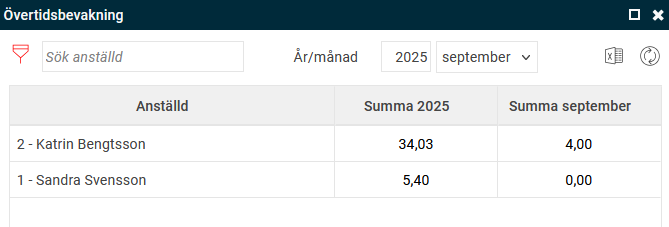
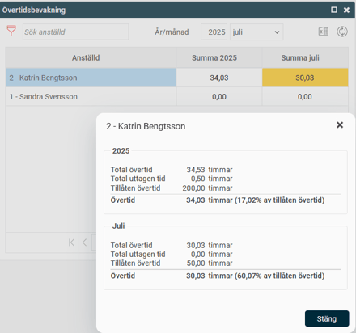

# Hur fungerar panelen Övertidsbevakning?

**Datum:** den 8 september 2025  
**Kategori:** Time  
**Underkategori:** Övertid & Ersättning  
**Typ:** howto  
**Svårighetsgrad:** intermediate  
**Tags:** övertid  
**Bilder:** 2  
**URL:** https://knowledge.flexhrm.com/sv/hur-fungerar-%C3%B6vertidsbevakning

---

Med övertidsbevakningen i Flex HRM kan du enkelt hålla koll på den anställdes övertid så att du inte beordrar mer övertid än vad som är tillåtet. Vanligt är att den anställde kan arbeta maximalt 50 timmar övertid per månad och 200 timmar per år.
Övertidsbevakningspanelen
Övertidsbevakningen visas som en panel på startsidan och visar hur mycket övertid de anställda du är behörig att se har.

Färgerna i panelen fungerar som en visuell guide för att snabbt se hur mycket övertid de anställda har arbetat:
Vitt: 0-25 %
Gult: 25-50 %
Orange: 50-75 %
Mörk orange: 75-100 %
Rött: 100 %
Panelen är sorterad efter övertidsvärdet för det aktuella året. De anställda med mest övertid visas då överst. Du kan ändra sorteringsordningen genom att klicka på de olika rubrikerna. Månads- och årssummorna räknas ut fram till dagens datum.
Detaljerad information
För att få mer information om en anställd, för markören över personens rad. Du kan då välja att klicka på antingen den blå informationsikonen eller grafikonen.

Uppdatera värden
Panelens värden uppdateras automatiskt varje natt. Om du behöver uppdatera dem manuellt klickar du på uppdateringsikonen högt upp i panelens högra hörn. Uppdateringen görs tre månader tillbaka och till dagens datum. Tänk på att en manuell uppdatering kan ta lång tid för större företag. Håll muspekaren över ikonen för att se en uppskattning av uppdateringstiden och när panelen senast uppdaterades.
Filtrera och exportera
Filtrera:
Om du vill visa ett urval av anställda kan du klicka på filterikonen.
Exportera:
För att exportera informationen till Excel, klicka på Excel-ikonen. Excel-filen innehåller all information som visas i övertidspanelen, med en rad per anställd. Du får också en fråga om du vill ta med hemkonteringar i exporten. Om du svarar ja läggs de till som extra kolumner.
