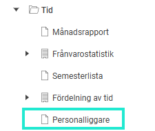

# Hur fungerar rapporten Personalliggare i Flex HRM Time?

**Datum:** den 3 december 2025  
**Kategori:** Time  
**Underkategori:** Inställningar  
**Typ:** howto  
**Svårighetsgrad:** intermediate  
**Tags:** hrm-time, ob  
**Bilder:** 1  
**URL:** https://knowledge.flexhrm.com/sv/rapport-personalliggare-hrm-time

---

Denna artikel beskriver standardrapporten Personalliggare i Flex HRM Time
Rapporten
Personalliggare
är en standardrapport i HRM Employee.

Personalliggaren är skapad för företag inom restaurang-, frisör- och tvätteribranschen som enligt lag måste föra personalliggare, d.v.s. anteckna vilka som är verksamma och när. Denna rapport uppfyller Skatteverkets krav och kan enkelt skrivas ut om Skatteverket kommer och gör kontroll.
Det innebär att denna rapport
visar alla instämplade personer
, inte endast personal du normalt har behörighet till.
Behörighetsinställning på roll
Om du endast vill visa de anställda som registrerat sin tid på den avdelning du är ansvarig för kan det ställas in som en särskild inställning på rollen.
⚙️Observera att denna inställning behöver göras av en behörig systemadministratör.
På rollen markerar du inställningen
Använd behörigheter enligt konteringsgranskning
. Vidare behöver du även på Användaren
– Flik Konteringsgranskning
specificera vilka avdelningar (vilken konteringsdimension som helst kan såklart användas) användaren ska vara behörig att se. I rapporten visas då endast de anställda som registrerat tid på den avdelningen, vilket även kan vara anställda som tillhör en annan avdelning och som tillfälligt är inlånade. På samma sätt visas då inte anställda som normalt sett tillhör din avdelning men som just idag registrerat sin tid på en annan avdelning.
