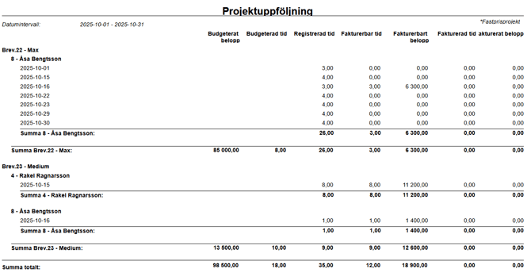
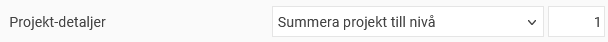
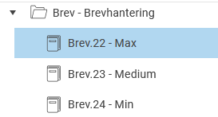
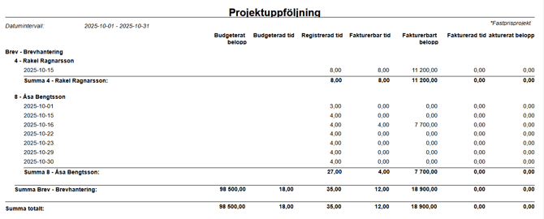
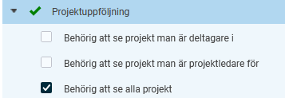

# Hur fungerar rapporten Projektuppföljning?

**Datum:** den 15 oktober 2025  
**Kategori:** Time  
**Underkategori:** Tidrapportering  
**Typ:** howto  
**Svårighetsgrad:** intermediate  
**Tags:** ob, tidkod, tidrapport  
**Bilder:** 5  
**URL:** https://knowledge.flexhrm.com/sv/hur-fungerar-rapporten-projektuppf%C3%B6ljning

---

Så bygger du upp rapporten
Gör urval och välj detaljnivå
Behörighet för Projektuppföljning
Rapporten
Projektuppföljning
ger dig möjlighet att följa upp dina projekt. Du kan bland annat se budgeterad, arbetad och fakturerad tid samt kostnader. Rapporten liknar
Fördelning av tid
men har fler projektspecifika funktioner.
Observera
Vi använder här begreppet
Projekt
. Ni kan ha valt att benämna det utökade projektregistret på annat sätt i ert system.
Om ni till exempel valt att kalla det utökade projektregistret
Uppdrag
heter er rapport
Uppdraguppföljning
.
Så bygger du upp rapporten
Du kan välja upp till fyra grupperingar. För varje gruppering kan du välja att gruppera på följande:
Anställd
Projektledare
Alla registrerade konteringar
Alla hemkonteringar
Tidkod
Dag
Vecka
Månad
Exempel:
Om du grupperar på projekt, anställd och dag kommer rapporten först att visa projekten. Under varje projekt visas sedan de anställda som har arbetat på projektet. Sist, under varje anställd, visas de dagar den anställde har arbetat på projektet.

Du kan välja att visa följande värden:
Budgeterat belopp
(projektens budgeterade belopp)
Budgeterad tid
(projektens budgeterade tid)
Registrerad tid
Fakturerbar tid
Fakturerbart belopp
Fakturerad tid
(tid som är frisläppt till fakturering)
Fakturerat belopp
(belopp som är frisläppt till fakturering)
Gör urval och välj detaljnivå
Du kan välja om kommentarer ska visas och göra urval baserat på anställda, konteringar, projektstatus, tidrapportstatus.
Via valet
Projekt-detaljer
kan du styra detaljnivån i rapporten.
Om du väljer
Visa registrerbara projekt
visas detaljer för projekt som det går att rapportera tid på, till exempel
Brev.22
och
Brev.23
i det tidigare exemplet.
Om du istället vill se en summering till en viss nivå i projektträdet väljer du
Summera projekt till nivå
. Till exempel kan du välja
Summera projekt till nivå 1
om du endast vill se tid summerat till huvudprojektet
Brev
.

Behörigheter för Projektuppföljning
Behörigheten att se data i rapporten styrs av inställningar i rollträdet. Under rapporten
Projektuppföljning
finns tre inställningar:
Behörig att se projekt man är deltagare i
Behörig att se projekt man är projektledare för
Behörig att se alla projekt

Deltagare
och
projektledare
kan du ställa in per projekt under
Register > Projekt
. Du kan även ställa in att alla anställda är deltagare i ett projekt.
Exempel på behörighet:
Du har behörighet till rapporten
Projektuppföljning
för en anställd.
Om du har en bock i
Behörig att se alla projekt
kan du se all projektrapporterad tid för den anställda.
Om du istället har en bock i
Behörig att se projekt man är deltagare i
kan du se all tid den anställda har rapporterat på de projekt du står som deltagare i, men inte annan tid.
Relaterad artikel
Vad är ett projektregister - Fliken Deltagare
