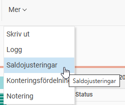
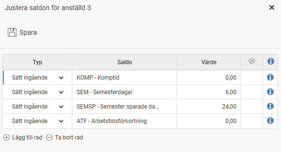
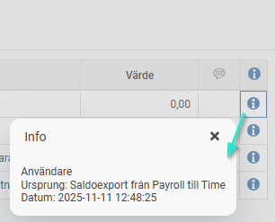

# ⚙️Hur fungerar saldojustering i tidrapporten?

**Datum:** den 4 december 2025  
**Kategori:** Time  
**Underkategori:** Lön & Överföring  
**Typ:** config  
**Svårighetsgrad:** intermediate  
**Tags:** lön, ob, saldo, tidrapport  
**Bilder:** 3  
**URL:** https://knowledge.flexhrm.com/sv/hur-fungerar-saldojustering-i-tidrapport

---

Denna artikel beskriver funktionen Saldojustering som finns i tidrapporten i Flex HRM Time.
Med denna funktion kan du justera befintliga saldovärden samt sätta nya saldovärden. Klicka på knappen och följande fönster visas:

Ange typ av justering, vilket saldo som ska registreras samt aktuellt värde. Följande typer finns:
Justera ingående
Ange denna typ om du önskar justera ett ingående saldovärde, exempelvis periodens ingående värde för flextid.
Justera utgående
Ange denna typ om du önskar justera ett utgående saldovärde.
Sätt ingående
Ange denna typ om du önskar sätta ett ingående saldovärde. Observera att eventuellt tidigare värde då skrivs över.
Genom att klicka på den pratbubblan kan du ange/visa eventuella kommentarer gällande saldojusteringen.
Genom att klicka på informations-ikonen till höger får du upp information om vilken användare som gjorde den, vilken tidpunkt den gjordes samt ursprung. Ursprunget kan vara antingen
Manuell
, om en användare lagt in raden manuellt i HRM,
Import
, om saldojusteringen importerats eller
saldoexport från Payroll till Time
om exporten kommer från lönesystemet.

