# Hur fungerar stämplingsterminalen?

**Datum:** den 21 augusti 2025  
**Kategori:** Time  
**Underkategori:** Mobil & Stämpling  
**Typ:** howto  
**Svårighetsgrad:** intermediate  
**Tags:** frånvaro, mobil, ob, saldo, schema, semester, stämpling, tidrapport  
**Bilder:** 14  
**URL:** https://knowledge.flexhrm.com/sv/hur-fungerar-st%C3%A4mplingsterminalen

---

Nedan kan du läsa om hur man använder stämplingsterminalen, HRM Timeclock. Artikeln beskriver hur du stämplar din tid och använder övriga funktioner.
Använda stämplingsterminalen
Stämpla din tid
För sen eller för tidig stämpling
Frånvaroansökan/planerad frånvaro
Frånvaro ut
Frånvaro in
Frånvaro aktuell dag
Stämpla med övertidsmarkering
Visa tidrapport
Saldon
Närvarotablå
Konteringsbyte
Använda stämplingsterminalen
H
RM Timeclock är den modul som används för att stämpla din tid i realtid. Det finns även andra funktioner i denna modul, vilka beskrivs nedan.
Observera
Era inställningar kan göra att vissa funktioner inte används, och att knapparna i stämplingsterminalen har andra benämningar än de som används i artikeln.
Stämpla din tid
Används en tagg eller ett kort är det bara att läsa av kortet eller taggen, så stämplas du in.
Annars anger du ditt anvä
ndar-ID och trycker på knappen för
instämpling
eller bara på
OK
.
Det finns möjlighet att ställa in vilken knappfunktion som ska vara standard när du stämplar din tid. Exempelvis kan standardknapp kopplas mot ”Konteringsbyte” istället för ”In/ut” vid instämpling. Kontrollera med er systemadministratör vilken funktion standardknappen är kopplad till för just ditt företag.
För sen eller för tidig stämpling
Om en instämpling sker efter tillåten ankomsttid eller före tillåten hemgång kommer klockan att varna och fråga om orsak till den sena/tidiga stämplingen.
Välj rätt orsak:
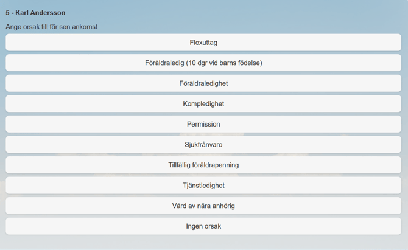
Du får en verifiering att stämpling skett.
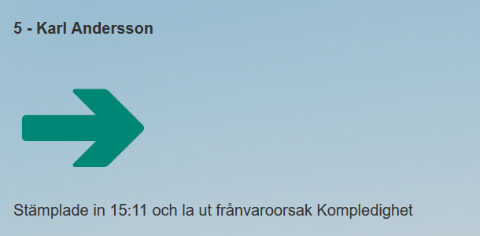
I
I din tidrapport ligger nu vald frånvaro från schemats start till instämplad tid eller från stämplad tid till schemats slut.
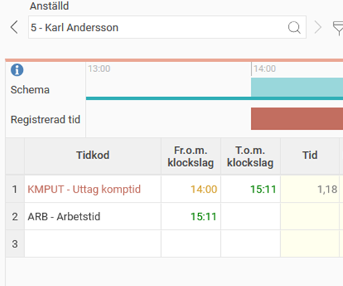
Frånvaroansökan/planerad frånvaro
Ange ditt användar-ID och tryck på knappen för
Frånvaroansökan
.
Välj datum och (om del av dag) även klockslag. Meddelanderutan är valfri att använda. När du markerar meddelanderutan kommer ett tangentbord att dyka upp i displayen.
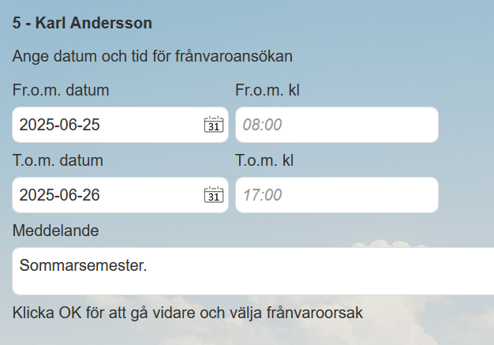
Tryck OK och välj frånvaroorsak.
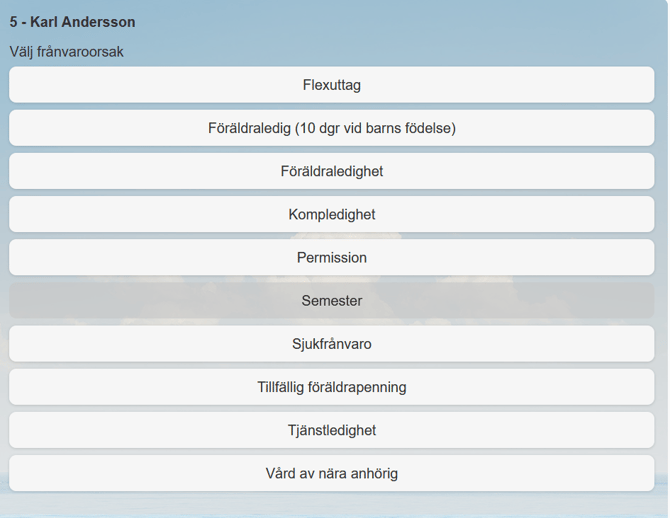
Du får en verifiering.
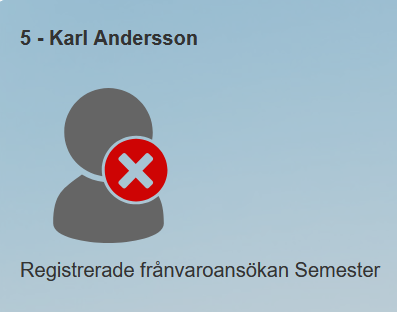
Frånvaron visas i frånvarohanteraren.
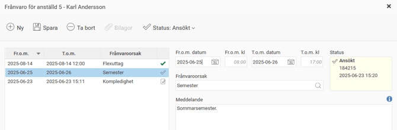
Frånvaro ut
Om utstämpling ska ske under t.ex. ett rastfönster kommer systemet tro att du försöker gå på rast. Om så inte är fallet, utan du ska t.ex. kompa ut under lunchen behöver du tala om för systemet att du stämplar ut med frånvaro.
Samma sak gäller om du går hem sjuk eller i alla lägen där det är osäkert när du nästa gång stämplar in igen.
Ange användar-ID och klicka på
Frånvaro ut.
Välj frånvaroorsak.
Du får en verifiering.
Du är utstämplad. Frånvaron visas i tidrapporten och i frånvarohanteraren.
Frånvaro in
Med frånvaro in kan du stämpla in med vald frånvaroorsak.
Exempel:
Ditt schema är 8:00 – 17:00 med flexramar 6:00 – 10:00 på morgonen. Du stämplar in klockan 9:30 efter att ha haft kompledighet på morgonen. Då kan du stämpla frånvaro in och välja frånvaroorsak kompledighet, så kommer den frånvaron att läggas 8:00 – 9:30. Väljer du endast att stämpla in blir det med automatik flexuttag eftersom du stämplar inom flexramen.
Ange användar-ID och klicka på
Frånvaro in
.
Välj vilken frånvaroorsak du vill stämpla frånvaro in med.
Du får en verifiering.
Du är instämplad. Frånvaron visas i tidrapporten och i frånvarohanteraren.
Frånvaro aktuell dag
Med frånvaro aktuell dag kan du stämpla ut med vald frånvaroorsak som sträcker sig resten av den aktuella dagen.
Exempel:
Ditt schema är 8:00 – 17:00. Du önskar stämpla ut klockan 13:30 för kompledighet resten av den aktuella dagen. Då kan du stämpla frånvaro aktuell dag och välja frånvaroorsak kompledighet, så kommer den frånvaron att läggas ut i tidrapporten 13:30 – 17:00 för den aktuella dagen.
Ange användar-ID och klicka på
Frånvaro aktuell dag
.
Välj frånvaroorsak.
Du får en verifiering.
Du är utstämplad. Frånvaron visas i tidrapporten och i frånvarohanteraren.
Stämpla med övertidsmarkering
Om du vet om att den tid som faller utanför schematid ska räknas som övertid kan du vid
in- eller utstämpling ange vilken ersättningstyp du önskar.
Ange användar-ID och klicka på
In/ut övertid
.
Välj ersättningstyp.
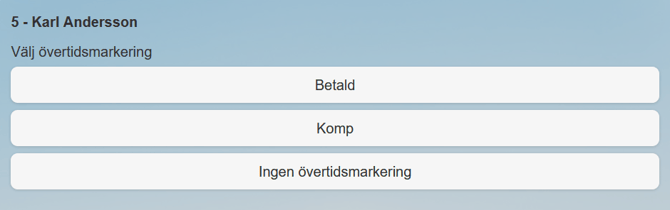
Du får en verifiering.
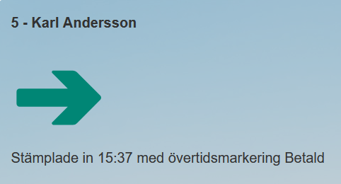
I tidrapporten är nu övertidsmarkering gjord.
Övertiden kommer att genereras när du stämplat ut för dagen och endast om alla krav för övertid är uppfyllda
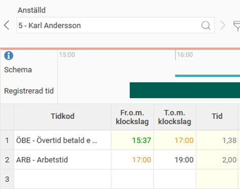
Visa tidrapport
Med funktionen
Visa tidrapport
går det att se hur tidrapporten ser ut idag och bakåt i tiden. Använd pilarna för att växla till nästa eller föregående dag.

Saldon
Från stämpelklockan går det se information om alla de periodsaldon som annars visas i tidrapporten.
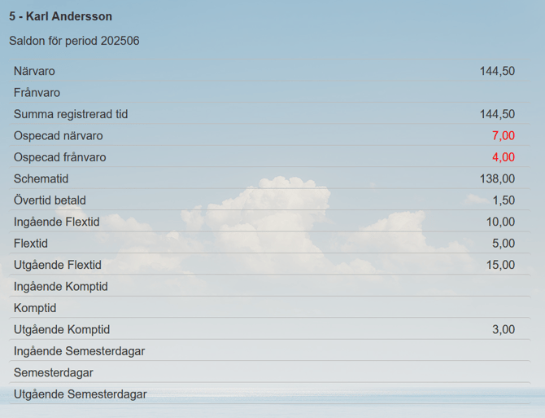
Närvarotablå
För att få en ögonblicksbild över medarbetarnas status finns knappen
Närvarotablå
som visar status och eventuell frånvaro. Här går det att söka efter en specifik anställd eller filtrera de anställda efter status.
Det finns möjlighet för anställda att skriva en notering
per dag som kan visas för andra i närvarotablån.
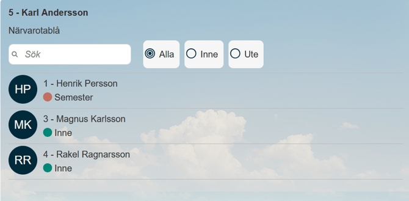
Konteringsbyte
För de som ska stämpla konteringsbyte, såsom projekt, kostnadsställe eller liknande, finns funktionen
Konteringsbyte
.
När du klickar på Konteringsbyte visas alla de konteringar som kan ändras, och möjlighet finns att ändra alla konteringar under en och samma stämpling. I exemplet nedan skulle det gå bra att ändra kostnadsställe, kund och projekt.
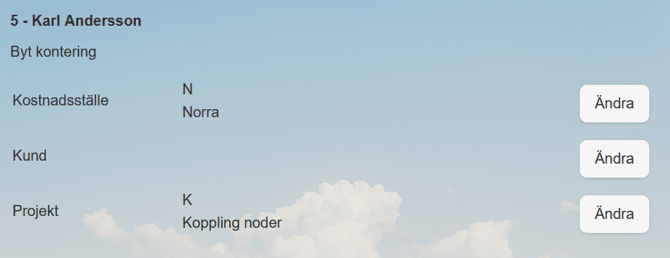
När du väljer
Ändra
på en rad får du förslag på tidigare använda poster. Du kan söka efter en kontering eller välja i ett register över alla konteringar.
Väljer du
Register
får du en lista med alla valbara poster, antingen som en rak lista eller strukturerade i en trädstruktur. I en trädstruktur kan du klicka på + för att expandera alla underliggande poster.
Relaterade artiklar
Vad händer när stämpelklockan är offline?
Hur stämplar man direkt i tidrapporten?
Hur stämplar man sin tid i mobilen?
