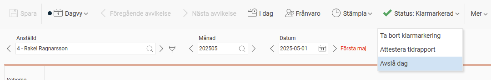
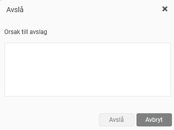

# Hur gör man för att avslå tidrapporter?

**Datum:** den 22 augusti 2025  
**Kategori:** Time  
**Underkategori:** Attestering & Granskning  
**Typ:** howto  
**Svårighetsgrad:** intermediate  
**Tags:** attestering, tidrapport  
**Bilder:** 3  
**URL:** https://knowledge.flexhrm.com/sv/hur-g%C3%B6r-man-f%C3%B6r-att-avsl%C3%A5-tidrapporter

---

Det kan finnas möjlighet att avslå en granskad tidrapport och skriva en kommentar till den anställde kring vad som behöver korrigeras. När en dag avslås tas alla tidigare granskningar bort och dagen blir preliminär.
Du kan avslå från tidrapporten eller i granskningsvyn för tidrapporter.
I granskningsvyn markerar du en tidrapport och klickar på knappen
Avslå
.

I tidrapporten finns valet för att avslå under Status-ikonen.

När du valt att avslå visas en popup där du kan skriva en kommentar och genomföra avslaget. Kommentaren kommer att skrivas med i eventuell påminnelse till anställd. En påminnelse skickas automatiskt vid avslag, om det är inställt så i ert företag.

