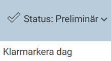
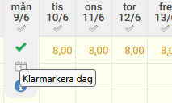
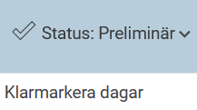
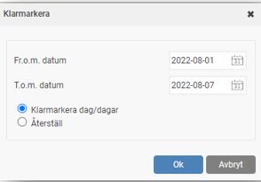
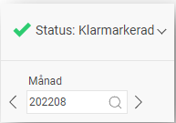

# Hur granskar man sin tidrapport?

**Datum:** den 22 augusti 2025  
**Kategori:** Time  
**Underkategori:** Tidrapportering  
**Typ:** howto  
**Svårighetsgrad:** intermediate  
**Tags:** ob, tidrapport  
**Bilder:** 5  
**URL:** https://knowledge.flexhrm.com/sv/hur-granskar-man-sin-tidrapport

---

En steg för steg-beskrivning för hur du granskar din tidrapport.
När din tidrapport är helt klar ska detta markeras genom att du granskar tidrapporten och sätter din signatur på att den är helt klar.
Observera
Vi använder här begreppet
Klarmarkering
för att användaren granskar sin rapporterade tid. Det kan heta något annat hos er.
1. Dag för dag kan du under status ange att dagen är klar från dagredovisningsfliken.
Klicka bara på
Status > Klarmarkera dag.

2. Via vecko- eller månadsvyn kan varje dag också granskas, klicka bara på ett datum och använd granskningsikonen.

3. Vill du klarmarkera flera dagar på en gång kan du gå till vecko- eller månadsvyn och klicka på
Status > Klarmarkera dagar
.

4. Ange vilket intervall du vill granska.

5. När hela perioden är granskad ändras periodstatusen.

