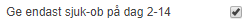
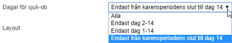

# ⚙️Hur hanterar man karensavdrag i HRM Time?

**Datum:** den 26 september 2025  
**Kategori:** Time  
**Underkategori:** Inställningar  
**Typ:** config  
**Svårighetsgrad:** intermediate  
**Tags:** hrm-time, lön, ob, schema, tidrapport  
**Bilder:** 2  
**URL:** https://knowledge.flexhrm.com/sv/karensavdrag-hur-hanterar-man-karensavdrag-i-flex-hrm-time

---

Artikeln beskriver hur du i HRM Time hanterar karensavdrag. Den innehåller en beskrivning av de ändringar som har gjorts i och med skiftet från karensdag till karensavdrag, 1 januari 2019.
Karensavdrag från 1 januari 2019
Den 1 januari 2019 avskaffades karensdagen och ersättes av ett karensavdrag. Syftet med ändringen var att det avdrag som görs när man är sjuk ska vara rättvist och förutsägbart.
Det är i första hand lönesystemet som påverkas av dessa förändringar.
Nedan kan du läsa om hur du sköter hanteringen i
HRM Time. Betalar ditt företag inte ut sjuk-ob behöver du inte göra någonting i
HRM Time.
Inställningar i HRM Time
I och med ändringen 1 Januari 2019 behöver man kunna skicka sjuk-ob till lön även på den första sjukdagen. Därför är, fr.o.m. version 182.14 och 183.3, inställningen
Ge endast sjuk-ob på dag 2-14
ändrad. Du kan ställa in per företag (
Tidrapporter
), tidgrupp (
Tidgrupper > Flik Tid
) eller anställd (
Personal > Flik Tid
).

Inställningen är nu en dropdown med fyra alternativ.

Alla
motsvarar att tidigare ha haft inställningen avmarkerad.
Endast dag 2-14
motsvarar att ha haft den markerad.
Endast dag 1-14
används för att skicka sjuk-ob även på första sjukdagen, men inte efter dag 14.
Endast från karensperiodens slut till dag 14
(se nedan för vidare beskrivning).
Endast från karensperiodens slut till dag 14
Valet
Endast från karensperiodens slut till dag 14
innebär att Flex HRM kommer att räkna fram hur många timmar karensperioden är genom att ta den anställdes faktiska arbetsmått per vecka från anställdaregistret delat med 5.
Exempel
En anställd som har arbetsmått 40 timmar/vecka och 75 % sysselsättningsgrad kommer att få 40 * 0,75 / 5 = 6 timmar.
Det innebär  att ingen sjuk-ob kommer att ges på de första 6 timmarna i sjukperioden. Observera att dessa timmar kan vara fördelade på flera dagar om den anställde t.ex. endast är schemalagd 4 timmar på den första sjukdagen.
Relaterade artiklar:
Varför faller sjuk-OB ut efter dag 14?
