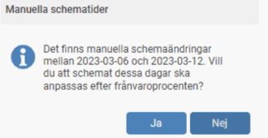

# Hur hanteras "manuella schemaändringar" vid skapandet av ett deltidsfrånvaroschema?

**Datum:** den 27 augusti 2025  
**Kategori:** Time  
**Underkategori:** Frånvaro & Semester  
**Typ:** howto  
**Svårighetsgrad:** intermediate  
**Tags:** frånvaro, schema  
**Bilder:** 2  
**URL:** https://knowledge.flexhrm.com/sv/hur-hanteras-utf%C3%B6rda-manuella-schema%C3%A4ndringar-vid-skapandet-av-ett-deltidsfr%C3%A5nvaroschema

---

Manuella schemaändringar vid deltidsfrånvaro
Om det finns manuella schemaändringar under intervallet för en deltidsfrånvaro med Fast procent kommer du att få en fråga om du vill att schemat på de manuellt ändrade dagarna ska justeras med frånvaroprocenten. Frågan får du när deltidsfrånvaron godkänns (om krav på granskning finns, annars när den sparas).

Om det är en deltidsfrånvaro där man valt Enligt schema så kommer du istället att få denna fråga och då ha möjlighet att få det nya schemat att ersätta även de manuellt ändrade dagarna.

Tips:
Vill du läsa om övriga inställningar i systemet som berör
deltidsfrånvaro
så klicka här.
