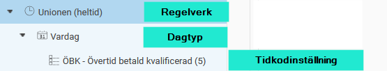
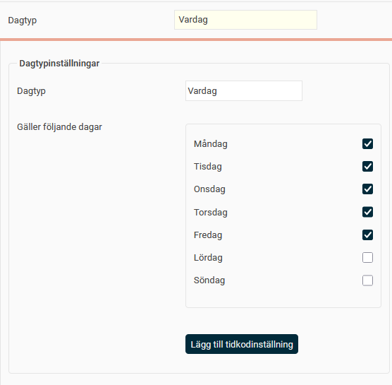
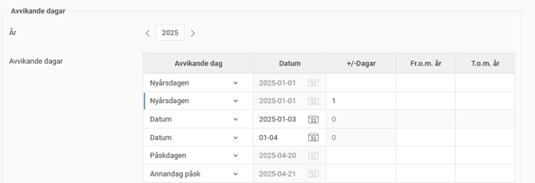
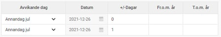
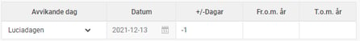
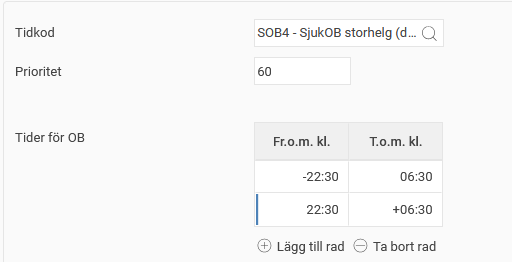

# ⚙️Hur justerar man avvikande dagar i regelverk i HRM Time?

**Datum:** den 29 september 2025  
**Kategori:** Time  
**Underkategori:** Övertid & Ersättning  
**Typ:** config  
**Svårighetsgrad:** advanced  
**Tags:** beredskap, hrm-time, ob, tidkod, övertid  
**Bilder:** 7  
**URL:** https://knowledge.flexhrm.com/sv/avvikande-dagar-hur-justerar-man-avvikande-dagar-i-regelverk-i-hrm-time

---

Avvikande dagar i regelverk för OB, övertid och beredskap behöver kontrolleras och ibland justeras från det ena året till det andra. Nedan visas med exempel hur avvikande dagar fungerar.
Tidregelverk
+/- Dagar
Exempel
Tidregelverk
Tidregelverk (för OB, övertid och beredskap) består av dagtyper och tidkodinställningar.

Ofta har man delat upp det i dagtyper som Vardag och Helg, där veckodagar är ibockade:

Dagar som t.ex. storhelger läggs in som avvikande dagar för att kunna ange andra tidkodinställningar på dem. På dessa är veckodagar inte ibockade, istället anges specifika dagar under Avvikande dagar.
Genom att ange ett siffervärde i fältet +/- Dagar kan man ange att x dag/dagar före respektive efter angiven dag ska gälla som avvikande dag.
Om en avvikande dag endast ska gälla specifika år är det möjligt att ange Fr.o.m. och T.o.m. år.
Anger du ett datum med årtal gäller avvikelsen endast det året. Om du däremot anger datum med endast månad och dag så rullar den på tills vidare.

+/-Dagar
Ser det ut enligt nedan i ett regelverk betyder det att tidkodinställningarna för den här dagtypen (som i det här fallet är Storhelg) gäller på Annandag jul (översta raden) och dagen efter Annandag jul (1 på nedersta raden betyder dagen efter).

På motsvarande sätt kan man ange -1 som betyder dagen före den angivna dagen. Exemplet nedan ger 12 december (Luciadagen minus en dag).

Exempel
Beroende på hur tidkodinställningarna ser ut, kan tidkoden falla ut mellan olika klockslag. Här följer några exempel:
Exempel 1
Om tidkodinställningarna ser ut så här (kl 06:30-16:30) gäller de klockslagen den/de dagar som tidkodinställningen gäller.
Är avvikande dagar Annandag jul och Annandag jul + 1 gäller SOB4 kl 06:30-16:30 26 och 27 december.

Exempel 2
Om tidkodinställningarna istället ser ut som nedan (kl -22:30-06:30, 22:30-+06:30), gäller tidkodinställningen från klockan 22:30 kvällen före till 06:30 den aktuella dagen, samt klockan 22:30 på den aktuella dagen till 06:30 dagen efter.
Är avvikande dagar Annandag jul och Annandag jul + 1 gäller SOB4
25 dec kl 22:30 - 26 dec kl 06:30
26 dec kl 22:30 - 27 dec kl 06:30
27 dec kl 22:30 - 28 dec kl 06:30

