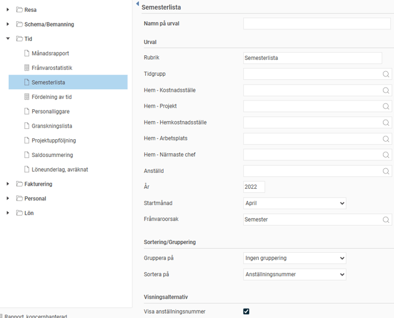
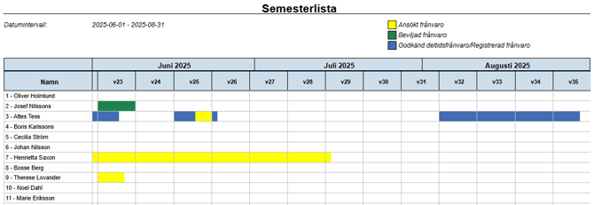
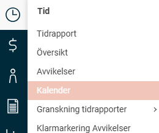
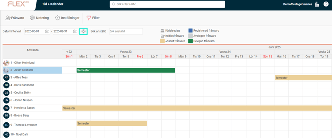
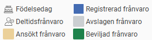
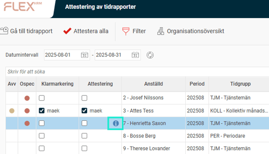
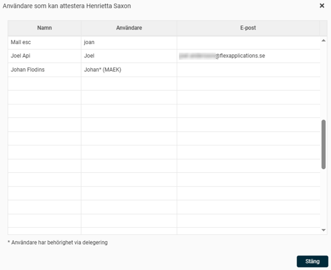

# Hur kan jag i HRM Time få en bra överblick över de anställdas frånvaro under semestern?

**Datum:** den 6 oktober 2025  
**Kategori:** Time  
**Underkategori:** Frånvaro & Semester  
**Typ:** howto  
**Svårighetsgrad:** intermediate  
**Tags:** attestering, frånvaro, hrm-time, ob, schema, semester, tidrapport  
**Bilder:** 8  
**URL:** https://knowledge.flexhrm.com/sv/hur-kan-jag-f%C3%A5-en-bra-%C3%B6verblick-%C3%B6ver-de-anst%C3%A4lldas-fr%C3%A5nvaro-under-semetsern

---

I denna artikel går vi igenom hur du i HRM Time kan ha koll på anställdas frånvaro via rapporten Semesterlista, kalenderfunktionen samt hur du kontrollerar granskning av tidrapporter inför och under semestertider.
Rapporten Semesterlista
Kalender
Kontrollera granskning av tidrapporter
Rapporten Semesterlista
Med rapporten Semesterlista kan du snabbt få en sammanställning över ansökt och beviljad frånvaro för en viss period.
Gå till
Rapporter > Tid
.
Välj rapporten
Semesterlista
.
Gör urval på år, startmånad och frånvaroorsak (till exempel semester). Rapporten visar alltid tre månader från och med den startmånad du väljer.

Kalender
Kalendern ger dig en visuell överblick över frånvaron utan att du behöver skriva ut en rapport. Här kan du se frånvaroperioder, orsaker och status för varje anställd. Du kan även hantera frånvaroansökningar direkt i vyn.
Så här gör du:
Gå in via
Tid > Kalender
i menyn till vänster.

Ange det
datumintervall
du vill se (du kan visa maximalt ett år). Klicka på den runda ikonen med pilar för att uppdatera vyn.

I översikten visas de anställdas frånvaro. De färgade staplarna visar status för frånvaron (till exempel ansökt, beviljad eller avvisad), enligt färgschemat uppe till höger.

Observera!
Din vy i kalendern kan se olika ut beroende på vilka behörigheter din användarroll har. Inställningarna för detta görs under
Administration > Användare/Behörigheter > Roller > Menyer
.
Vad granskningsnivåerna kallas (till exempel Attestering, Beviljande) och vilka färger deras ikoner har kan skilja sig åt mellan olika företag. Detta ställs in under
Allmänt > Granskningsnivåer > Frånvaroansökningar
.
För att granskningsnivåerna ska fungera måste de vara aktiverade för företaget under
Inställningar > Allmänt > Granskningsnivåer > Frånvaroansökningar
.
Kontrollera granskning av tidrapporter
För att se status på tidrapporter och säkerställa att de är granskade i tid kan du använda granskningsvyn.
Gå till modulen
Tid
och välj en granskningsvy, till exempel
Attestering
.

Där ser du en lista över de tidrapporter du har behörighet till och vilken status de har.
Om du i attesteringskolumnen klickar på i-symbolen, kan du se vilken eller vilka användare som har behörighet att attestera den specifika tidrapporten.

