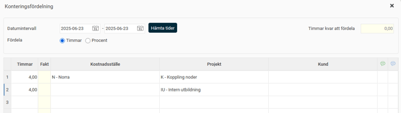
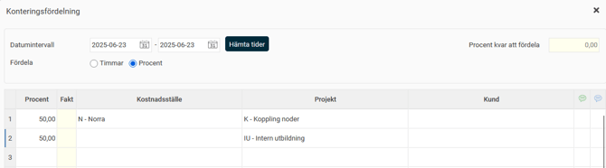
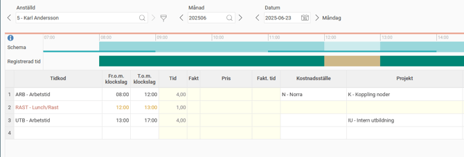
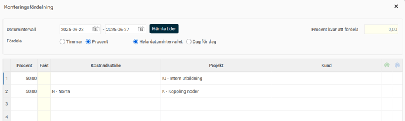
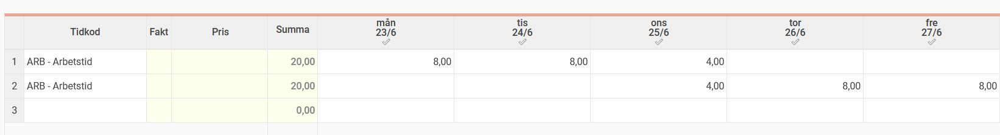
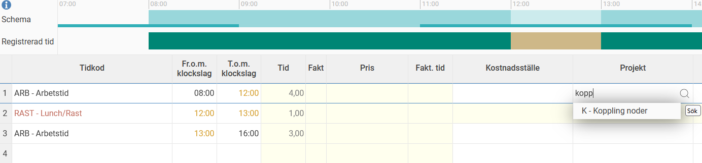
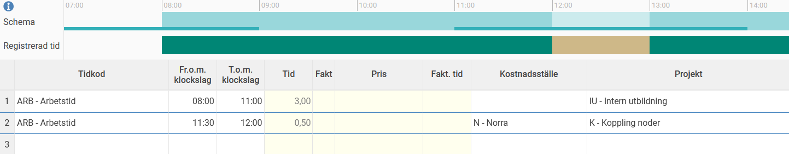

# Hur kan man kontera tiden i HRM Time?

**Datum:** den 18 augusti 2025  
**Kategori:** Time  
**Underkategori:** Tidrapportering  
**Typ:** howto  
**Svårighetsgrad:** intermediate  
**Tags:** hrm-time, saldo, tidrapport  
**Bilder:** 8  
**URL:** https://knowledge.flexhrm.com/sv/hur-kan-man-kontera-tiden-i-hrm-time

---

Artikeln beskriver hur man kan kontera (märka upp) tiden i tidrapporten på två olika sätt, genom konteringsfördelning eller genom att kontera varje tidrad.
Kontera tiden
Tiden i en tidrapport kan märkas upp med konteringar, t.ex. projekt, kostnadsställe osv. Detta går att göra på två olika sätt. Antingen väljs kontering för varje registrerad tid eller så används konteringsfördelningen för att fördela en dag eller flera dagar utifrån antal timmar eller procent av arbetsdagen.
Använda konteringsfördelning
Konteringsfördelningen hittar du under
Mer
-menyn i tidrapporten:

När du klickar på
Konteringsfördelning
laddas som default den dag du senaste besökte.
I exemplet nedan fördelas den 23/6 i timmar. Allteftersom tiden fylls i minskar
Timmar kvar att fördela
som från början visade antal konterbara timmar på den valda dagen.

I nästa exempel fördelas alla timmar som har rapporterats 23/6 i procent av arbetsdagen istället för timmar.

Tidrapporten delas i båda fallen upp på det här viset, hälften av dagens arbetstid på kostnadsställe N och projekt K, andra hälften på projekt IU.:

Fördelar man flera dagar samtidigt finns en inställning för om uppdelning ska göras på samma sätt varje dag, eller om uppdelningen bara ska läggas ut för en rad i konteringsfördelningen i taget. Ett exempel på det sistnämnda visas nedan. Fördelningen görs på en vecka, 50% ska läggas på projekt IU, 50% på projekt K. I tidrapporten får 2,5 dagar projekt IU och 2,5 dagar projekt K.

Kontera varje tidrad
Om dagen redan har rapporterad tid kan du ange konteringen för varje rad, genom att skriva in den post du vill söka efter direkt i respektive konteringsfält. Stämmer inte klockslagen eller antalet rader kan nya rader skapas med rätt klockslag och kontering.

Har du en tom dag kan du lägga in rätt kontering samtidigt som du rapporterar klockslag.

