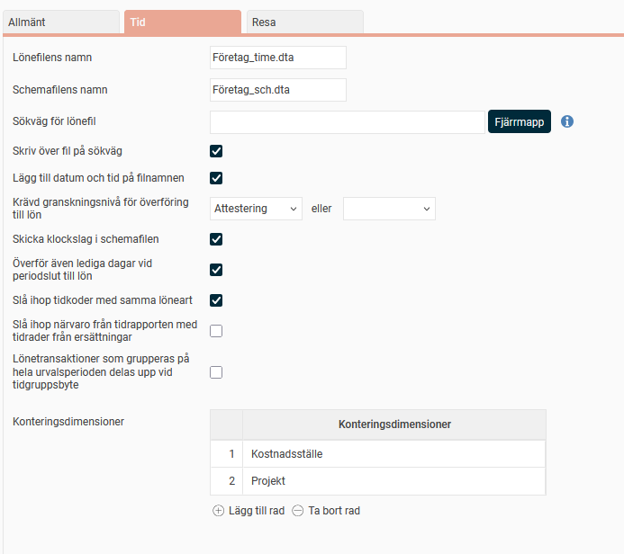
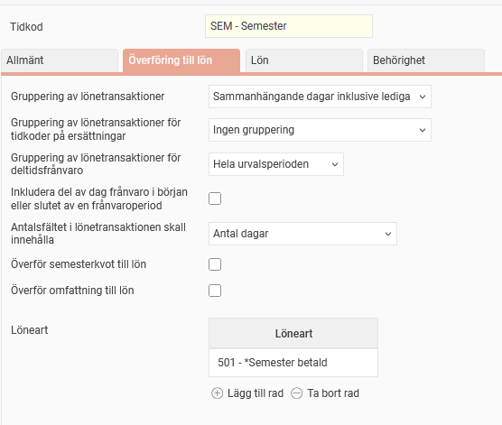

# ⚙️Hur överförs information från tidrapporterna till lönesystemet?

**Datum:** den 3 november 2025  
**Kategori:** Time  
**Underkategori:** Frånvaro & Semester  
**Typ:** config  
**Svårighetsgrad:** advanced  
**Tags:** frånvaro, lön, ob, schema, semester, tidkod, tidrapport  
**Bilder:** 2  
**URL:** https://knowledge.flexhrm.com/sv/hur-%C3%B6verf%C3%B6rs-information-fr%C3%A5n-tidrapporterna-till-l%C3%B6nesystemet

---

Information från tidrapporter till lön skickas på olika sätt beroende på mottagande lönesystem. Denna artikel berättar om hur man kan anpassa inställningar för överföring till lön i vyn för lönekoppling och i vyn för tidkoder.
Lönekopplingsinställningar
Tidkodsinställningar för överföring till lön
Observera
Det är viktigt att dessa inställningar kontrolleras hela vägen in i lönesystemet. Vi rekommenderar att ni tar hjälp av en konsult vid uppsättning av en ny lönekoppling och vid anpassning av en befintlig.
När tidrapporter registrerats och granskats överförs de till ett lönesystem för att man ska få korrekt lön utbetald. Använder ni
HRM Payroll
görs detta i
Löneberedningen
, i annat fall under
Bearbetningar > Överföring av tidrapporter till lön
.
Lönekopplingsinställningar
Under
Inställningar > Lön > Lönekoppling
har ni angett det lönesystem ni använder. Denna inställning bestämmer hur filerna som skapas vid överföringen utformas, för att lönesystemet ska läsa in dem korrekt.
Under fliken
Tid
kan man anpassa filernas innehåll. Inställningarna för vad man kan överföra och hur det kan överföras varierar beroende på lönekoppling.

Sökväg för lönefil
Om lönefilen ska sparas i en fjärrmapp vid överföringen till lön, kan denna anges här. Om det finns en uppsatt sökväg kommer systemet som standard att spara till sökvägen, men det går att välja bort för specifika överföringar.
Krävd granskningsnivå för överföring till lön
Här anges den granskningsnivå som krävs för att tidrapporten ska kunna överföras till lönesystemet. Observera att du kan ange två alternativa granskningsnivåer, exempelvis att tidrapporten behöver vara antingen klarmarkerad eller attesterad.
Överför även lediga dagar vid periodslut till lön
Markera detta fält om även arbetsfri dag vid periodslut ska föras över till lönesystemet. Om en anställd har sjukfrånvaro i slutet av en månad och den sista i månaden är en lördag kommer då även lördagen att föras över till lön (förutsatt att tidkoden för sjukfrånvaro är inställd så att även lediga dagar inkluderas).
Slå ihop tidkoder med samma löneart
Markeras detta fält kommer tidkoder med samma löneart att slås samman, för att minska antal rader.
Lönetransaktioner som grupperas på hela urvalsperioden delas upp vid tidgruppsbyte
Markera denna inställning om du vill att lönetransaktioner som grupperas på hela urvalsperioden ska brytas upp i flera transaktioner med datumintervall som följer datumen vid eventuella tidgruppsbyten. Detta gäller generellt för alla lönekopplingar som kan skicka transaktioner för hela urvalsperioden.
Konteringsdimensioner
Här kan du ange eventuell konteringsdimension som ska tas med i lönefilen. Om flera konteringsdimensioner anges kan du specificera deras ordningsföljd i lönefilen genom att skriva in önskat ordningsnummer i rutan till vänster.
Tidkodsinställningar för överföring till lön
Under
Inställningar > Tid och Bemanning > Tidkoder > Överföring till lön
finns inställningar som styr hur information från tidrapporter ska överföras i lönefiler. Liksom för lönekopplingsinställningarna varierar möjligheterna beroende på lönesystem.

Gruppering av lönetransaktioner, gruppering av lönetransaktioner för tidkoder på ersättningar
Här ställer du in hur aktuell tidkod ska summeras i lönetransaktionsfilen.
Följande alternativ finns:
Ingen gruppering
Ingen gruppering av registrerade tidrader sker, dvs. en rad i tidrapporten blir en lönetransaktion.
Dag
Gruppering sker per dag. Om det finns flera tidrader i tidrapporten med samma tidkod grupperas de ihop till en lönetransaktion.
Dag, inklusive lediga
Fungerar som alternativet
Dag
ovan med skillnaden att lediga dagar som omfattas av t.ex. en längre tids frånvaro tas med i lönetransaktionerna med antal = noll. Kan inte användas för tidkoder på ersättningar.
Sammanhängande dagar
Flera dagar i följd med samma tidkod grupperas till en och samma lönetransaktion.
Sammanhängande dagar inklusive lediga
Flera dagar i följd grupperas till en och samma lönetransaktion. Även lediga dagar som omfattas av t.ex. en längre tids frånvaro grupperas.
Hela urvalsperioden
Alla tidrader med samma tidkod i hela datumomfånget som förs över till lön grupperas till en lönetransaktion.
Inkludera del av dag frånvaro i början eller slutet av en frånvaroperiod
Detta fält visas om något av alternativen
Sammanhängande dagar
eller
Sammanhängande dagar inklusive lediga
väljs ovan. Här anges om frånvaro i början/slutet av en frånvaroperiod ska inkluderas när tidkoden summeras i lönetransaktionen.
Antalsfältet i lönetransaktionen skall innehålla
Här kan du ange vad som ska läggas i fältet för antal i lönetransaktionsfilen. Följande alternativ finns: Antal timmar, antal dagar, antal dagar räknat mot schematid och antal kalenderdagar.
Överför semesterkvot till lön
Här kan du välja om semesterkvot ska skickas med semestertransaktioner. Semesterkvoten beräknas enligt formeln
Antal veckor i schemat * 5 / Antal arbetsdagar i schemat
. Schemat avser den anställdes grundschema och tar alltså inte hänsyn till eventuella manuella schemaändringar på enstaka dagar.
Överför omfattning till lön
Om denna ruta markeras kommer omfattning att skickas över på transaktioner.
Lönearter
Här anges den löneart eller de lönearter som ska kopplas till aktuell kod. Tidkoder som saknar löneart överförs inte till lön.
Orsakskod
Används av vissa lönesystem och skrivs i filen med eller istället för löneart.
