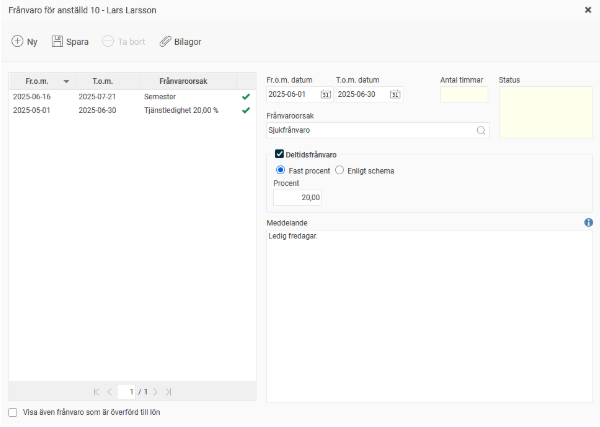
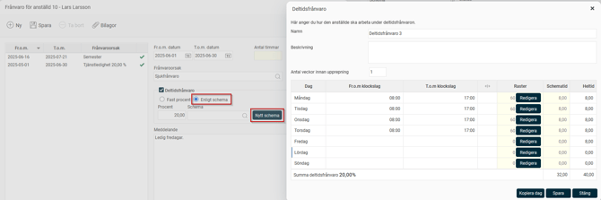
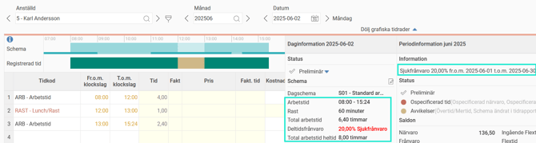
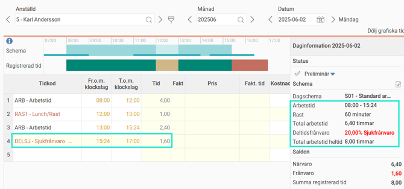
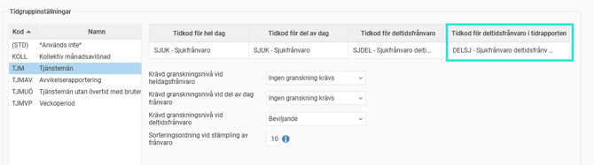

# Hur registrerar jag deltidsfrånvaro i HRM Time?

**Datum:** den 14 januari 2026  
**Kategori:** Time  
**Underkategori:** Tidrapportering  
**Typ:** howto  
**Svårighetsgrad:** intermediate  
**Tags:** frånvaro, hrm-time, lön, ob, schema, tidkod, tidrapport  
**Bilder:** 5  
**URL:** https://knowledge.flexhrm.com/sv/deltidsfr%C3%A5nvaro-i-hrm-time

---

En anställd ska vara deltidsfrånvarande, t ex sjukskriven 20% i en månad. Hur registrerar man det i HRM Time?
Registrering av deltidsfrånvaro.
Visning av deltidsfrånvaro i tidrapporten.
Registrering av deltidsfrånvaro
Följ stegen nedan för att registrera en månads sjukskrivning på 20% för en anställd i HRM Time:
1. Skapa frånvaroansökan.
Klicka på ikonen
Frånvaro
.
Ange
från och med-datum
och
till och med-datum
för perioden.
Välj
frånvaroorsak
(t.ex. 'Sjukfrånvaro').
Kryssa i ‘
Deltidsfrånvaro
’.
Ange
procent
: skriv '20' (för 20% sjukskrivning).
Ange eventuellt meddelande, t.ex. information om hur den anställde vill arbeta under perioden.

2. Välj registreringssätt.
Om den anställda ska vara sjukskriven samma procent varje dag under hela perioden:
Markera '
Fast procent
'.
Schemat kommer automatiskt att förkortas med angiven procent när frånvaron genereras ut.
Om sjukskrivningen är olika för olika dagar (intermittent frånvaro):
Markera '
Enligt schema
'.
Klicka på '
Nytt schema
' och ange hur mycket och vilka dagar hen är ledig/arbetar.
Spara
schemat när du är klar.

Saknar du valet för "Enligt schema"?
Möjligheten att ange ett schema för deltidsfrånvaron kan behörighetsstyras. Det används ofta om man vill att den anställde ska ansöka endast med procent och att chefen sedan kompletterar med schemaläggningen vid granskning av frånvaron.
3.
Spara
ansökan.
4. Beroende på inställningar ska en attestant (till exempel den anställdes chef) godkänna frånvaroansökan innan den syns i tidrapporten.
Visning av deltidsfrånvaro i tidrapporten
Deltidsfrånvaro förkortar den anställdes schema. Deltidsfrånvarons omfattning skrivs ut i tidrapportens dag- och periodinformation.

Det går att visa deltidsfrånvaron med tidrader i tidrapporten, som på bilden nedan. Schemat förkortas, precis som ovan, men deltidsfrånvaron visas också med en tidrad, utlagd efter schematid.

Bra att veta om tidrader för deltidsfrånvaro
För dagar med schematid läggs tidrader för deltidsfrånvaro ut när det finns något annat registrerat på dagen.
För dagar utan schematid ska endast tidrad för deltidsfrånvaro läggas ut (om man till exempel arbetar måndag till torsdag, och är föräldraledig på fredagar). Detta läggs inte ut i förväg. Tidraden för deltidsfrånvaro visas på lediga dagar först när dagen passerats.
För att tidkoden för frånvaro ska läggas ut som tidrader i tidrapporten behöver man ange en
tidkod för deltidsfrånvaro i tidrapporten
under
Inställningar > Tid och Bemanning > Frånvaroorsaker.

OBS!
Använd olika tidkoder för
Tidkod för deltidsfrånvaro
och
Tidkod för deltidsfrånvaro i tidrapporten.
Använder man samma tidkod kommer deltidsfrånvaron att skickas dubbelt till lönesystemet. För att undvika detta kan man använda en separat tidkod för
Tidkod för deltidsfrånvaro i tidrapporten,
och inte koppla den till en löneart.
Relaterade artiklar:
Vad är en frånvaroorsak?
