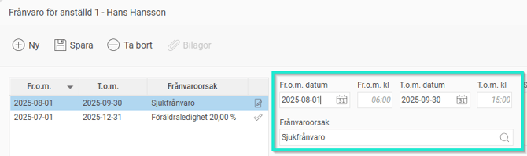
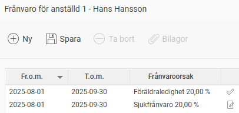
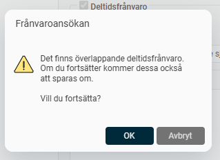
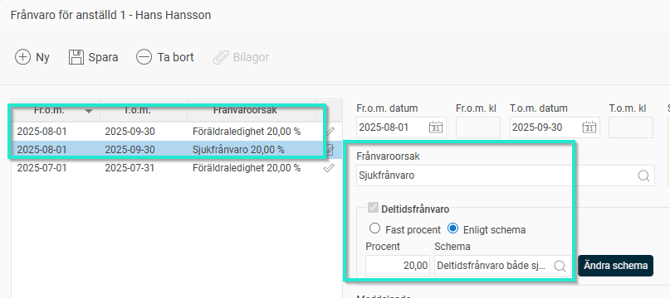
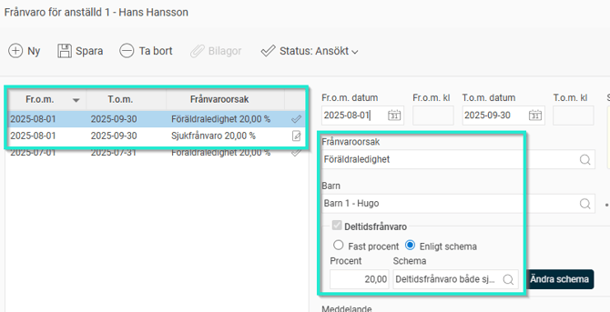
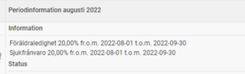

# Hur registrerar man två samtidiga deltidsfrånvaro?

**Datum:** den 27 augusti 2025  
**Kategori:** Time  
**Underkategori:** Frånvaro & Semester  
**Typ:** howto  
**Svårighetsgrad:** intermediate  
**Tags:** frånvaro, schema, tidrapport  
**Bilder:** 8  
**URL:** https://knowledge.flexhrm.com/sv/hur-registrerar-man-2-samtidiga-deltidsfr%C3%A5nvaro-

---

Fler deltidsfrånvaro samtidigt
Scenario om frånvaro totalt 100%
Om anställd redan har en deltidsfrånvaro och får ytterligare en deltidsfrånvaro vilket medför att man totalt är 100% frånvarande. Exempelvis en
befintlig föräldraledighet
om 20% och en sjukfrånvaro på resterande 80% - totalt 100% frånvaro.
Deltidsfrånvaro sjukdom
skall EJ registreras som en deltidsfrånvaro
utan som en vanlig frånvaro

Scenario om frånvaro totalt under 100%
Om anställd redan har en deltidsfrånvaro och får ytterligare en deltidfrånvaro. Exempelvis en befintlig föräldraledighet om 20% och en sjukfrånvaro på 20% - totalt 40% frånvaro d.v.s. under 100%
Deltidsfrånvaro nummer 2 (sjuk) skall registreras som en deltidsfrånvaro och måste ha exakt samma from och tom-datum som föräldraledigheten.

Skapa ett schema där ni klickar i deltidsfrånvaro och skapa ett nytt schema. Viktigt att på varje dag tala om vilket heltidsmåttet är. Detta schema skall spegla båda frånvarotyperna.

När man sparar kommer systemet meddela att även föräldraledigheten kommer att ändras till samma schema

Efteråt kommer båda deltidsfrånvarona att ha samma datum och samma schema

I Periodöversikten i tidrapporten kommer det att se ut så här:

Dagvyn

Vid överföring till HRM Payroll genereras 2 olika frånvarotyper på vardera omfattning 20%.
Tips:
Vill du läsa om övriga inställningar i systemet som berör
deltidsfrånvaro
så klicka här.
