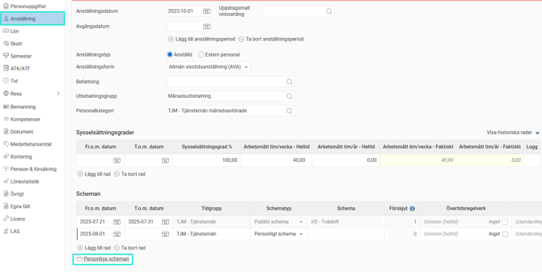
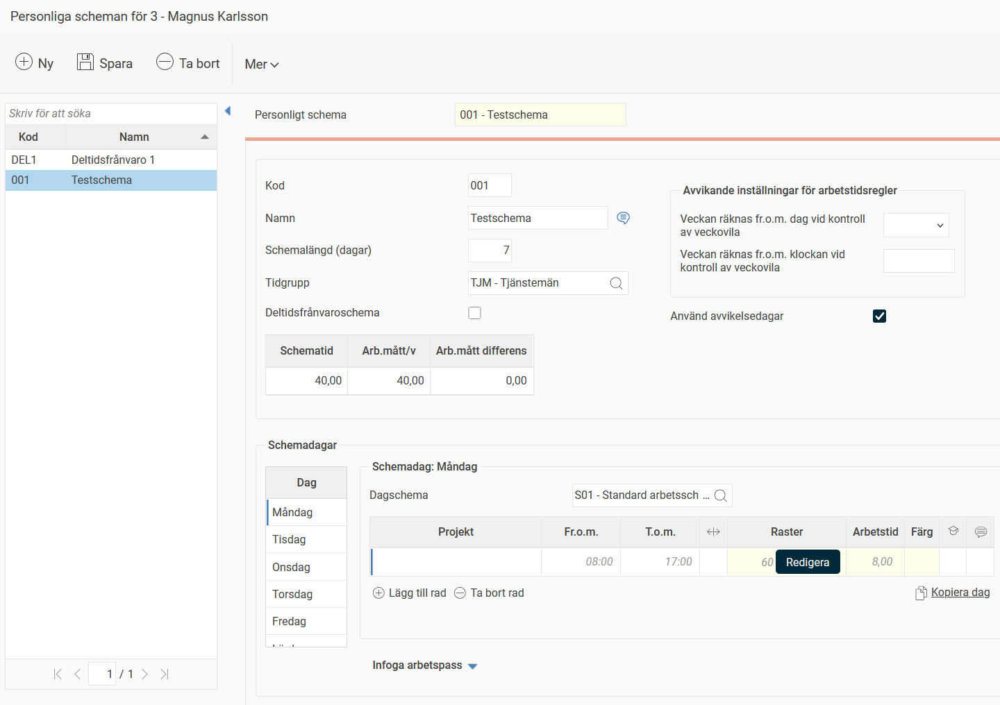
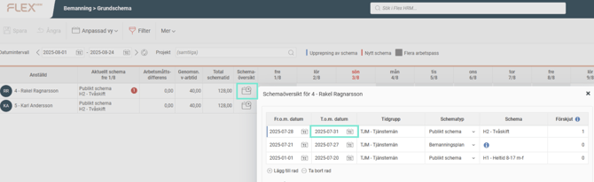
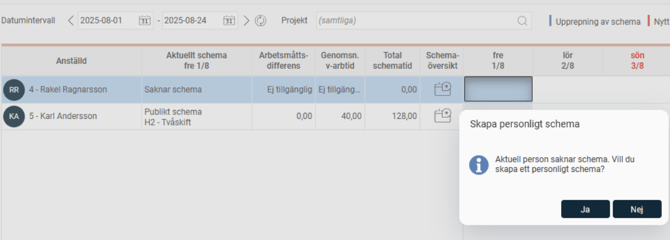
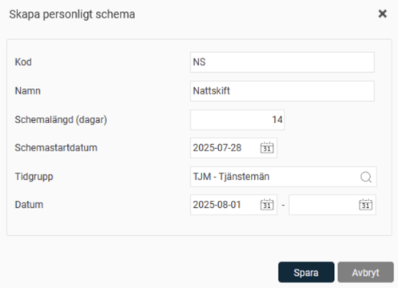
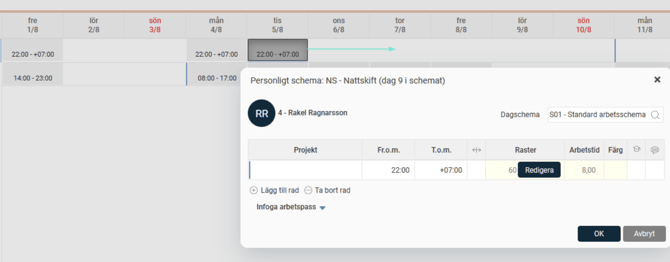

# ⚙️Hur skapar man ett personligt schema?

**Datum:** den 26 september 2025  
**Kategori:** Time  
**Underkategori:** Schema & Planering  
**Typ:** howto  
**Svårighetsgrad:** intermediate  
**Tags:** schema  
**Bilder:** 6  
**URL:** https://knowledge.flexhrm.com/sv/schema-personligt-schema-hur-skapar-man-ett-personligt-schema

---

Det finns två sätt att skapa ett personligt schema, genom fliken Anställning i Anställdaregistret eller i Grundschemavyn. Båda tillvägagångssätten beskrivs i följande artikel.
I vissa fall önskar man skapa personliga scheman. Personliga scheman kan skapas i fliken
Anställning
under
Anställda
eller i vyn
Grundschema
.
Anställda > Anställning
Gå in under
Personliga scheman
.

Skapa det personliga schemat genom att ange kod, namn och antal dagar i grundschemat.
Om antal dagar är mer än 7 måste schemastartdatum anges för när systemet ska lägga ut schemat. Datumet kan vara före startdatum för när själva schemat ska starta på personen.
Du kan läsa mer om schemastartdatum i artikeln
Vad betyder schemastartdatum?
I vårt exempel nedan visas ett personligt schema med schemalängd på 7 dagar och dagschema på måndagar som har schematid kl. 08:00 (fr.o.m. klockslag) - 17:00 (t.o.m. klockslag) och rast på 60 minuter.

Knyt schemat till den anställde. Det görs på fliken
Anställning
, under
Scheman
(se artikelns första bild ovan). Ange datum, tidgrupp, typ Personligt schema och välj det schema du skapat.
Grundschemavyn
Klicka in på
schemaöversikten
och avsluta den period som ska avslutas.

Skapa ett nytt schema genom att dubbelklicka på första dagen i perioden. Du får upp en textruta:
“Aktuell person saknar schema. Vill du skapa ett personligt schema?” Svara
Ja
.

Ange kod, namn, antal dagar (schemalängd), schemastartdatum (om mer än 7 dagar), tidgrupp och datum i grundschemaperioden.

Klicka på dagarna i grundschemavyn och lägg in arbetstider. Det går att kopiera och flytta dagar genom att dra och släppa.

Kontrollera arbetsmåttsdifferenser och justera vid behov.
Relaterade artiklar:
Hur skapar man ett publikt schema?
Vad betyder schemastartdatum?
