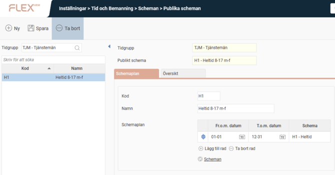
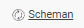
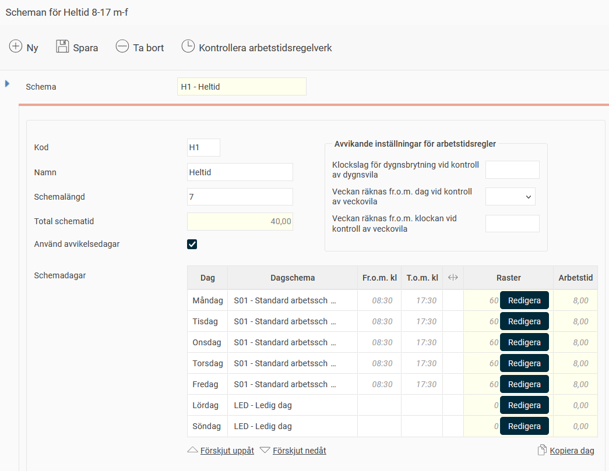
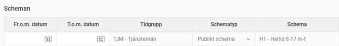
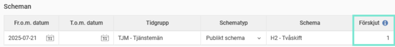
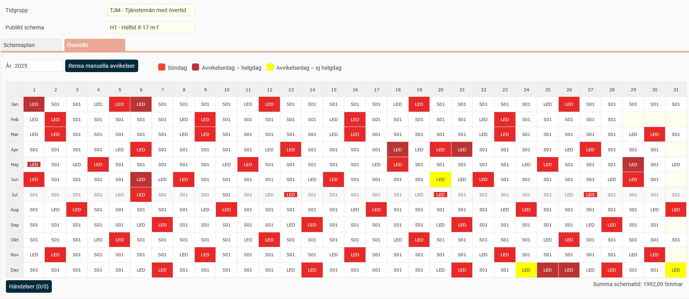

# ⚙️Hur skapar man ett publikt schema?

**Datum:** den 26 september 2025  
**Kategori:** Time  
**Underkategori:** Schema & Planering  
**Typ:** howto  
**Svårighetsgrad:** intermediate  
**Tags:** ob, schema  
**Bilder:** 7  
**URL:** https://knowledge.flexhrm.com/sv/hur-skapar-man-ett-publikt-schema

---

Artikeln beskriver hur man skapar ett publikt schema, hur man kan förskjuta ett publikt schema och hur man schemalägger anställda på ett publikt schema.
Publikt schema
Tilldela publikt schema
Förskjuta publikt schema
Översikt
Publikt schema
När ett dagschema har skapats kan du knyta detta till ett publikt schema. Flera personer kan använda samma publika schema.

Skapa ett nytt publikt schema genom att skriva in
kod
och
namn
och
spara.
Därefter kan du skapa ett schema i det publika schemat (en s.k.
schemacykel
eller
delschema
).
Klicka på
Scheman
.

Avvikande inställningar för arbetstidsregler kan vid behov göras här. Inställningar på bilden beskrivs nedan.
Kod
– Välj kod för schemat.
Namn
– Namnge delschemat tydligt.
Schemalängd
– Ange längd i dagar. Om schemat ska rulla på 2 veckor skriver man 14 dagar.
Schemastartdatum
- Visas om någon annan schemalängd än 7 angetts, detta för att specificera när vecka 1 i schemat infaller.
Du kan läsa mer om schemastartdatum i artikeln
Vad betyder schemastartdatum?
Använd avvikelsedagar
- Avgör om avvikelsedagar som lagts upp (
Inställningar > Tid och Bemanning > Scheman > Avvikelsedagar
) ska ändra schemat, eller om dessa ska ignoreras för de anställda som använder schemat.
Schemadagar
- Ange dagschema för varje dag i cykeln. De fält som är gula kan man endast ändra via knappen
Redigera
eller genom att ändra de kursiva delarna.
Det går att kopiera ett dagschema till andra dagar. Du kan t.ex. ange dagschema för måndagen och ändra ett klockslag för att sedan klicka på
Kopiera dag
och ange att måndagens schema ska gälla även tisdag - fredag.
Koppla sedan schemacykeln till det publika schemat under rätt period. Har du flera olika scheman under året kopplar du dessa olika perioder under året. Det gör du i fliken
Schemaplan
.
Du fyller i fr.o.m. datum, t.o.m. datum och anger vilket schema som gäller under aktuell period. Ange datum med månad+dag för att det ska rulla på över årsskiften.
På bilden nedan gäller schemacykeln 01-01 - 12-31  vilket innebär att den rullar på hela året, alla år.

Tilldela publikt schema
Under
Anställda
, fliken
Anställning
finns en tabell för
Scheman
. Denna används för att tilldela anställda ett publikt schema.

Förskjuta publika scheman
I personbilden går det att förskjuta publika scheman, vilket innebär att om flera personer ska jobba på samma publika schema men med start olika veckor så behövs det endast ett publikt schema. Det gör man i kolumnen
Förskjut
under
Scheman
.
Du kan läsa mer om att förskjuta scheman i artikeln
Vad betyder schemastartdatum?

Översikt
Under
Översikt
kan du se det publika schema du byggt. Här kan du också bygga händelser och rensa manuella avvikelser.

Relaterade artiklar:
Hur ställer man in ett dagschema?
Avvikelsedagar - Hur ställer man in avvikande dagar?
Vad betyder schemastartdatum?
